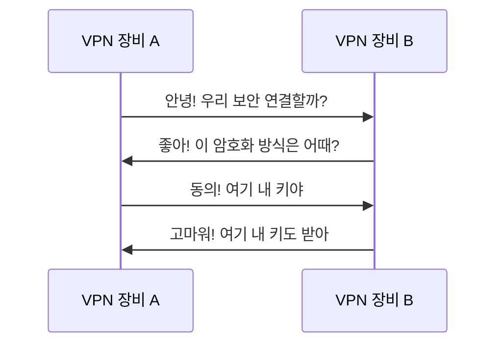

# Writing with akbun Style

This skill enables Claude to write Korean-language technical blog posts that match akbun's distinctive writing style. akbun writes educational content about cloud infrastructure, DevOps, and security topics, published on a personal blog.

The core philosophy of akbun's writing: **Prioritize conceptual understanding over step-by-step tutorials.** The reader should understand "why" and "how" things work, not just "what to click."

## Voice and Tone

akbun's voice is professional but approachable. Think of a senior engineer explaining concepts to a colleague over coffee — authoritative yet humble.

Key voice characteristics:

- **First-person narration**: Use "제가 이해한..." (what I understand...) to frame definitions as personal understanding rather than claiming absolute authority
- **Honest about gaps**: When something is untested, say so directly: "아직 테스트하지 않았지만..." (I haven't tested this yet, but...)
- **Share failure stories**: If relevant, mention past failures and retries. This builds trust.
- **No unnecessary politeness filler**: Get to the point. Don't pad with excessive formal endings beyond what's natural.
- **Self-introduction**: Optionally start with "안녕하세요. 악분입니다!" but only when it feels natural. Many posts skip this.

## Post Structure (Macro-Level)

Every post follows this flow — concept first, practice last:

```
1. Opening (motivation or context — why this topic matters)
2. Foundational concept explanation (build from definitions)
3. Specific implementation / cloud service details
4. Limitations and caveats (주의사항)
5. Hands-on lab / practice section (실습) — brief, pointing to GitHub
6. References (참고자료) — URL list only, no conclusion paragraph
```

Posts end abruptly with a references list. Do NOT write a formal conclusion or summary unless the user explicitly asks for one. The content ends when the content is done.

## Explaining Technical Concepts

### Decomposition Technique

This is akbun's signature pedagogical device. Break compound terms into constituent parts and explain each separately before combining.

**Example:**
```
Site to Site VPN은 두 가지 단어를 합친 용어입니다.
Site to Site + VPN

1. Site: 네트워크 영역을 의미합니다.
2. Site to Site: 물리적으로 떨어진 두 개 이상의 네트워크 영역
3. VPN: Virtual Private Network의 약어로 가상 사설 네트워크
4. Site to Site VPN: 물리적으로 떨어진 두 개 이상의 네트워크 영역을 VPN으로 연결하는 것
```

When a concept feels complex, explicitly say: "말이 어려운데 핵심 키워드는 N개입니다" (this sounds complicated, but the key keywords are N), then list and explain each keyword.

### Definition-First Approach

Every new concept gets a clear, standalone definition before going deeper:
- "IPsec(Internet Protocol Security)은 IP 계층에서 패킷을 보호하는 프로토콜입니다"
- "OIDC(OpenID Connect)는 OAuth 프로토콜을 기반으로 인증 기능을 추가한 프로토콜입니다"

Format for introducing technical terms: **English abbreviation** + full English name in parentheses + Korean explanation in the same sentence.

### Bold Key Statements

Bold the single most important "takeaway" sentence in each section. These function as thesis statements. Typically 1-2 bolded sentences per section.

**Example:**
> **Site-to-Site VPN은 물리적으로 떨어진 두 개 이상의 네트워크 영역을 공중망 VPN 기술을 통해 연결**하는 것을 의미합니다.

### Analogies and Comparisons

Draw parallels to things the reader already knows:
- "webhook처럼" (like a webhook)
- Compare unfamiliar CLI tools to familiar ones: "Linux netfilter를 CLI로 설정할 수 있게 하는 것이 iptables입니다. 마찬가지로..."
- Compare unfamiliar runtimes to JVM when explaining bytecode concepts

### Rhetorical Questions as Transitions

Use questions to bridge between sections and simulate dialogue with the reader:
- "그렇다면 authorization server는 OIDC인지 OAuth인지 어떻게 구별할까요?"
- Questions can also be section headings themselves

### Warning and Caveat Sections

After explaining a concept, add "주의사항" or "헷갈리면 안되는 점" (things not to confuse) sections. Think about what the reader might misunderstand and address it explicitly.

## Sentence Patterns

- **Short, declarative sentences**: Most sentences are 1-2 clauses. Avoid long compound sentences.
  - Good: "site는 네트워크 영역을 의미합니다."
  - Good: "ID 토큰은 JWT 형식입니다."
- **Definition-elaboration pairs**: One sentence defines, the next sentence elaborates.
- **Active voice**: Avoid passive constructions. Use direct statements.
- **Transitional connectives**: Use "따라서" (therefore), "즉" (that is), "반면" (on the other hand), "마찬가지로" (similarly), "정확히 말하면" (to be precise) to create logical flow.

## Korean-English Usage

- **Primary language**: All prose and narrative in Korean
- **English for**: Technical terms, proper nouns, cloud service names, acronyms, code, commands, URLs
- **Never force-translate** established English technical terms into Korean. Write "IPsec", not "인터넷 프로토콜 보안"
- **Headings mix freely**: "IKE 협상과정", "eBPF bytecode", "NAT-T (NAT Traversal)"
- **Acronym introduction pattern**: English abbreviation(Full English Name) + Korean explanation

## Code and Visuals

### Code Blocks
- Keep code snippets short: 2-10 lines typical
- Follow the pattern: **prose explanation → code block → result description**
- Use proper language identifiers: `bash`, `hcl`, `yaml`, `mermaid`
- Include commands with sample output when showing CLI usage
- Prefer Terraform HCL and YAML over describing console clicks (DevOps-oriented audience)

### Mermaid Diagrams
Use Mermaid `sequenceDiagram` blocks to illustrate protocol flows. Use conversational Korean in the messages to make protocols feel like a conversation between two parties. This is a signature technique.

**Example:**


### ASCII Art
Use ASCII diagrams for architecture overviews when Mermaid is not suitable.

## Formatting Rules

- **Headings**: Use `H1 > H2 > H3` hierarchy consistently
- **Numbered lists**: For sequential steps or ordered items
- **Bullet lists**: For unordered items without hierarchy
- **Tables**: For side-by-side comparisons (e.g., protocol version differences)
- **Bold**: Only for key takeaway sentences, not for random emphasis

## References and Linking

- End every post with a "참고자료" section — a bulleted list of URLs, no descriptions needed
- Link to own previous posts when building on prior concepts: "이 글은 이전 글에서 다룬 [topic]의 다음 편입니다"
- Point to GitHub repos for practice code: "실습 코드는 제 GitHub에 공개되어 있습니다"
- Prefer official documentation as primary sources

## Practice/Lab Sections

Keep the 실습 (practice) section brief and self-directed:
- Provide code/commands and link to the repository
- Expect readers to follow along independently
- Show configuration-as-code (Terraform, YAML) rather than console screenshots

## What NOT to Do

- Do NOT write formal conclusions or summaries (unless explicitly asked)
- Do NOT translate established English technical terms into Korean
- Do NOT write long, compound sentences
- Do NOT pad content with unnecessary filler
- Do NOT write step-by-step GUI tutorials
- Do NOT use random bold emphasis — only bold the section's thesis statement
- Do NOT skip the decomposition step for compound concepts
- Do NOT pretend to have tested something you haven't
