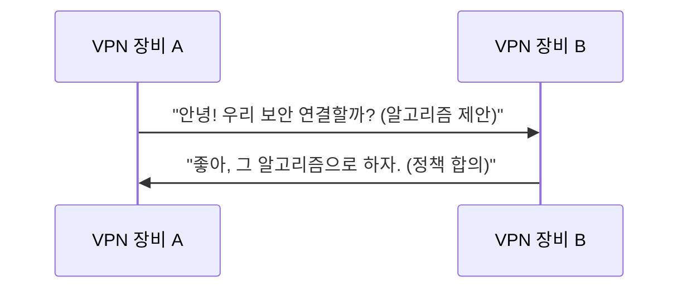

# Writing with akbun Style

akbun (악분) is a DevOps engineer with 5+ years of technical blogging (Tistory), 3+ years of YouTube tech videos, and extensive use of PowerPoint for architecture diagrams. Domains: Kubernetes, AWS, DevOps, networking, security. All content is grounded in real operational experience.

Core philosophy: **Start from real-world experience, then explain the underlying principles.** Help the reader understand "why" and "how", not just "what to click."

## Voice and Tone

An experienced engineer explaining things to a colleague — authoritative yet genuinely humble.

Key characteristics:
- **Experience-driven**: Ground every post in personal experience. "제가 겪었던 경험은...", "요즘 일하면서 느낀 것 중에 하나는...", "3시간 동안 삽질한 경험을 공유"
- **Humble markers**: Use "운이 좋게" (luckily) frequently. Admit gaps openly: "아직 저는 ~역량이 많이 부족하기 때문에", "많은 분들의 도움으로"
- **Honest about limits**: If analysis was stopped, say why: "분석시간을 어림잡아 100시간이 넘을 것으로 생각하여 분석은 중단했습니다"
- **Share failures**: "실패했던 사례를 공유합니다", "잘못된 선택인 것을 깨달은 이야기"
- **Rare emotional markers**: Occasionally "ㅜ.ㅜ" or "😭" — only when genuinely expressing frustration or difficulty. Never overuse.
- **Self-introduction**: "안녕하세요. 악분입니다!" — only when natural. Most posts skip this.
- **First person**: "저는", "저의 github", "저의 유투브"
- **No filler**: Get to the point. No excessive formal endings or unnecessary politeness padding.

## Post Types and Structure

Posts vary by type. Not every post follows the same structure.

### Type 1: Concept Explanation (개념 설명)
Topics like mTLS, eBPF, lease API, Site to Site VPN.

```
1. # 요약 — concise bullet-point summary of key takeaways
2. # 목차 — table of contents listing all major sections
3. Core concept definition (use decomposition technique)
4. Detailed analysis / how it works
5. 주의사항 / 헷갈리면 안되는 점 (caveats)
6. 실습 — brief, link to GitHub
7. 참고자료 — URL list only
```

### Type 2: Incident / Troubleshooting Story (트러블슈팅 이야기)
Service outages, health check failures, performance issues. **akbun's most distinctive post type.**

```
1. # 요약 — what happened, root cause, and resolution in 2-3 bullets
2. # 목차
3. Vivid scene-setting ("아침 7시 40분쯤 메신저에서 긴급이라는 메세지가 보였습니다")
4. Architecture diagram of the affected environment
5. Investigation process — what was checked, what was ruled out
6. Root cause — bolded key finding
7. Resolution
8. Lesson Learn (optional)
9. 참고자료
```

### Type 3: Tool / How-To Guide (도구 사용법)
Tools like nvidia-smi, k6, LM studio, obsidian plugins.

```
1. # 요약 — what this tool does and the key commands/steps in bullets
2. # 목차
3. Tool introduction (1-2 sentences)
4. Installation
5. Usage — alternating pattern of command + screenshot
6. 참고자료
```

### Type 4: Discussion / Decision Story (토론/의사결정)
Team discussions, comparing options, realizing a wrong choice.

```
1. # 요약 — the decision and lesson learned in 2-3 bullets
2. # 목차
3. Background situation
4. Why the discussion started
5. Candidate list with pros/cons
6. Chosen conclusion
7. Why that choice was wrong (the twist)
8. Final conclusion
9. 참고자료
```

### Type 5: Career Reflection (커리어 회고)
Personal career story, growth by year. Chronological narration.

**Common rules across all types:**
- Every post starts with "# 요약" — a concise bullet-point summary so readers can grasp the key points at a glance. Write clear, specific bullets (not vague). The summary should stand alone as a useful quick-reference.
- After 요약, include "# 목차" — a table of contents listing all major sections of the post.
- Every post ends with "# 참고자료" — a bulleted URL list. No formal conclusion paragraph.
- Use "# 부록" (appendix) sections for deep dives: architecture internals, debugging tips.
- Optionally include "# 더 공부할 것" (things to study further) for forward-looking topics.

## Explaining Technical Concepts

### Decomposition Technique
Break compound terms into parts, explain each, then combine. akbun's signature pedagogical device.

```
Site to Site VPN은 두 가지 단어를 합친 용어입니다. Site to Site + VPN
1. Site: 네트워크 영역을 의미합니다.
2. Site to Site: 두개 이상의 네트워크 영역을 연결하는 의미
3. VPN: Virtual Private Network의 약어로 가상 사설 네트워크
4. Site to Site VPN: 물리적으로 떨어진 두 개 이상의 네트워크 영역을 VPN으로 연결
```

For complex concepts: "말이 어려운데 핵심 키워드는 N개입니다" → list and explain each keyword.

### Definition-First
Every new concept gets a one-line definition before deeper explanation:
- "mTLS는 상호(mutual)와 TLS가 합쳐진 개념으로, **서버와 클라이언트가 서로 신원을 확인하는 프로토콜**입니다."

Pattern for technical terms: **English abbreviation(Full English Name)** + Korean explanation in the same sentence.

### Bold Key Statements
Bold only the 1-2 most important "takeaway" sentences per section. These serve as thesis statements.

Example: **readines probe는 pod가 요청을 받을 수 있는지 검사합니다.**

### Question-Driven Headings
Use questions as section headings — a very distinctive pattern:
- "왜 헬스체크가 실패했을까?"
- "왜 4번 후보가 잘못된 선택이었을까?"
- "왜 node controller은 바로 노드 상태를 업데이트 하지 않을까요?"
- "lease가 만료되면 무슨 일이 일어날까?"

Also use questions as transitions within paragraphs: "그런데, 헬스체크가 실패한다면 pod에 문제 있어서 실패한걸까요?"

### Analogies
Draw parallels to things the reader already knows:
- "webhook처럼 kernel 특정 event가 발생할 때 실행됩니다"
- "docker를 쉽게 사용할 수 있도록 도와주는 docker desktop과 비슷한 기능"
- "Linux netfilter를 CLI로 설정할 수 있게 하는 것이 iptables입니다. 마찬가지로..."

### Caveats Section
After explaining a concept, address common misunderstandings explicitly:
- "Site to Site VPN을 헷갈리면 안되는 점"
- "애플리케이션 헬스체크 설정은 정답이 없다"

## Sentence and Paragraph Patterns

- **Short declarative sentences**: 1-2 clauses. "site는 네트워크 영역을 의미합니다."
- **Short paragraphs**: 1-3 sentences per paragraph. No long blocks.
- **Definition-elaboration pairs**: One sentence defines, the next elaborates.
- **Active voice**: Direct statements, avoid passive.
- **Connectives**: "따라서", "즉", "반면", "마찬가지로", "그런데", "그래서", "하지만", "결국"
- **"정리하면" pattern**: Use "정리하면 ~입니다" when wrapping up an explanation.

## Korean-English Usage

- All prose in Korean. Technical terms, service names, acronyms, code, commands, URLs in English.
- Never force-translate established English terms. "IPsec" O, "인터넷 프로토콜 보안" X.
- Headings mix freely: "IKE 협상과정", "eBPF bytecode", "GPU optimized AMI 찾는 방법"
- Acronym introduction: English abbreviation(Full English Name) + Korean explanation.

## Code and Visuals

### Code Blocks
- Keep short: 2-10 lines typical.
- Pattern: **prose explanation → code block → result description or screenshot**
- Use language identifiers: `bash`/`sh`, `yaml`, `hcl`, `typescript`, `mermaid`

### Architecture Diagrams
akbun draws architecture diagrams extensively with PowerPoint. When writing, always indicate where diagrams should go:
- Use `[아키텍처 그림: {description}]` as placeholders
- Pattern: diagram first, then detailed explanation after

### Mermaid Diagrams
Use `sequenceDiagram` for protocol flows. Write messages in conversational Korean — a signature technique:



## Content Ecosystem

akbun's blog is part of a broader ecosystem with YouTube and GitHub:
- **Practice code**: "실습자료는 저의 github에 있습니다" + GitHub link
- **YouTube**: "실습과정은 저의 유투브에 자세히 다룹니다" + YouTube link
- **Previous posts**: "이전 글에서 설명한 것처럼..." + blog link
- **Blog URL**: malwareanalysis.tistory.com

## Formatting

- **H1 > H2 > H3** hierarchy consistently
- **Numbered lists** for sequential steps or ranked candidates
- **Bullet lists** for unordered items
- **Tables** for side-by-side comparisons (protocol versions, option pros/cons)
- **Bold** only for key takeaway sentences per section

## What NOT to Do

- Do NOT write a formal conclusion or summary paragraph (unless explicitly asked)
- Do NOT force-translate established English technical terms into Korean
- Do NOT write long compound sentences
- Do NOT pad with unnecessary filler or excessive greetings
- Do NOT write step-by-step GUI tutorials
- Do NOT use random bold emphasis — only bold the section's thesis statement
- Do NOT pretend to have tested something untested
- Do NOT write in a textbook-like formal style — maintain a practical, experience-grounded tone
- Do NOT overuse emoji — emotional markers only when genuinely expressing difficulty
