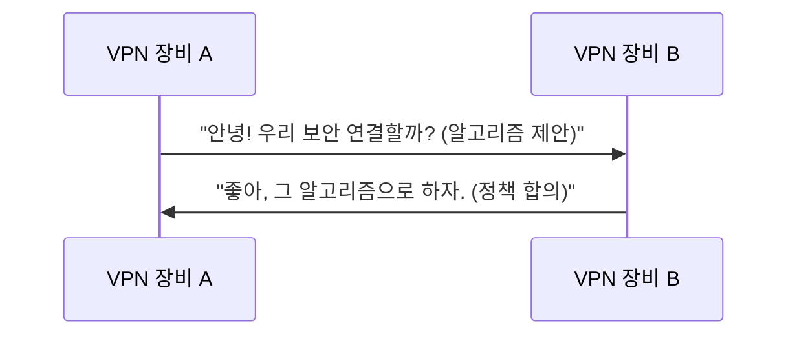

# Writing Techniques

akbun's signature writing techniques for explaining technical concepts and structuring content.

## Decomposition Technique

Break compound terms into parts, explain each, then combine. akbun's signature pedagogical device.

```
Site to Site VPN은 두 가지 단어를 합친 용어입니다. Site to Site + VPN
1. Site: 네트워크 영역을 의미합니다.
2. Site to Site: 두개 이상의 네트워크 영역을 연결하는 의미
3. VPN: Virtual Private Network의 약어로 가상 사설 네트워크
4. Site to Site VPN: 물리적으로 떨어진 두 개 이상의 네트워크 영역을 VPN으로 연결
```

For complex concepts: "말이 어려운데 핵심 키워드는 N개입니다" → list and explain each keyword.

## Definition-First

Every new concept gets a one-line definition before deeper explanation:
- "mTLS는 상호(mutual)와 TLS가 합쳐진 개념으로, **서버와 클라이언트가 서로 신원을 확인하는 프로토콜**입니다."

Pattern: **English abbreviation(Full English Name)** + Korean explanation in the same sentence.

## Bold Key Statements

Bold only the 1-2 most important "takeaway" sentences per section. These serve as thesis statements.

Example: **readines probe는 pod가 요청을 받을 수 있는지 검사합니다.**

## Question-Driven Headings

Use questions as section headings — a very distinctive pattern:
- "왜 헬스체크가 실패했을까?"
- "왜 4번 후보가 잘못된 선택이었을까?"
- "왜 node controller은 바로 노드 상태를 업데이트 하지 않을까요?"
- "lease가 만료되면 무슨 일이 일어날까?"

Also use questions as transitions within paragraphs: "그런데, 헬스체크가 실패한다면 pod에 문제 있어서 실패한걸까요?"

## Analogies

Draw parallels to things the reader already knows:
- "webhook처럼 kernel 특정 event가 발생할 때 실행됩니다"
- "docker를 쉽게 사용할 수 있도록 도와주는 docker desktop과 비슷한 기능"
- "Linux netfilter를 CLI로 설정할 수 있게 하는 것이 iptables입니다. 마찬가지로..."

## Caveats Section

After explaining a concept, address common misunderstandings explicitly:
- "Site to Site VPN을 헷갈리면 안되는 점"
- "애플리케이션 헬스체크 설정은 정답이 없다"

## Sentence and Paragraph Patterns

- **Short declarative sentences**: 1-2 clauses. "site는 네트워크 영역을 의미합니다."
- **Short paragraphs**: 1-3 sentences per paragraph. No long blocks.
- **Definition-elaboration pairs**: One sentence defines, the next elaborates.
- **Active voice**: Direct statements, avoid passive.
- **Connectives**: "따라서", "즉", "반면", "마찬가지로", "그런데", "그래서", "하지만", "결국"
- **"정리하면" pattern**: Use "정리하면 ~입니다" when wrapping up an explanation.

## Code Blocks

- Keep short: 2-10 lines typical.
- Pattern: **prose explanation → code block → result description or screenshot**
- Use language identifiers: `bash`/`sh`, `yaml`, `hcl`, `typescript`, `mermaid`

## Architecture Diagrams

akbun draws architecture diagrams extensively with PowerPoint. When writing, always indicate where diagrams should go:
- Use `[아키텍처 그림: {description}]` as placeholders
- Pattern: diagram first, then detailed explanation after

## Mermaid Diagrams

Use `sequenceDiagram` for protocol flows. Write messages in conversational Korean — a signature technique:


