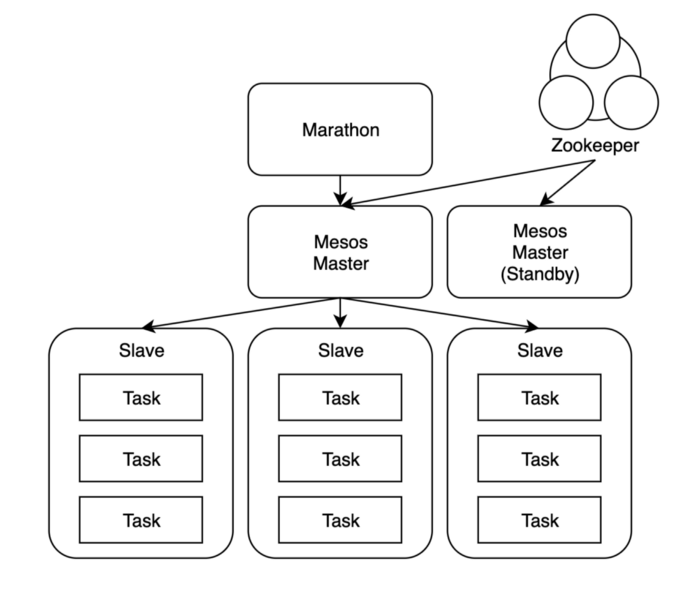

# 끄적끄적
## mesos란
* 여러 대의 자원을 하나로 묶어서 관리 -> 마치 한 개의 PC를 사용하는 것 같은 느낌을 주는 것

## 컴포넌트

### 마스터(Master)
* slave를 관리
* 주키퍼가 선정한 리더(leader) 마스터는 actvie상태, 나머지는 standby 상태

### 주키퍼(Zookeeper)
* 실행 중인 마스터가 문제가 생기면(failover) 후보 마스터를 리더 마스터로 승격

### 마라톤(Marathon)
* 자원할당과 application 생성
* application을 생성하면 slave 자원을 확인하고 실행

### 크로노스(Chronos)
* 스케쥴러

## 마라톤 로드밸런서(Mrathon-lb): Option
* HAProxy를 사용하여 로드밸런서와 서비스 디스커버리 기능 수행

## spartan
* DNS forwarder
* 주키퍼가 마스터 노드를 변경?하면 agent노드의 dns설정(/etc/resolv.conf)을 변경

## 기능
* zone 설정: Constraint

# 참고지료
* [1] [블로그-mesos 개념정리](https://brownbears.tistory.com/261)
* [2] [블로그-mesos 개념정리](https://chrisjune-13837.medium.com/infra-apache-mesos-marathon-%EC%9D%B4%EB%9E%80-dc088630b5d)
