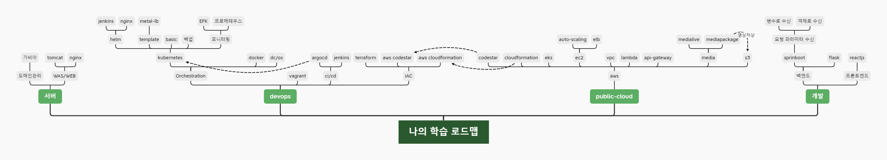

- [학습 로드맵](#학습-로드맵)
- [요약 목차](#요약-목차)
- [상세 목차](#상세-목차)
- [프로젝트](#프로젝트)
- [백엔드 (deprecated)](#백엔드-deprecated)
  - [스프링부트](#스프링부트)

# 학습 로드맵

 

# 요약 목차
| 번호 | 이름 | 설명 | 링크 |
| ---- | ---- | ---- | ---- |
| 1 | aws lambda | lambda로 백엔드 기능 연습 | [Readme 링크](./aws/lambda/Readme.md) |
| 2 | aws codepipeline lambda | 1. github webhook설정을 통한 codepipeline 자동 실행   2. lambda, api gateway, role 연동 등 실행 | 팀원 요청으로 비공개 |
| 3 | kubernetes helm | prometheus, efk 등 helm 연습  | [Readme 링크](./kubernetes/helm/Readme.md) |
| 4 | kubernetes basic | 쿠버네티스 공부  | [Readme 링크](./kubernetes/basic/Readme.md) |
| 5 | terraform과 aws연동 | VPC, EC2 인스턴스 생성 등 | [Readme 링크](./aws/terraform/Readme.md) |
| 6 | DC/OS 설치 | vagrant로 DC/OS 설치 자동화 | [Readme 링크](./Dcos/install/manual/Readme.md) |
| 7 | 공부기록 | 공부노트 정리 | [Readme 링크](./documentation/Readme.md) |

 

# 상세 목차
| 분류 | 설명 | 문서링크 | 영상링크 |
| --- | --- | ----- | ------ |
| aws와 terraform | EC2 인스턴스와 공개키 인증방식 설정 | [Readme 링크](./aws/terraform/9_ec2-userdata/Readme.md) | [유투브 링크](https://youtu.be/rHm6C2-77uA) |
| aws와 terraform | EC2 인스턴스 user data설정 | [Readme 링크](./aws/terraform/12_ec2-user-data/Readme.md) | [유투브 링크](https://youtu.be/qAvSbUEjWnU) |
| aws와 terraform | EC2 인스턴스를 AMI로 생성 | [Readme 링크](./aws/terraform/11_create-ami/Readme.md) | [유투브 링크](https://youtu.be/j4O1nrworMU) |
| kubernetes | kubespray설치(인프라 환경: vagrant) | [Readme 링크](./kubernetes/kubespray/Readme.md) | |
| kubernetes | helm nexus | [Readme 링크](./kubernetes/helm/nexus-charts/Readme.md) | [유부트 링크](https://youtu.be/9hXz-GCTQ2w) |
| kubernetes | metal-lb를 활용한 온프레미스 환경 loadbalancer 서비스 사용 | [Readme 링크](./kubernetes/documentation/metal-lb/Readme.md) | [유부트 링크](https://youtu.be/la_7lumpkvw) |
| DC/OS | DCOS 설치 | [Readme 링크](./Dcos/install/manual/Readme.md) | [유투브 링크](https://youtu.be/y1rOk_c_a-o) |
| DC/OS | DCOS-CLI 설치 | [Readme 링크](./Dcos/manual/dcos_cli.md) | [유투브 링크](https://youtu.be/7QWhCVIiEVo) |
| docker | 커스텀 젠킨스 Dockerfile | [Readme 링크](./docker/jenkins-dood/Readme.md) | [유투브 링크](https://youtu.be/CLCLIV3IBrk) |
| docker | private docker registry - nexus 활용 | [Readme 링크](./docker/nexus/Readme.md) | [유투브 링크](https://youtu.be/2whuSZdKpwE) |
| 운영 | gitlab 백업 | [Readme 링크](./documentation/gitlab-backup.md) | |
| 운영 | nexus maven 연동 | [Readme 링크](./documentation/maven.md)) | [유투브 링크](https://youtu.be/e0Dt0jb40xU) |

 

# 프로젝트
| 번호 | 설명 | 기술요약 | 프로젝트 바로가기 링크 |
| ---- | ------- | --------- | ----------- |
| 1 | 온 프레미스 쿠버네티스 자동 설치 | vagrant, ansible, k8s | [이동](https://github.com/choisungwook/installK8s_in_vagrantWithAnsible) |
| 2 | 웹 터미널 | xtermjs, webpack | [이동](https://github.com/choisungwook/web_terminal.git) |
| 3 | 스프링부트 ssh client | springboot websocket | [이동](https://github.com/choisungwook/web_terinal_try2.git) |

---

 

# 백엔드 (deprecated)
## 스프링부트
| 번호 | 제목 | 설명 | 바로가기 링크 |
| ---- | ----- | --------------------- | -------------------|
| 1 | 인메모리 로그인 인증 | 계정을 인메모리로 관리, 인증 설정 | [github 링크](https://github.com/choisungwook/springsecurity-InMemory-Authentication) |
| JPA | DB설계도를 보고 JPA구현 |   |
| 프로파일관리 | 개발, 배포 등 각 단계마다 프로파일 관리 | https://github.com/sungwookspring/profiles.git |
| 보안 | 인증,인가 관리 | https://github.com/sungwookspring/security.git  |
| https | | |