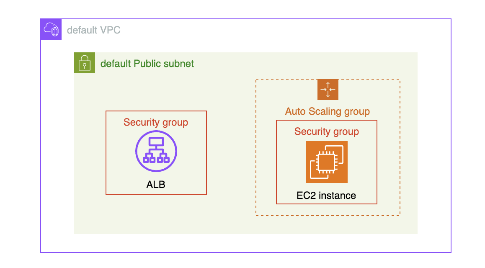

# 개요

* AWS ASG를 활용한 Canary 예제입니다.
* ASG는 총 4대 인스턴스를 관리하고, 이 예제에서는 2대씩 RollingUpdate합니다.

## 아키텍처

* AWS계정의 default VPC와 public subnet을 사용합니다.
* EC2인스턴스는 t4g.nano를 사용하고 userdata에서 nginx를 설치합니다.
* EC2인스턴스는 4대를 생성합니다.

* 

## 생성방법

```sh
terraform apply
```

## 삭제 방법

```sh
terraform destroy
```

## RollingUpdate 배포 방법

* launch tempalte 수정 후, 인스턴스 새로고침 API호출

```sh
aws autoscaling start-instance-refresh \
  --auto-scaling-group-name example2-canary-asg \
  --desired-configuration '{
    "LaunchTemplate": {
      "LaunchTemplateId": "lt-0e984424fe3ba9f46",
      "Version": "2"
    }
  }' \
  --preferences '{
      "MinHealthyPercentage": 50,
      "MaxHealthyPercentage": 100,
      "CheckpointPercentages": [50,100],
      "CheckpointDelay": 100
  }'
```
