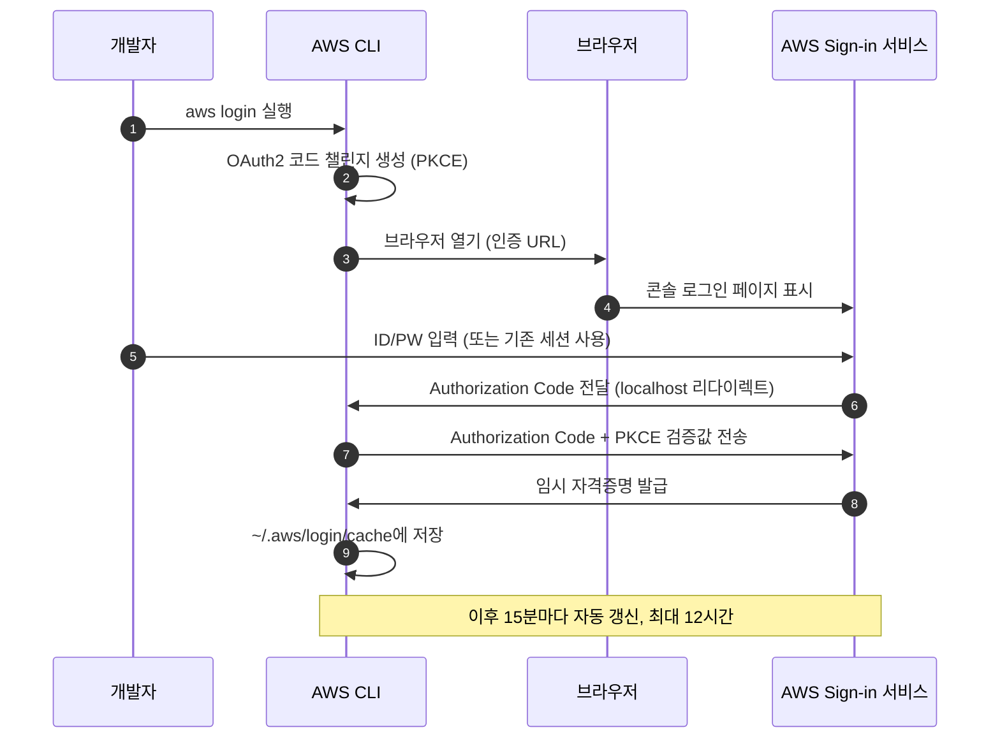

# aws login — Access Key 없이 AWS CLI 인증하기

## 목차

- [공부 배경](#공부-배경)
- [이 글을 읽고 답할 수 있는 질문](#이-글을-읽고-답할-수-있는-질문)
- [Access Key의 문제](#access-key의-문제)
- [aws login이란](#aws-login이란)
- [동작 원리 — OAuth2 Authorization Code Flow](#동작-원리--oauth2-authorization-code-flow)
- [필수 조건](#필수-조건)
- [기존 방식과 비교](#기존-방식과-비교)
- [헷갈리면 안되는 점](#헷갈리면-안되는-점)
- [실습](#실습)
- [결론](#결론)
- [참고자료](#참고자료)

## 공부 배경

지금까지 IAM User가 AWS CLI를 사용하려면 Access Key를 발급받아야 했습니다. 다른 방법이 없었습니다.

Access Key는 한번 발급하면 삭제하기 전까지 영구적으로 유효한 장기 자격증명(Long-term Credential)입니다. 키가 유출되면 바로 보안 사고로 이어집니다.

그래서 AWS는 항상 "Access Key 대신 IAM Role이나 Identity Center를 쓰세요"라고 권장해왔습니다. 하지만 개인 계정이나 소규모 팀에서 Identity Center를 구성하는 건 과한 경우가 많았습니다.

2025년 11월, AWS가 이 문제를 해결하는 `aws login` 명령어를 공개했습니다. **Access Key 없이도 브라우저 로그인만으로 CLI 임시 자격증명을 받을 수 있게 된 것입니다.**

## 이 글을 읽고 답할 수 있는 질문

1. Access Key의 보안 문제가 정확히 무엇인가?
2. `aws login`은 어떤 원리로 동작하는가?
3. `aws login`을 사용하려면 어떤 IAM 권한이 필요한가?
4. Access Key, `aws login`, `aws sso login`의 차이는 무엇인가?
5. `aws login`과 IAM Identity Center(SSO)는 같은 것인가?

## Access Key의 문제

IAM User의 CLI 인증 흐름은 지금까지 이랬습니다.

1. AWS 콘솔에서 IAM User 생성
2. Access Key(Access Key ID + Secret Access Key) 발급
3. 개발자 PC의 `~/.aws/credentials` 파일에 키 저장
4. CLI 명령 실행 시 이 키를 사용하여 인증

문제는 3번입니다. **`~/.aws/credentials`에 저장된 Access Key는 만료되지 않는 평문 자격증명입니다.**

이게 왜 위험하냐면:

- 노트북을 분실하면 키가 그대로 유출됩니다
- `.env` 파일이나 git commit에 실수로 키가 포함되면 즉시 악용 가능합니다
- 퇴사자의 키를 회수하지 못하면 외부에서 계속 접근할 수 있습니다
- 키 로테이션을 주기적으로 해야 하지만, 수동 관리라 잊기 쉽습니다

AWS도 이 문제를 알고 있습니다. CloudTrail에서 오래된 Access Key 사용을 경고하고, IAM Access Analyzer로 미사용 키를 탐지하는 등 여러 장치를 만들었습니다. 하지만 근본적인 해결은 아니었습니다.

`aws login`은 이 근본 문제를 해결합니다. **장기 자격증명 자체를 없앤 것입니다.**

## aws login이란

`aws login`은 AWS CLI v2.32.0에서 추가된 명령어입니다.

**브라우저에서 AWS 콘솔에 로그인하면, CLI가 임시 자격증명을 자동으로 받아오는 기능입니다.** 콘솔 로그인 방식(Root User, IAM User, 페더레이션)을 그대로 사용합니다.

핵심을 정리하면:

- Access Key를 발급할 필요가 없습니다
- 임시 자격증명이 자동으로 발급되고, 15분마다 자동 갱신됩니다
- 최대 12시간 유효하며, 만료되면 다시 `aws login`을 실행합니다
- 자격증명은 `~/.aws/login/cache`에 저장됩니다

## 동작 원리 — OAuth2 Authorization Code Flow

`aws login`은 내부적으로 OAuth2 Authorization Code Flow + PKCE를 사용합니다.

그런데, OAuth2가 뭔지 몰라도 사용하는 데는 문제없습니다. 중요한 건 "브라우저에서 로그인하면 CLI가 알아서 임시 키를 받아온다"는 것입니다. 원리가 궁금한 분을 위해 설명합니다.



단계별로 보면:

1. `aws login`을 실행하면 CLI가 내부적으로 OAuth2 코드 챌린지(PKCE)를 생성합니다
2. CLI가 브라우저를 열어 AWS 로그인 페이지로 이동시킵니다
3. 이미 콘솔에 로그인되어 있으면 "Continue with an active session" 화면이 보입니다
4. 로그인하면 AWS가 Authorization Code를 CLI에 전달합니다 (localhost로 리다이렉트)
5. CLI가 이 코드와 PKCE 검증값을 AWS에 보내서 임시 자격증명을 받습니다
6. 자격증명은 `~/.aws/login/cache`에 저장되고, 15분마다 자동 갱신됩니다

CloudTrail에는 `AuthorizeOAuth2Access` 이벤트가 기록됩니다. OAuth2 리소스 ARN은 `arn:aws:signin:<region>:<account-id>:oauth2/public-client/localhost`입니다.

## 필수 조건

`aws login`을 사용하려면 두 가지가 필요합니다.

### 1. AWS CLI v2.32.0 이상

AWS CLI 버전을 확인합니다.

```bash
aws --version
# aws-cli/2.32.0 이상이어야 합니다
```

버전이 낮으면 업데이트합니다.

```bash
# Linux
curl "https://awscli.amazonaws.com/awscli-exe-linux-x86_64.zip" -o "awscliv2.zip"
unzip awscliv2.zip
sudo ./aws/install --update
```

### 2. IAM 권한: signin 서비스 액션 2개

**IAM User에 `signin:AuthorizeOAuth2Access`와 `signin:CreateOAuth2Token` 권한이 있어야 합니다.** 이 두 권한이 없으면 `aws login`은 동작하지 않습니다.

IAM Policy JSON 예시입니다.

```json
{
  "Version": "2012-10-17",
  "Statement": [
    {
      "Effect": "Allow",
      "Action": [
        "signin:AuthorizeOAuth2Access",
        "signin:CreateOAuth2Token"
      ],
      "Resource": "*"
    }
  ]
}
```

이 권한은 AWS 콘솔 로그인 서비스(`signin`)에 대한 것입니다. IAM User에 직접 붙이거나, IAM Group을 통해 부여할 수 있습니다.

## 기존 방식과 비교

CLI 인증 방식 3가지를 비교합니다.

| 항목 | Access Key | `aws login` | `aws sso login` |
|------|-----------|-------------|-----------------|
| 자격증명 유형 | 장기 (영구) | 임시 (최대 12시간) | 임시 |
| 인증 방식 | Access Key ID + Secret | 브라우저 로그인 | 브라우저 로그인 |
| 저장 위치 | `~/.aws/credentials` | `~/.aws/login/cache` | `~/.aws/sso/cache` |
| 자동 갱신 | 없음 (영구) | 15분마다 자동 갱신 | 자동 갱신 |
| 필요 인프라 | IAM User만 있으면 됨 | IAM User + signin 권한 | IAM Identity Center 구성 필요 |
| 대상 | IAM User | Root User, IAM User, 페더레이션 | Identity Center 사용자 |
| CLI 버전 | 모든 버전 | v2.32.0 이상 | v2 이상 |

**개인 계정이나 소규모 팀에서 Identity Center 없이 보안을 강화하려면 `aws login`이 가장 적합합니다.**

## 헷갈리면 안되는 점

### aws login ≠ aws sso login

이 두 명령어는 완전히 다릅니다.

- `aws login`: IAM User, Root User, 페더레이션 사용자를 위한 기능입니다. IAM Identity Center가 필요 없습니다.
- `aws sso login`: IAM Identity Center(구 AWS SSO)를 통해 인증하는 기능입니다. Identity Center 구성이 선행되어야 합니다.

### 프로필 지원

여러 AWS 계정을 사용한다면 프로필을 지정할 수 있습니다.

```bash
aws login --profile staging
aws sts get-caller-identity --profile staging
```

### 원격 서버에서 사용하기

브라우저가 없는 원격 서버(EC2, SSH 접속 환경)에서는 `--remote` 옵션을 사용합니다.

```bash
aws login --remote
```

화면에 URL과 코드가 표시되면, 브라우저가 있는 로컬 PC에서 해당 URL에 접속하여 인증합니다. 이 방식은 OAuth2 Device Authorization Grant를 사용합니다.

## 실습

실습자료는 저의 GitHub에 있습니다.

- Terraform 코드: [terraform/](../terraform/)
- 핸즈온 가이드: [hands-on.md](./hands-on.md)

## 결론

`aws login`은 "IAM User는 Access Key가 필수"라는 오래된 전제를 깨뜨린 기능입니다. 장기 자격증명을 발급하지 않고도 CLI를 사용할 수 있게 되면서, 개인 계정과 소규모 팀의 보안 수준을 한 단계 올릴 수 있게 되었습니다.

## 참고자료

- https://aws.amazon.com/blogs/security/simplified-developer-access-to-aws-with-aws-login/
- https://docs.aws.amazon.com/cli/latest/userguide/cli-configure-sign-in.html
- https://docs.aws.amazon.com/signin/latest/userguide/command-line-sign-in.html
