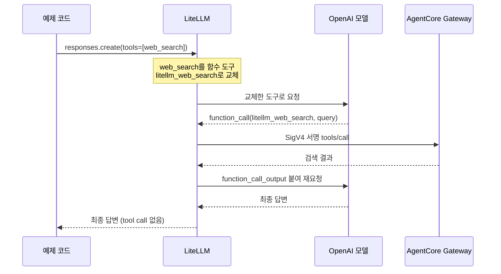
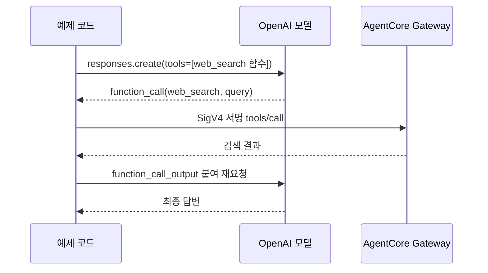
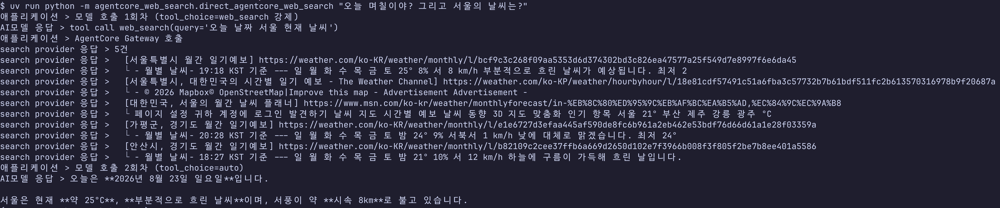

# AgentCore Web Search

먼저 [환경 구성](./1-setup.md)의 AgentCore 기동까지 끝내 두세요. 여기서는 그렇게 만들어 둔 Gateway를 실제로 불러 봅니다.

> 이 실습은 `aws login`으로 받은 임시 세션 위에서 돌아가요. 인증이나 로그인 오류가 보이면 [환경 구성](./1-setup.md)의 AWS 로그인 갱신을 먼저 해 주세요.

AgentCore Web Search는 AgentCore Gateway 위에 MCP 도구 하나로 올라가 있어요. MCP는 모델이 외부 도구를 부르는 규약이고, Gateway는 그 도구를 대신 들고 있는 창구라고 보면 됩니다. 그런데 이 도구를 모델이 쓰게 만드는 방법이 하나가 아니더라고요. 크게 두 갈래인데, 이 문서는 두 갈래를 각각 한 번씩 실행해 봅니다.

첫 번째는 LiteLLM이 중간에서 요청을 가로채 대신 검색해 주는 방식이에요. 클라이언트는 도구 호출을 아예 만지지 않습니다. 두 번째는 클라이언트가 Gateway를 직접 부르는 방식이고, 도구 호출 루프를 애플리케이션이 들고 있게 됩니다. 두 시나리오는 같은 모델과 같은 Gateway를 씁니다. 다른 건 딱 하나, 검색을 누가 실행하느냐예요.

## 리소스 관리

스크립트 세 개가 수명 주기를 나눠 맡고 있어요. `scripts/create-agentcore-resources.sh`가 IAM 역할과 Gateway, target, CloudWatch Logs 전송을 순서대로 만들고, `scripts/install-web-search-target.sh`는 같은 이름의 target이 있으면 갱신하고 없으면 새로 만듭니다. 정리할 때는 `scripts/delete-agentcore-resources.sh`가 의존 관계의 역순으로 지웁니다. 모든 AWS 명령이 `us-east-1`을 명시하고 있으니 리전은 신경 쓰지 않아도 돼요.

여기서 하나만 기억해 두면 뒤가 편합니다. Gateway에 올라간 도구 이름은 `<target 이름>___<connector 구성 이름>` 규칙을 따라요. 이 실습에서는 `web-search-tool___WebSearch`가 되고, 두 시나리오 모두 이 이름으로 도구를 부릅니다. 밑줄이 세 개인 것도 규칙이라 하나만 빠져도 "tool not found"가 납니다.

## 시나리오 1: LiteLLM이 대신 검색하기

클라이언트가 하는 일은 OpenAI Responses API에 내장 `web_search` 도구를 켠 요청 하나를 보내는 게 전부예요. 그다음은 LiteLLM이 알아서 합니다.

말로만 들으면 감이 잘 안 오죠. 요청 하나가 서버 안에서 어떻게 풀리는지 그림으로 먼저 봅니다.



LiteLLM이 이렇게 움직이는 근거는 설정 파일 한 곳에 다 들어 있어요. `websearch_interception` callback이 OpenAI 요청의 `web_search`를 가로채고, `agentcore-search`라는 search tool이 그 검색을 AgentCore Gateway로 보냅니다.

```yaml
search_tools:
  - search_tool_name: agentcore-search
    litellm_params:
      search_provider: agentcore
      api_base: os.environ/AGENTCORE_GATEWAY_URL

litellm_settings:
  callbacks: ["websearch_interception"]
  websearch_interception_params:
    enabled_providers: ["openai"]
    search_tool_name: agentcore-search
```

그래서 클라이언트 코드에는 AgentCore도, 검색을 실행하는 코드도 없습니다. OpenAI SDK로 LiteLLM을 부르는 게 정말 끝이에요.

```python
from openai import OpenAI

client = OpenAI(
  base_url="http://localhost:4001/v1",
  api_key="sk-local-agentcore",
)

response = client.responses.create(
  model="openai-search-agent",
  input="오늘 며칠이야? 그리고 서울의 날씨는?",
  tools=[{"type": "web_search"}],
)
```

준비된 예제로 질의를 지정해 실행해 보세요.

```bash
uv run --env-file .env python -m agentcore_web_search.litellm_with_agentcore_web_search \
  "오늘 며칠이야? 그리고 서울의 날씨는?"
```

## 시나리오 1의 응답, 처음엔 저도 헷갈렸어요

처음 이걸 돌렸을 때 저는 응답만 보고 한참 헤맸습니다. 답은 그럴듯하게 나오는데 검색을 했다는 흔적이 응답 어디에도 없더라고요. "이거 진짜 검색한 거 맞나, 아니면 모델이 아는 대로 답한 건가?" 싶었죠.

이유는 앞의 그림 두 번째 단계에 있어요. LiteLLM이 OpenAI 내장 `web_search`를 자기 함수 도구로 바꿔치기했으니, OpenAI 내장 검색이 남기는 `web_search_call` 항목도 URL 인용도 응답에 있을 수가 없거든요. 흔적이 없는 게 정상이라는 걸 알기까지가 오래 걸렸습니다.

그래서 예제가 응답 본문 뒤에 두 줄을 더 찍도록 해 뒀어요. 눈으로 확인할 게 있어야 마음이 놓이잖아요.

```text
오늘은 2026년 8월 23일 일요일입니다. ...
LiteLLM이 모델에 보낸 도구: ['litellm_web_search']
클라이언트가 처리한 tool call: 0건
```

첫 줄은 모델에게 실제로 간 도구가 `litellm_web_search`였다는 뜻이라 교체가 일어났다는 증거예요. 둘째 줄의 0건은 도구 호출 루프를 클라이언트가 아니라 LiteLLM이 돌렸다는 증거고요. 이 교체가 없으면 예제는 그냥 실패로 끝나게 해 뒀습니다. 설정이 빠졌는데 답변만 그럴듯하게 나오는 상황이 제일 위험하거든요.

## 검색이 진짜 돌았는지 서버에서 확인하기

응답으로 확신이 안 서면 서버 쪽 기록을 보면 됩니다. LiteLLM은 요청 하나가 실제로 몇 번의 호출로 풀렸는지 spend log에 남겨요. 검색은 `agentcore/search`, 모델 호출은 `openai/...`로 찍힙니다.

```bash
docker compose exec postgres psql -U litellm -d litellm \
  -c 'select "startTime", model, call_type from "LiteLLM_SpendLogs" order by "startTime" desc limit 6;'
```

제 경우에는 이렇게 나왔어요. 클라이언트 요청은 분명히 한 번이었는데 안쪽에서는 모델 호출 두 번, 검색 두 번이 돌아 있었습니다. 이걸 보고 나서야 인터셉트가 동작한다는 확신이 들었어요.

```text
 2026-08-23 13:44:56.594 | openai/gpt-5.6-luna | aresponses
 2026-08-23 13:44:55.924 | agentcore/search    | asearch
 2026-08-23 13:44:55.923 | agentcore/search    | asearch
 2026-08-23 13:44:51.057 | openai/gpt-5.6-luna | aresponses
```

한 가지 조심할 게 있어요. 검색이 실패해도 모델은 조용히 자기가 아는 대로 답을 만들어 냅니다. 저는 검색이 실패한 줄 모르고 지어낸 날씨 답변을 한참 들여다봤어요. 답이 최신 정보 같지 않다 싶으면 로그부터 보는 게 빠릅니다.

```bash
docker compose logs litellm | grep WebSearchInterception
```

## 시나리오 2: 클라이언트가 직접 도구를 부르기

이번에는 LiteLLM을 거치지 않습니다. 시나리오 1에서 LiteLLM이 대신 해 주던 일을 애플리케이션이 그대로 하는 구조예요.

앞의 그림과 나란히 놓고 보면 차이가 한눈에 들어옵니다. 단계 수는 같고, 화살표를 그리는 주체만 바뀌었어요.



Gateway를 AWS_IAM 인증으로 만들었으니 요청에 SigV4 서명을 붙여야 해요. 서명 이름은 `bedrock-agentcore`고, 본문은 JSON-RPC `tools/call`입니다. 서명과 호출, 결과 파싱은 `search_web` 하나가 맡고 있어서 쓰는 쪽은 세 줄이면 됩니다.

```python
from agentcore_web_search import search_web

results = search_web(
  gateway_url="https://<gateway-id>.gateway.bedrock-agentcore.us-east-1.amazonaws.com/mcp",
  query="서울 날씨",
  region="us-east-1",
)
```

예제는 이 함수를 모델의 function tool로 연결하고, 모델이 도구를 그만 부를 때까지 루프를 돕니다. 첫 턴에는 `tool_choice`로 검색을 강제하고 두 번째 턴부터 `auto`로 풀어 둡니다. 왜 첫 턴만 강제하냐면, 매 턴 강제하면 모델이 검색 결과를 받고도 또 도구를 불러야 해서 최종 답변이 영영 안 나오거든요. 강제는 "이번 응답에 도구 호출을 넣어라"는 뜻이라 답변을 낼 자유까지 같이 막아 버려요.

```python
def tool_choice(turn: int) -> dict[str, str] | str:
  if turn == 1:
    return {"type": "function", "name": "web_search"}
  return "auto"
```

루프는 10회에서 끊어 두었어요. 처음에는 3회면 넉넉하겠지 했는데, 모델이 질문 하나를 검색 여러 번으로 쪼개서 던지는 바람에 도중에 끊기더라고요.

Gateway URL과 자격 증명은 `scripts/export-runtime-env.sh`가 만들어 둔 `.runtime.env`와 `.runtime.aws-credentials`에서 읽습니다.

```bash
set -a
source .env
source .runtime.env
set +a
export AWS_SHARED_CREDENTIALS_FILE="$PWD/.runtime.aws-credentials"
export AWS_PROFILE=runtime
uv run python -m agentcore_web_search.direct_agentcore_web_search "오늘 며칠이야? 그리고 서울의 날씨는?"
```

실행하면 누가 무슨 일을 했는지가 접두어로 갈려서 찍혀요. 저는 처음에 로그가 뒤섞여서 어디까지가 검색이고 어디부터가 모델 답인지 헷갈렸는데, 앞에 이름을 붙이고 나서야 흐름이 눈에 들어오더라고요.

```text
애플리케이션 > 모델 호출 1회차 (tool_choice=web_search 강제)
AI모델 응답 > tool call web_search(query='서울 현재 날씨')
애플리케이션 > AgentCore Gateway 호출
search provider 응답 > 5건
search provider 응답 >   [서울특별시 월간 일기예보] https://weather.com/ko-KR/weather/monthly/l/...
search provider 응답 >   └ - 월별 날씨- 19:18 KST 기준 --- 일 월 화 수 목 금 토 25° 8% 서 8 km/h 부분적으로 흐린
애플리케이션 > 모델 호출 2회차 (tool_choice=auto)
AI모델 응답 > 오늘은 2026년 8월 23일 일요일입니다. ...
```



`└` 줄이 모델에게 실제로 넘어가는 본문이에요. 처음에는 제목과 URL만 찍었는데, 그러면 답변에 나온 기온이 어디서 왔는지 알 수가 없더라고요. 로그에는 앞 80자만 보여 주고 모델에는 잘리지 않은 본문과 `publishedDate`가 통째로 갑니다.


시나리오 1에서 안 보이던 검색 질의와 출처가 여기서는 그대로 보입니다.

## 그래서 둘 중 뭘 골라야 하냐면

정답은 없고 상황만 있어요. 저도 처음엔 "더 나은 쪽"을 찾으려다 시간을 썼는데, 둘은 우열이 아니라 트레이드오프더라고요. 비교해야 보이는 항목들이라 표로 정리했습니다.

| 항목 | 시나리오 1 (LiteLLM) | 시나리오 2 (직접 호출) |
|---|---|---|
| 검색 실행 주체 | LiteLLM | 애플리케이션 |
| 클라이언트 코드 | OpenAI SDK 호출 하나 | 도구 정의와 루프 필요 |
| 검색 질의와 결과 | 서버 로그로만 확인 | 애플리케이션이 그대로 통제 |
| 모델 교체 | 설정만 변경 | 코드 변경 없음 |

여러 애플리케이션이 같은 검색 정책을 공유해야 하면 시나리오 1이 편해요. 설정 한 곳만 고치면 전부 따라오니까요. 반대로 검색 질의를 가공하거나 결과를 따로 저장해야 하면 시나리오 2가 낫습니다. 손에 쥐고 있어야 할 게 애플리케이션 안에 있거든요.

한 가지는 어느 쪽을 고르든 그대로예요. Web Search connector는 유해 질의를 자동으로 막아 주지 않습니다. 안전성 검사는 [유해 검색 대응](./5-safety.md)에서 따로 다뤄요.

## 구성 파일

어떤 파일이 무슨 일을 하는지 한 번에 보고 싶을 때를 위해 정리해 둡니다.

- `scripts/create-agentcore-resources.sh`: IAM, Gateway, target, 로그 전송 생성
- `scripts/delete-agentcore-resources.sh`: AgentCore와 IAM 리소스 삭제
- `scripts/install-web-search-target.sh`: target 생성과 갱신
- `scripts/delete-web-search-target.sh`: target 삭제
- `litellm/config.yaml`: AgentCore search provider와 OpenAI interception
- `src/agentcore_web_search/litellm_with_agentcore_web_search.py`: 시나리오 1 실행 예제
- `src/agentcore_web_search/agentcore_mcp_client.py`: Gateway MCP 직접 호출 클라이언트
- `src/agentcore_web_search/direct_agentcore_web_search.py`: 시나리오 2 실행 예제

## 참고 자료

- [AgentCore Web Search Tool](https://docs.aws.amazon.com/bedrock-agentcore/latest/devguide/gateway-target-connector-web-search-tool.html)
- [Gateway target 구성](https://docs.aws.amazon.com/bedrock-agentcore/latest/devguide/gateway-add-target-api-target-config.html)
