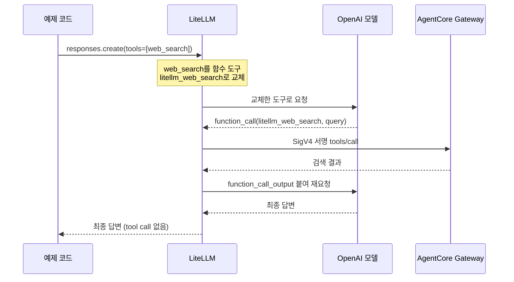
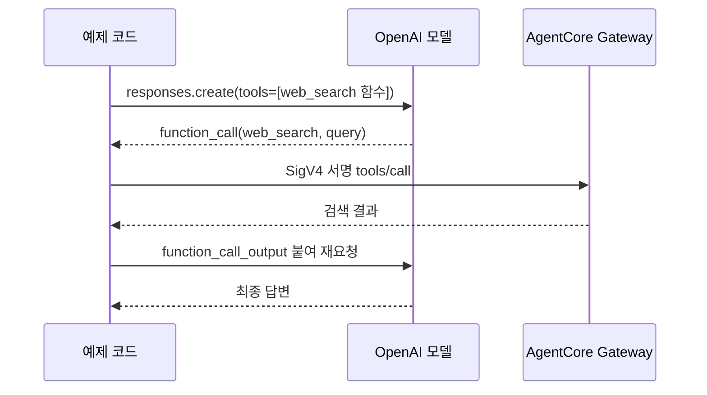

# AgentCore Web Search

[환경 구성](./1-setup.md)의 AgentCore 기동을 완료합니다.

> 이 실습은 `aws login`의 임시 세션으로 동작합니다. 인증이나 로그인 오류가 나면 [환경 구성](./1-setup.md)의 AWS 로그인 갱신을 따릅니다.

AgentCore Web Search는 AgentCore Gateway 위에 MCP 도구로 올라갑니다. 모델이 이 도구를 쓰게 만드는 방법은 두 가지이고, 이 문서는 두 방법을 각각 실행해 봅니다.

- 시나리오 1: LiteLLM이 중간에서 가로채 대신 검색합니다. 클라이언트는 도구 호출을 처리하지 않습니다.
- 시나리오 2: 클라이언트가 직접 Gateway를 호출합니다. 도구 호출 루프를 애플리케이션이 가집니다.

두 시나리오는 같은 모델과 같은 Gateway를 씁니다. 차이는 "검색을 누가 실행하는가" 하나입니다.

## 리소스 관리

`scripts/create-agentcore-resources.sh`는 IAM 역할, Gateway, target, CloudWatch Logs 전송을 순서대로 생성합니다. 모든 AWS 명령은 `us-east-1`을 명시합니다.

`scripts/install-web-search-target.sh`는 같은 이름의 target이 없으면 생성하고, 있으면 갱신합니다. `scripts/delete-agentcore-resources.sh`는 의존 관계의 역순으로 전체 리소스를 삭제합니다.

Gateway에 올라간 도구 이름은 `<target 이름>___<connector 구성 이름>` 규칙을 따르므로 이 실습에서는 `web-search-tool___WebSearch`입니다. 두 시나리오 모두 이 이름으로 도구를 호출합니다.

## 시나리오 1: LiteLLM 인터셉트

클라이언트는 OpenAI Responses API에 내장 `web_search` 도구를 켠 요청 하나만 보냅니다. 그다음은 LiteLLM이 처리합니다.



LiteLLM이 이 일을 하는 근거는 `litellm/config.yaml`에 있습니다. `websearch_interception` callback이 OpenAI 요청의 `web_search`를 가로채고, `agentcore-search` search tool이 AgentCore Gateway로 연결됩니다.

```yaml
search_tools:
  - search_tool_name: agentcore-search
    litellm_params:
      search_provider: agentcore
      api_base: os.environ/AGENTCORE_GATEWAY_URL

litellm_settings:
  callbacks: ["websearch_interception"]
  websearch_interception_params:
    enabled_providers: ["openai"]
    search_tool_name: agentcore-search
```

클라이언트 코드에는 AgentCore도 검색 도구 실행 코드도 없습니다. OpenAI SDK로 LiteLLM을 부르는 것이 전부입니다.

```python
from openai import OpenAI

client = OpenAI(
  base_url="http://localhost:4001/v1",
  api_key="sk-local-agentcore",
)

response = client.responses.create(
  model="openai-search-agent",
  input="오늘 며칠이야? 그리고 서울의 날씨는?",
  tools=[{"type": "web_search"}],
)
```

질의를 지정해 실행합니다.

```bash
uv run --env-file .env python -m agentcore_web_search.litellm_with_agentcore_web_search \
  "오늘 며칠이야? 그리고 서울의 날씨는?"
```

## 시나리오 1의 응답 읽는 법

응답에는 검색의 흔적이 거의 남지 않습니다. LiteLLM이 OpenAI 내장 `web_search`를 자기 함수 도구로 바꿔 버렸으므로, OpenAI 내장 검색이 남기는 `web_search_call` 항목과 URL 인용이 없습니다.

그래서 예제는 응답의 `tools`와 클라이언트가 받은 도구 호출 수를 함께 출력합니다. 모델에게 간 도구가 `litellm_web_search`라는 것이 인터셉트가 일어났다는 증거이고, 클라이언트 tool call이 0건이라는 것이 검색 루프를 LiteLLM이 대신 돌렸다는 증거입니다.

```text
오늘은 2026년 8월 23일 일요일입니다. ...
LiteLLM이 모델에 보낸 도구: ['litellm_web_search']
클라이언트가 처리한 tool call: 0건
```

이 교체가 없으면 예제는 실패로 끝납니다. `litellm/config.yaml`의 callback 설정이 빠졌을 때 답변만 그럴듯하게 나오는 상황을 막기 위해서입니다.

## 시나리오 1의 서버 측 확인

요청 하나가 실제로 몇 번의 호출로 풀렸는지는 LiteLLM의 spend log에 남습니다. `agentcore/search` 행이 검색이고 `openai/...` 행이 모델 호출입니다.

```bash
docker compose exec postgres psql -U litellm -d litellm \
  -c 'select "startTime", model, call_type from "LiteLLM_SpendLogs" order by "startTime" desc limit 6;'
```

한 번의 클라이언트 요청에서 검색과 모델 호출이 번갈아 기록되면 인터셉트가 동작한 것입니다.

```text
 2026-08-23 13:44:56.594 | openai/gpt-5.6-luna | aresponses
 2026-08-23 13:44:55.924 | agentcore/search    | asearch
 2026-08-23 13:44:55.923 | agentcore/search    | asearch
 2026-08-23 13:44:51.057 | openai/gpt-5.6-luna | aresponses
```

검색이 실패해도 모델은 아는 대로 답을 만들어 냅니다. 답이 최신 정보 같지 않으면 LiteLLM 로그에서 검색 오류를 확인합니다.

```bash
docker compose logs litellm | grep WebSearchInterception
```

## 시나리오 2: 클라이언트 직접 tool calling

LiteLLM을 거치지 않고 애플리케이션이 Gateway를 직접 부릅니다. 시나리오 1에서 LiteLLM이 하던 일을 그대로 애플리케이션이 합니다.



Gateway는 AWS_IAM 인증으로 만들었으므로 `bedrock-agentcore` 서비스 이름으로 SigV4 서명한 JSON-RPC `tools/call` 요청을 보냅니다. `search_web`이 서명과 호출, 결과 파싱을 담당합니다.

```python
from agentcore_web_search import search_web

results = search_web(
  gateway_url="https://<gateway-id>.gateway.bedrock-agentcore.us-east-1.amazonaws.com/mcp",
  query="서울 날씨",
  region="us-east-1",
)
```

예제는 이 함수를 모델의 function tool로 연결하고, 모델이 도구를 그만 부를 때까지 루프를 돕니다. Gateway URL과 자격 증명은 `scripts/export-runtime-env.sh`가 만든 `.runtime.env`와 `.runtime.aws-credentials`에서 읽습니다.

```bash
set -a
source .env
source .runtime.env
set +a
export AWS_SHARED_CREDENTIALS_FILE="$PWD/.runtime.aws-credentials"
export AWS_PROFILE=runtime
uv run python -m agentcore_web_search.direct_agentcore_web_search "오늘 며칠이야? 그리고 서울의 날씨는?"
```

출력은 말하는 주체를 접두어로 구분합니다. 애플리케이션이 무엇을 했고 검색이 무엇을 돌려줬는지, 모델이 언제 도구를 불렀는지가 한 줄씩 남습니다.

```text
애플리케이션 > 모델 호출 1회차 (tool_choice=web_search 강제)
AI모델 응답 > tool call web_search(query='서울 현재 날씨')
애플리케이션 > AgentCore Gateway 호출
search provider 응답 > 5건
search provider 응답 >   [서울특별시 월간 일기예보] https://weather.com/ko-KR/weather/monthly/l/...
search provider 응답 >   └ - 월별 날씨- 19:18 KST 기준 --- 일 월 화 수 목 금 토 25° 8% 서 8 km/h 부분적으로 흐린
애플리케이션 > 모델 호출 2회차 (tool_choice=auto)
AI모델 응답 > 오늘은 2026년 8월 23일 일요일입니다. ...
```


로그의 `└` 줄이 모델에게 실제로 전달되는 본문입니다. 제목과 URL만으로는 답변의 근거를 알 수 없어 앞 80자를 함께 출력합니다. 모델에는 잘리지 않은 전체 본문과 `publishedDate`가 JSON으로 전달됩니다.


첫 턴에만 `tool_choice`로 검색을 강제하고, 두 번째 턴부터는 `auto`로 풉니다. 검색 여부를 모델 판단에 맡기지 않으면서도 최종 답변을 받으려면 이 구분이 필요합니다. 매 턴 강제하면 모델은 검색 결과를 받은 뒤에도 도구를 또 불러야 하므로 답변이 나오지 않습니다.

```python
def tool_choice(turn: int) -> dict[str, str] | str:
  if turn == 1:
    return {"type": "function", "name": "web_search"}
  return "auto"
```

도구 호출 루프는 10회에서 끊습니다. 질문 하나에 검색을 여러 번 나눠 하는 모델이 있어 3회로는 모자랐습니다.

## 두 시나리오의 선택 기준

| 항목 | 시나리오 1 (LiteLLM) | 시나리오 2 (직접 호출) |
|---|---|---|
| 검색 실행 주체 | LiteLLM | 애플리케이션 |
| 클라이언트 코드 | OpenAI SDK 호출 하나 | 도구 정의와 루프 필요 |
| 검색 질의와 결과 | 서버 로그로만 확인 | 애플리케이션이 그대로 통제 |
| 모델 교체 | 설정만 변경 | 코드 변경 없음 |

정답은 없습니다. 여러 애플리케이션이 같은 검색 정책을 공유해야 하면 시나리오 1이 유리하고, 검색 질의를 가공하거나 결과를 저장해야 하면 시나리오 2가 유리합니다.

Web Search connector는 유해 질의를 자동 차단하지 않습니다. 안전성 검사는 [유해 검색 대응](./5-safety.md)을 따릅니다.

## 구성 파일

- `scripts/create-agentcore-resources.sh`: IAM, Gateway, target, 로그 전송 생성
- `scripts/delete-agentcore-resources.sh`: AgentCore와 IAM 리소스 삭제
- `scripts/install-web-search-target.sh`: target 생성과 갱신
- `scripts/delete-web-search-target.sh`: target 삭제
- `litellm/config.yaml`: AgentCore search provider와 OpenAI interception
- `src/agentcore_web_search/litellm_with_agentcore_web_search.py`: 시나리오 1 실행 예제
- `src/agentcore_web_search/agentcore_mcp_client.py`: Gateway MCP 직접 호출 클라이언트
- `src/agentcore_web_search/direct_agentcore_web_search.py`: 시나리오 2 실행 예제

## 참고 자료

- [AgentCore Web Search Tool](https://docs.aws.amazon.com/bedrock-agentcore/latest/devguide/gateway-target-connector-web-search-tool.html)
- [Gateway target 구성](https://docs.aws.amazon.com/bedrock-agentcore/latest/devguide/gateway-add-target-api-target-config.html)
