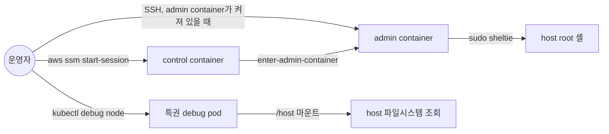
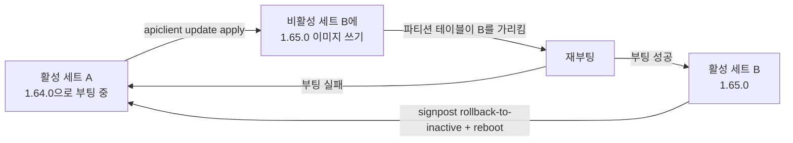

# Bottlerocket 원리

Bottlerocket은 컨테이너 실행에 필요한 것만 담은 AWS 주도 Linux다. 일반 배포판과 가장 크게 다른 점은 운영 단위다. 패키지 하나가 아니라 OS 이미지 전체를 바꾸고, 파일을 고치는 대신 API로 설정을 넣는다. 그래서 SSH, 셸, 패키지 관리자가 host에 없다. 이 문서는 그 구조를 "들어가는 길 → 설정 → 파일시스템 → 업데이트" 순서로 정리한다. 각 절 끝에 그 원리를 확인하는 실습 문서를 적는다.

## 이미지는 변형 단위로 나온다

- 이미지 종류를 변형(variant)이라 부른다. `aws-k8s-1.36`은 EKS 1.36 노드용, `aws-ecs-2`는 ECS용이다
- 변형이 kubelet 버전을 고정한다. `aws-k8s-1.36` 안에서는 OS 패치만 올라가고, Kubernetes minor를 올리려면 변형이 다른 새 AMI로 노드를 교체한다
- AMI는 SSM public parameter `/aws/service/bottlerocket/<변형>/<arch>/<버전>/image_id`로 조회한다. 버전 자리에 `latest`나 `1.64.0` 같은 값을 넣는다
- EKS 관리형 노드그룹은 `ami_type`을 `BOTTLEROCKET_ARM_64`나 `BOTTLEROCKET_x86_64`로 주면 클러스터 버전에 맞는 변형을 고른다

## 일반 EKS 노드와 운영 모델이 다르다

AL2023 EKS 노드와 비교하면 차이가 드러난다.

| 항목 | AL2023 EKS 노드 | Bottlerocket |
|---|---|---|
| 소프트웨어 변경 | dnf로 패키지 단위 | OS 이미지 전체 교체 |
| 셸, 인터프리터 | bash, python | host에 없음 |
| SSH 서버 | host의 sshd | host에 없음. admin container가 제공 |
| 루트 파일시스템 | 읽기 쓰기 | 읽기 전용, dm-verity로 검증 |
| `/etc` | 디스크 | tmpfs. 부팅마다 설정에서 다시 렌더링 |
| 설정 변경 | 파일 편집, user data 셸 스크립트 | API(`apiclient`), user data TOML |
| 노드 조인 설정 | nodeadm `NodeConfig` | `settings.kubernetes` TOML |
| OS 업데이트 | `dnf update` 또는 AMI 교체 | A/B 파티션 전환 또는 AMI 교체 |
| SELinux | 기본 permissive | enforcing, 끌 수 없음 |

표의 모든 행은 한 가지 목표로 모인다. 노드의 상태가 "이미지 + 설정 값"만으로 결정되게 만드는 것이다. 누군가 노드에 들어가 파일을 고치면 그 노드는 다른 노드와 달라지고, 다음 업데이트가 그 차이를 모른 채 적용된다. Bottlerocket은 그 경로를 구조로 차단한다.

## 셸은 host가 아니라 host container 안에 있다

host에 셸이 없어도 들어갈 수 있는 것은 host container 덕분이다. host container는 Kubernetes가 모르는 별도의 containerd 인스턴스에서 돈다. `kubectl get pod`에 나오지 않고, kubelet이 중단돼도 살아 있다.

| host container | 기본값 | 들어 있는 것 | 역할 |
|---|---|---|---|
| control | 켜짐 | SSM agent, `apiclient`, `enter-admin-container` | Session Manager 진입점. API 호출 |
| admin | 꺼짐 | sshd, `sheltie`, 일반 Linux 도구 | SSH 진입점. host root 셸로 가는 발판 |

admin container는 superpowered 권한으로 돈다. 그 안의 `sheltie`는 몇 줄짜리 스크립트다.

- `nsenter -t 1 -a`로 host PID 1의 모든 네임스페이스에 들어간다
- 실행하는 셸은 host의 것이 아니라 admin container 안의 정적 빌드 bash(`/proc/<부모 PID>/root/opt/bin/bash`)다. host에 셸이 없어도 root 셸이 열리는 이유다
- 셸만 빌려 올 뿐이라 이 셸도 읽기 전용 루트 파일시스템과 SELinux를 벗어나지 못한다. 실행할 수 있는 명령은 host에 있는 바이너리뿐이다

접속 경로는 다음 순서로 이어진다.

- 3가지 경로 모두 host에 새 프로그램을 설치하지 않는다. 필요한 도구는 컨테이너 이미지에 담아 들어간다
- admin container 이미지는 레지스트리에서 받는다. private subnet 노드면 NAT나 ECR VPC endpoint가 있어야 켤 수 있다. 이미지 주소는 `apiclient get settings.host-containers.admin.source`로 확인한다
- 노드 IAM role에 SSM 권한이 없으면 control container는 떠 있어도 Session Manager에 등록되지 않는다

이 구조를 직접 지나가는 실습은 [4-first-access.md](4-first-access.md)다. 노드 장애 때 어느 경로가 남는지는 [8-eks-emergency-access.md](8-eks-emergency-access.md)에서 비교한다.

## 설정은 API로만 바꾼다

- host에 apiserver가 Unix 소켓으로 떠 있다. `apiclient`는 이 소켓에 HTTP 요청을 보내는 클라이언트다
- 조회는 `apiclient get settings.motd`, 변경은 `apiclient set motd="hi"`다
- 부팅할 때 early-boot-config가 EC2 user data의 TOML을 읽어 같은 API로 넣는다. TOML의 `[settings.kubernetes]`는 API의 `settings.kubernetes.*`와 같은 키다
- API에 모델링된 키만 바꿀 수 있다. `settings.kubernetes` 아래 노출되지 않은 kubelet 옵션은 쓸 방법이 없다
- SELinux 정책이 대부분의 컴포넌트가 설정 저장소를 직접 고치지 못하게 한다. 설정을 바꾸는 길은 API 하나다

설정 값은 어디에 넣었느냐에 따라 남는 범위가 다르다.

| 설정 방법 | 재부팅 | 노드 교체 | 쓰는 곳 |
|---|---|---|---|
| user data TOML | 유지 | 유지 | 모든 영구 설정 |
| `apiclient set` | 유지 | 사라짐 | 장애 대응 중 임시 변경 |
| `/etc` 파일 직접 편집 | 사라짐 | 사라짐 | 쓰지 않는다 |

EKS 관리형 노드그룹에서 Bottlerocket `ami_type`을 쓰고 커스텀 AMI를 지정하지 않으면, EKS가 launch template의 TOML에 `settings.kubernetes`의 클러스터 이름, API server endpoint, CA를 병합한다. 호출자는 클러스터 접속 설정을 쓰지 않아도 된다. 커스텀 AMI를 지정하면 병합이 없으므로 직접 넣어야 한다. AL2023에서 커스텀 AMI를 쓸 때 `NodeConfig`를 직접 넣어야 하는 것과 같은 구조다.

지속 범위를 확인하는 실습은 [6-settings-and-update.md](6-settings-and-update.md)다.

## 루트 파일시스템은 읽기 전용이고 dm-verity가 블록을 검증한다

- 루트 파일시스템은 읽기 전용으로 마운트된다. root 권한 프로세스도 `/usr/bin`에 파일을 쓸 수 없다
- dm-verity는 루트 디바이스의 블록을 읽을 때마다 해시 트리와 대조한다. 해시 트리는 루트 디바이스에 함께 들어 있다
- 불일치를 찾으면 커널이 재시작한다. 변조된 상태로 계속 도는 대신 멈추는 fail closed 설계다
- 차단하려는 대표 공격은 컨테이너 탈출 후 host 바이너리를 덮어쓰는 것이다. runc 바이너리를 덮어쓴 CVE-2019-5736이 그 예다
- dm-verity만으로는 부족하다. 블록 디바이스 전체에 접근한 공격자는 해시 트리까지 바꿀 수 있다. Secure Boot가 부트로더부터 서명을 검증해 이 체인을 닫는다

쓸 수 있는 곳은 2군데다.

| 경로 | 저장 위치 | 재부팅 후 |
|---|---|---|
| `/etc` | tmpfs(메모리) | 사라짐. 부팅마다 API 설정에서 템플릿으로 다시 만든다 |
| `/local`, 그리고 bind mount된 `/var`, `/opt` | 데이터 볼륨 | 남음. OS 업데이트 후에도 남는다 |

`/etc/containerd/config.toml`을 직접 고쳐도 재부팅하면 원래대로 돌아가는 이유가 여기에 있다. 설정 파일은 결과물이고, 원본은 API 설정이다.

거부되는 작업을 하나씩 시도하는 실습은 [5-cannot-do.md](5-cannot-do.md)다.

## 볼륨은 2개이고 역할이 다르다

| 디바이스 | 기본 크기 | 담는 것 |
|---|---|---|
| `/dev/xvda` 루트 디바이스 | 2GiB(AMI 스냅샷) | 부트로더, A/B 파티션 세트, dm-verity 해시 트리, API 설정 저장소 |
| `/dev/xvdb` 데이터 디바이스 | 20GiB | 컨테이너 이미지, 로그, kubelet 데이터, host container 저장소. `/local`로 마운트 |

- 일반 AMI처럼 "루트 볼륨을 키우면 디스크가 늘어난다"가 성립하지 않는다. 이미지가 많은 노드에서 부족해지는 것은 xvdb다
- 부팅할 때 데이터 파티션을 디바이스 크기에 맞춰 늘린다. EBS를 키웠으면 재부팅하면 반영된다
- Nitro 인스턴스에서는 `/dev/xvda`, `/dev/xvdb`가 `nvme0n1`, `nvme1n1`로 표시된다

## 업데이트는 A/B 파티션 세트를 바꾸는 것이다

루트 디바이스에는 똑같은 파티션 세트가 A, B 2개 있다. 한쪽으로 부팅해 돌고, 다른 쪽은 비어 있거나 이전 버전이 남아 있다.

- 새 이미지는 TUF로 서명된 저장소에서 받는다. 비활성 세트에 통째로 쓰므로 패키지 DB가 꼬이는 중간 상태가 없다
- 부팅 성공 여부를 추적해서 실패하면 이전 세트로 자동으로 돌아간다
- 부팅은 됐지만 워크로드가 이상하면 `signpost rollback-to-inactive` 후 재부팅으로 수동 롤백한다. 네트워크가 필요 없다
- API 설정은 부팅 때 migration이 새 버전 형식으로 옮긴다

EKS 관리형 노드그룹에서는 이 A/B 전환을 쓰지 않고 노드그룹의 AMI 버전을 올려 노드를 교체하는 것이 기본이다. 선택 기준은 [9-operations.md](9-operations.md)에 있다. A/B 전환과 롤백을 직접 해 보는 실습은 [6-settings-and-update.md](6-settings-and-update.md)다.

## 원리와 실습의 대응

| 원리 | 확인하는 문서 | 확인하는 명령 |
|---|---|---|
| 셸은 host container 안에 있다 | [4-first-access.md](4-first-access.md) | 층마다 `cat /etc/os-release` |
| kubelet과 무관하게 host container가 돈다 | [4-first-access.md](4-first-access.md), [8-eks-emergency-access.md](8-eks-emergency-access.md) | `systemctl status kubelet`, `systemctl list-units 'host-containers@*'` |
| 루트는 읽기 전용, `/etc`는 tmpfs | [5-cannot-do.md](5-cannot-do.md) | `touch /usr/bin/hello`, `grep ' /etc ' /proc/mounts` |
| 설정 원본은 API, TOML이 영구 | [6-settings-and-update.md](6-settings-and-update.md) | `apiclient set` 후 재부팅과 교체 |
| 업데이트는 A/B 전환 | [6-settings-and-update.md](6-settings-and-update.md) | `signpost status`, `apiclient update apply` |
| EKS가 TOML에 `settings.kubernetes`를 병합 | [8-eks-emergency-access.md](8-eks-emergency-access.md) | `describe-instance-attribute --attribute userData` |

## 참고자료

- [Bottlerocket README](https://github.com/bottlerocket-os/bottlerocket/blob/develop/README.md)
- [Bottlerocket SECURITY_FEATURES](https://github.com/bottlerocket-os/bottlerocket/blob/develop/SECURITY_FEATURES.md)
- [Bottlerocket admin container](https://github.com/bottlerocket-os/bottlerocket-admin-container)
- [Bottlerocket control container](https://github.com/bottlerocket-os/bottlerocket-control-container)
