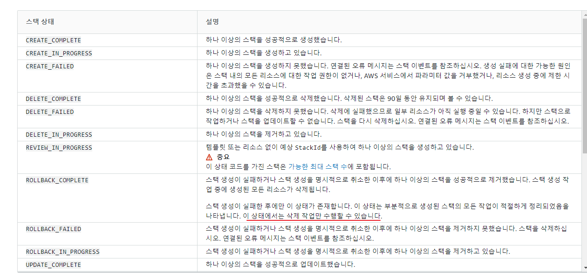

# 기록
* 운영입장에서는 테라폼이 안정적으로 보인다.
  * 첫 번쨰 실행 템플릿이 실패할 경우(syntax 에러 등) 삭제만 가능하다.




* 단, 테라폼은 최신 리소스 반영이 한 템포 느리다.

# create stack
```shg
aws cloudformation create-stack --stack-name [스택이름] --template-body file://[파일경로]
```

# udpate stack
```
aws cloudformation update-stack --stack-name [스택이름] --template-body file://[파일경로]
```

# VPC
> 참고자료: [AWS공식문서](https://docs.aws.amazon.com/ko_kr/AWSCloudFormation/latest/UserGuide/aws-resource-ec2-vpc.html)

```yaml
VPC:
    Type: AWS::EC2::VPC
    Properties: 
        CidrBlock: 10.0.0.0/16
        EnableDnsHostnames: true
        EnableDnsSupport: true
        InstanceTenancy: default
        Tags: 
        - Key: Name
            Value: !Join ['', [!Ref "AWS::StackName", "-VPC"]]
```

# subnet
## public subnet
```yaml
PublicSubnetA:
    Type: AWS::EC2::Subnet
    Properties: 
      AvailabilityZone: !Select [0, !GetAZs ]
      CidrBlock: 10.0.0.0/24
      MapPublicIpOnLaunch: true
      Tags: 
        - Key: Name
          Value: !Sub ${AWS::StackName}-Public-A
      VpcId: !Ref VPC
```

## private subent
```yaml
PublicSubnetA:
    Type: AWS::EC2::Subnet
    Properties: 
      AvailabilityZone: !Select [0, !GetAZs ]
      CidrBlock: 10.0.0.0/24
      MapPublicIpOnLaunch: true
      Tags: 
        - Key: Name
          Value: !Sub ${AWS::StackName}-Public-A
      VpcId: !Ref VPC
```

# 참고자료
* [1] [블로그](https://www.infoq.com/articles/aws-vpc-cloudformation/)