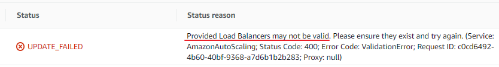

# cloudformation 단점
* 관리가 어려움
  * 속성이 변경되면 기존 것을 참고해서 변경하는 것이 아니므로 오류 발생
    * 다시 리소스를 삭제해서 생성해야 함 

# 기록

* alb는 AMI가 필요없고 Target Group만 필요
* TargetGroup에는 VPC, health check, listen port, security group 설정
* 리소스 이름 가져오기(여러가지 방법 존재)
```yaml
Resources:
  demo-resource:
    Tags:
    - Key: Name
      Value: !Sub ${AWS::StackName}
```
* SecurityGroup ALL 설정
```yaml
Resources:
  PublicAutoScalingSecurityGroup:
    Type: AWS::EC2::SecurityGroup
    SecurityGroupEgress:
      - IpProtocol: -1
        CidrIp: 0.0.0.0/0
```


* autoscaling을 만들 떄 필수 Tag 존재
```yaml
Resources:
  AutoScalingGroup:
    Tags:
    - Key: Environment
      Value: dev
      PropagateAtLaunch: "true"
```


* (todo) autoscaling threshold

* securitygroup groupname은 unique


* autoscalinggroup에 alb적용시 주의사항
  * TargetGroupARNs에 loadbalancer설정
  * LoadbalancerNames는 classic타입만 지원
```yaml
Resources:
  AutoScalingGroup:
    Properties
      TargetGroupARNs:
      - !Ref xxxx
```

