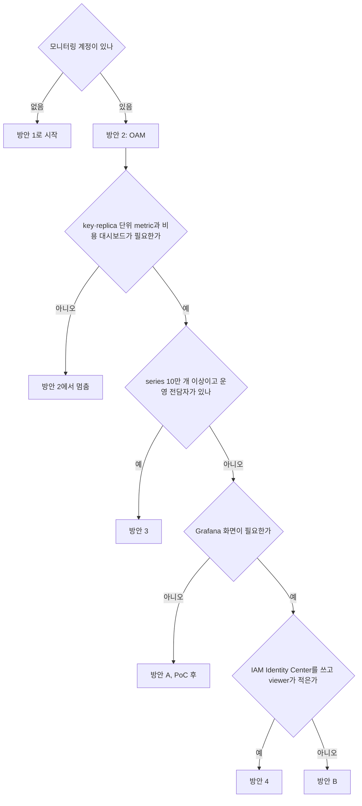

# 방안 선택

요구사항별로 6개 방안을 대조하고, 이 상황에서 고른 조합과 이유를 정리한다.

## 요구사항 대조

○ 충족, △ 일부, × 불충족

| 요구 | 1 | 2 | 3 | 4 | A | B |
|---|:-:|:-:|:-:|:-:|:-:|:-:|
| 한 화면에서 dev·prod | × | ○ | ○ | ○ | △ 쿼리마다 계정 지정 | ○ |
| replica 단위 | △ 정상 replica 수만 | △ 정상 replica 수만 | ○ | ○ | ○ | ○ |
| 90일 보관 | △ 63일 이후 1시간 해상도 | △ 63일 이후 1시간 해상도 | ○ | ○ | ○ 15개월 | ○ |
| key 단위 비용 | × | × | ○ | ○ | ○ | ○ |
| 처음 보는 사람 | △ 계정마다 로그인 | ○ | ○ | ○ | △ CloudWatch PromQL 화면 | ○ |
| 운영 부담 | ○ | ○ | × | ○ | ○ | △ Grafana 운영 |
| 계정 간 네트워크 공사 | 없음 | 없음 | 필요 | 없음 | 없음 | 없음 |
| 월 USD(기준 / 대규모) | 132 / 454 | 132 / 454 | 174 / 186 | 249 / 841 | 112 / 649 | 217 / 691 |

## 고르는 순서

위 대조를 질문 순서로 바꾼 흐름이다.

## 이 상황에서 고른 조합: 방안 2 + 방안 4

- 로그와 ECS·ALB metric은 방안 2(OAM)로 모니터링 계정에서 본다. 설정이 sink 1개와 link 계정당 1개라 가장 먼저 끝난다
- LiteLLM metric은 방안 4(AMP)에 90일 저장한다. 수집기에 remote write 목적지 하나만 추가하고, 계정 간 네트워크는 건드리지 않는다
- 화면은 AMG다. 사내 계정(IAM Identity Center)으로 로그인하고 서버 패치와 백업이 없다
- 추가 예정인 LiteLLM exporter는 같은 수집기에 scrape job 하나를 더해 같은 경로로 보낸다

감수할 점:

- 6개 방안 중 비용이 가장 높다(기준 월 249 USD). slim 설정을 넣으면 193 USD다
- viewer가 늘면 license가 는다. 가끔 보는 사람이 많아지면 대시보드 JSON을 그대로 들고 방안 B로 옮긴다
- CloudWatch PromQL(방안 A)이 과금 기준과 교차 계정 질의 제약에서 문제가 없으면 AMP·AMG 없이 더 낮은 비용으로 같은 요구를 채운다. PoC 결과에 따라 다시 판단한다

## 도입 순서

1. OAM sink·link와 모니터링 계정 CloudWatch 대시보드(방안 2)
2. 각 계정 수집기에 AMP remote write 추가, AMP 보관 90일 설정
3. LiteLLM 설정에 slim 항목 적용(`prometheus_exclude_labels`, `prometheus_exclude_metrics`)
4. AMG workspace, 사용자 배정, datasource 2개, 대시보드 3개 가져오기
5. LiteLLM exporter를 각 계정에 띄우고 수집기 scrape job 추가
6. 실패율·replica 수·시간당 spend에 alarm

## 처음 보는 사람을 위한 대시보드 원칙

이 실습의 대시보드는 아래를 지킨다. 새 패널을 더할 때도 같은 기준을 쓴다.

- 맨 위 텍스트 패널에 "무엇을 먼저 보고, 어느 숫자가 이상이면 문제인가"를 한 줄로 쓴다
- 첫 줄은 지금 괜찮은지(replica 수, 요청 수, 실패율, p95), 둘째 줄부터 원인(replica별, model별, 상태 코드별)이다
- 패널마다 description에 무엇을 세는지와 단위를 쓴다
- 비용 패널에는 LiteLLM 추정치이고 AWS 청구서와 다르다는 안내를 붙인다
- 계정과 저장소는 드롭다운 변수로 고른다. 같은 대시보드를 dev·prod와 VictoriaMetrics·AMP에 그대로 쓴다
