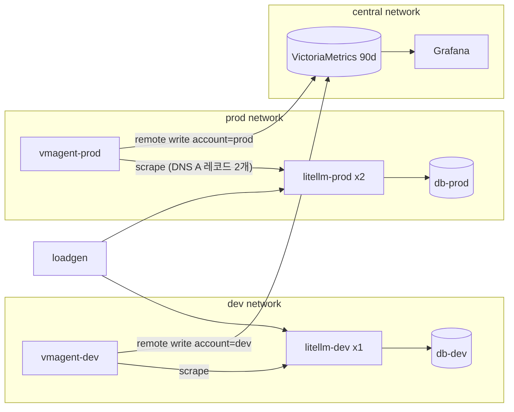

# 로컬 실습 환경

방안 3(중앙 Prometheus 호환 저장소 + Grafana)을 docker compose로 축소 재현한다. AWS 계정 없이 수집 구조, replica별 series, 대시보드 쿼리를 확인한다.

## 구조

compose network 3개가 계정 3개 역할을 한다. 모니터링 network는 LiteLLM에 닿지 않고, 계정 안의 vmagent가 밀어 넣는 값만 받는다.



- vmagent는 서비스 이름 하나로 replica를 모두 찾는다(`dns_sd_configs`). ECS에서 Cloud Map A 레코드로 찾는 구조와 같다
- 계정 구분은 vmagent의 `external_labels.account`가 붙인다

## up

workspace 루트에서 실행한다. 이미지를 받고 LiteLLM DB 마이그레이션이 끝나기까지 2~3분 걸린다.

```bash
docker compose up -d
```

| 주소 | 내용 |
|---|---|
| http://localhost:3100 | Grafana. 로그인 없이 Viewer로 열린다. 편집은 admin/admin |
| http://localhost:8428/vmui | VictoriaMetrics 질의 화면 |
| http://localhost:4101 | dev LiteLLM. master key `sk-local-master` |
| http://localhost:4102, 4103 | prod LiteLLM replica 2개 |

Grafana의 LiteLLM 폴더에 대시보드 2개가 프로비저닝된다.

- LiteLLM 운영 개요: replica 수, 요청 수, 실패율, p95, replica별 요청 수
- LiteLLM 비용: 계정·team·model·key별 spend

실습 절차는 [6-option3-selfhosted.md](6-option3-selfhosted.md)의 "로컬 실습"에 있다.

## down

저장된 metric과 LiteLLM DB volume까지 지운다.

```bash
docker compose down -v
```
