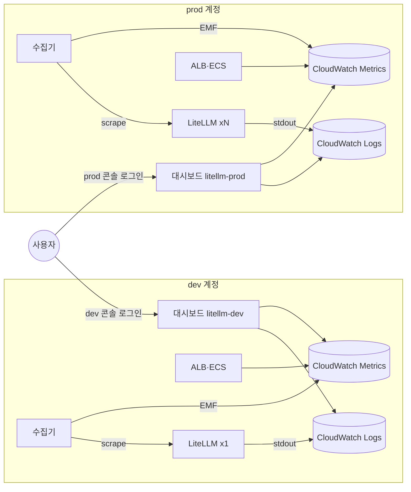

# 방안 1. 계정마다 CloudWatch 대시보드

dev와 prod 계정에 각자 CloudWatch 대시보드를 만든다. metric과 로그는 원래 있던 계정에서 벗어나지 않는다. 보는 사람이 계정을 바꿔 로그인한다.

## 구조

계정마다 같은 구성이 따로 있고, 보는 사람이 계정을 오간다.



## 대시보드에 올라가는 데이터

| 데이터 | 출처 | 추가 비용 |
|---|---|---|
| 요청 수, 5xx, p95 응답 시간, 정상 replica 수 | ALB(`AWS/ApplicationELB`) | 없음 |
| CPU·메모리 | ECS 서비스(`AWS/ECS`) | 없음 |
| model별 요청, team별 spend, 실패 요청 | 수집기가 LiteLLM `/metrics`를 EMF로 변환(`LiteLLM` namespace) | custom metric + EMF 로그 수집 |
| 에러 로그, 상태 코드 분포 | Logs Insights 위젯 | 스캔한 GB |

로그도 대시보드에 올라간다. CloudWatch 대시보드의 `log` 위젯은 Logs Insights 쿼리 결과를 표나 그래프로 그린다.

LiteLLM metric은 counter 5개만 CloudWatch로 보낸다. 수집기 설정은 [collector.yaml.tftpl](../terraform/modules/litellm-ecs/collector.yaml.tftpl)에 있다.

- dimension은 `requested_model`, `team_alias`, 없음 세 가지다. dimension 조합 하나가 custom metric 하나(월 0.30 USD)라서 key·replica는 넣지 않는다
- 선언하지 않은 metric도 EMF 로그로는 기록된다. 로그 수집 요금을 막으려고 `filter/emf`로 counter 5개만 남긴다
- counter는 awsemf가 직전 값과의 차이(delta)로 바꿔 보낸다. 그래서 CloudWatch의 Sum이 그 구간 증가량이다
- 이름은 Prometheus 이름 그대로다(`litellm_spend_metric_total`)

## 실습

[2-setup-aws.md](2-setup-aws.md)로 기본값 apply를 하면 방안 1이 만들어진다.

1. dev 계정 콘솔에서 CloudWatch → Dashboards → `litellm-dev`를 연다
2. "에러 로그 수"와 "최근 에러 로그"에 부하 생성기가 만든 `Invalid model name` 에러가 표시되는지 본다
3. LiteLLM custom metric 수를 센다. 5 × (model 수 + team 수 + 1) 안쪽이다

```bash
aws cloudwatch list-metrics --namespace LiteLLM --profile lab-dev --query 'length(Metrics)'
```

4. prod 계정으로 다시 로그인해 `litellm-prod`를 연다. dev와 prod의 요청 수를 한 그래프에서 비교할 수 없다

## 90일 보관

CloudWatch metric은 15개월 보관되지만 오래될수록 해상도가 낮아진다.

| 경과 | 해상도 |
|---|---|
| 15일까지 | 1분 |
| 63일까지 | 5분 |
| 455일까지 | 1시간 |

90일 전 추이는 1시간 단위로 본다. 로그는 로그 그룹 보관 기간(실습 90일)을 따른다.

## 비용

기준 시나리오에서 공통 비용 외에 월 83.2 USD다.

- custom metric: 계정당 5 × (6 + 10 + 1) = 85개, 무료 10개를 빼고 2개 계정 45.0 USD
- EMF 로그 수집: 38.2 USD. replica × key×model 조합 수에 비례해 규모가 커지면 가장 빨리 늘어난다
- 대시보드: 계정당 3개까지 무료

## 장단점

| 장점 | 단점 |
|---|---|
| 새 계정 설정이 없다. 각 계정에서 바로 만든다 | dev·prod를 한 그래프로 비교하지 못한다 |
| 권한이 계정 단위 그대로라 보안 검토가 짧다 | 보는 사람이 계정마다 권한을 받아야 한다 |
| 로그 위젯까지 CloudWatch 하나로 끝난다 | key·replica 단위 LiteLLM metric은 custom metric 비용 때문에 올리기 어렵다 |
| | latency 분포(histogram)는 ALB 지표로 대신한다 |

## 맞는 상황

- 모니터링 계정을 아직 준비하지 못했다
- 계정마다 담당자가 달라 자기 계정만 보면 된다
