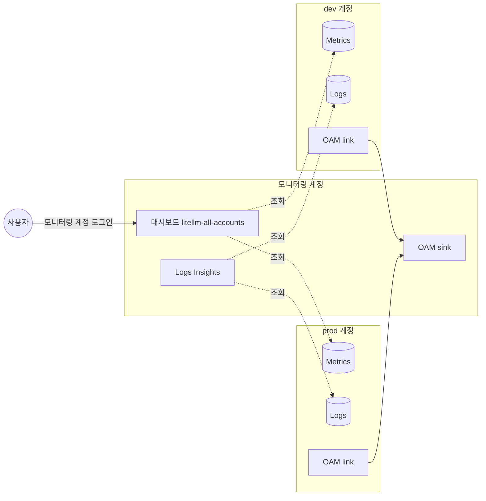

# 방안 2. OAM으로 모니터링 계정에서 함께 보기

CloudWatch cross-account observability(OAM)로 모니터링 계정이 dev·prod의 metric과 로그를 조회한다. 데이터는 복사하지 않는다. 대시보드는 방안 1과 같은 위젯에 `accountId`만 붙인다.

## 구조

점선은 복사 없이 조회만 하는 경로다.



## 동작 원리

- 모니터링 계정에 sink를 만들고, sink policy로 dev·prod 계정과 공유 대상(metric, 로그 그룹)을 허용한다
- dev·prod는 link를 만들어 sink에 붙는다. link에 filter를 걸어 공유 범위를 좁힌다

| 대상 | filter |
|---|---|
| 로그 그룹 | `LogGroupName LIKE '/litellm/%'` |
| metric | `Namespace IN ('AWS/ECS', 'ECS/ContainerInsights', 'AWS/ApplicationELB', 'LiteLLM')` |

- 대시보드 위젯은 계정을 이렇게 가리킨다

| 위젯 | 계정 지정 방법 |
|---|---|
| 일반 metric | metric 옵션에 `accountId` |
| Metrics Insights(SQL) | `GROUP BY AWS.AccountId` |
| 로그 | `SOURCE 'arn:aws:logs:...:log-group:/litellm/prod/app'` 처럼 로그 그룹 ARN |

- sink와 link는 같은 리전이어야 한다. 리전을 여러 개 쓰면 리전마다 만든다
- AWS Organizations 없이 계정 단위로 link를 걸 수 있다. 조직이 있으면 OU 단위로 건다
- 모니터링 계정에서 source 계정 metric으로 alarm을 만들 수 있다. 계정을 넘는 composite alarm은 안 된다

## 실습

`terraform.tfvars`에서 `enable_oam = true`로 바꾸고 apply한다.

1. 모니터링 계정에 붙은 link를 확인한다. dev·prod 2개가 나와야 한다

```bash
SINK=$(aws oam list-sinks --profile lab-monitoring --query 'Items[0].Arn' --output text)
aws oam list-attached-links --sink-identifier "$SINK" --profile lab-monitoring
```

2. 모니터링 계정 콘솔 → CloudWatch → Dashboards → `litellm-all-accounts`를 연다. 요청 수 그래프에 dev·prod 선이 함께 그려진다
3. 모니터링 계정 Logs Insights에서 source 계정 로그 그룹을 골라 아래 쿼리를 실행한다. `@log` 앞부분이 계정 ID다

```text
fields @timestamp, @log, level, message
| filter level = "ERROR"
| sort @timestamp desc
| limit 20
```

4. filter를 확인한다. dev 계정에 `/other/test` 로그 그룹을 만들어도 모니터링 계정 Logs Insights 목록에 나타나지 않는다

```bash
aws logs create-log-group --log-group-name /other/test --profile lab-dev
```

## 비용

OAM 자체는 metric·로그 공유에 추가 요금이 없다. 비용 구조는 방안 1과 같다(기준 시나리오 월 83.2 USD + 공통).

- 대시보드와 Logs Insights 조회 요금은 조회한 쪽에서 발생한다
- 모니터링 계정 대시보드도 3개까지 무료다

## 장단점

| 장점 | 단점 |
|---|---|
| 설정이 sink 1개, link 계정당 1개로 끝난다 | LiteLLM metric 한계는 방안 1과 같다(key·replica 단위, histogram) |
| 추가 저장 비용이 없다 | 같은 리전 안에서만 동작한다 |
| 보는 사람은 모니터링 계정 권한 하나만 받으면 된다 | source 계정이 지워지면 그 데이터도 사라진다 |
| 로그를 OAM으로 읽는 구조는 방안 3·4·A·B가 그대로 재사용한다 | CloudWatch 콘솔에 익숙하지 않은 사람에게는 Grafana보다 낯설다 |

## 맞는 상황

- 모든 중앙 방안의 첫 단계다. 로그와 AWS 기본 metric은 이것으로 충분하다
- LiteLLM metric을 team·model 수준으로만 보면 되는 경우 이 방안에서 멈춘다
