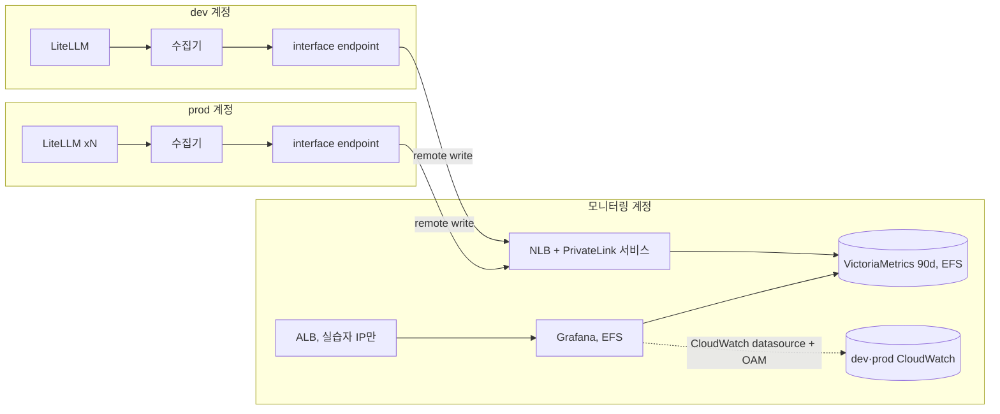

# 방안 3. 모니터링 계정 ECS에 VictoriaMetrics + Grafana

모니터링 계정 ECS에 Prometheus 호환 저장소와 Grafana를 직접 띄운다. dev·prod의 수집기가 LiteLLM metric을 긁어 remote write로 밀어 넣는다. 로그와 AWS 기본 metric은 Grafana CloudWatch datasource가 OAM으로 읽는다.

## 구조

실선은 metric이 흐르는 경로, 점선은 조회 경로다.



## 동작 원리

수집:

- 계정마다 수집기(ADOT collector) task 1개가 Cloud Map 이름 `litellm.<env>.<project_name>.internal`(예: `litellm.prod.litellm-mon.internal`)의 A 레코드로 replica를 하나씩 찾는다. replica마다 `instance` label이 달라 series가 섞이지 않는다
- 계정 구분은 수집기의 `external_labels.account`가 붙인다
- `/metrics`는 `/metrics/`로 307 redirect하고, 기본값으로 인증을 요구한다. 수집기는 `/metrics/`를 master key로 긁는다
- OTel collector의 remote write는 기본값에서 이름 중간의 `total`을 지운다. `litellm_proxy_total_requests_metric_total`이 `litellm_proxy_requests_metric_total`로 바뀌어 대시보드가 비게 된다. `add_metric_suffixes: false`로 원래 이름을 유지한다

네트워크:

- 계정 간 remote write에는 네트워크 경로가 필요하다. 실습의 default VPC는 계정마다 CIDR이 `172.31.0.0/16`으로 같아 VPC peering을 걸 수 없다
- PrivateLink는 CIDR이 겹쳐도 된다. 모니터링 계정의 NLB를 endpoint service로 열고, dev·prod가 interface endpoint를 만든다
- 운영 VPC에 이미 Transit Gateway나 peering이 있으면 NLB·endpoint 없이 그 경로를 쓴다

저장:

- VictoriaMetrics single-node, `-retentionPeriod=90d`. sample당 약 1바이트를 쓴다
- Fargate task는 교체되면 로컬 디스크가 사라진다. 데이터는 EFS에 둔다
- Grafana도 대시보드 수정 이력과 사용자를 EFS에 둔다

## Prometheus 대신 VictoriaMetrics를 고른 이유

| 기준 | Prometheus | VictoriaMetrics single |
|---|---|---|
| remote write 수신 | `--web.enable-remote-write-receiver`를 켜야 한다 | 기본으로 `/api/v1/write`를 연다 |
| NFS(EFS) | 공식 문서가 지원하지 않는다고 명시. EBS를 쓰려면 ECS EC2 launch type이 필요 | EFS 같은 NFS 저장소를 지원 |
| 디스크 | sample당 1~2바이트 | sample당 약 1바이트 |
| 보관 기간 | 설정 파일 필드 | `-retentionPeriod=90d` 플래그 |
| 질의 | PromQL | PromQL 호환(MetricsQL). 대시보드를 그대로 쓴다 |

Thanos·Mimir는 object storage와 여러 컴포넌트를 운영해야 해서 이 규모에는 과하다.

## 로컬 실습

[3-setup-local.md](3-setup-local.md)로 compose를 띄운다.

1. vmui(http://localhost:8428/vmui)에서 replica마다 series가 따로 쌓이는지 본다. prod instance가 2개로 표시된다

```promql
count by (account, instance) ({job="litellm"})
```

2. Grafana(http://localhost:3100) → LiteLLM 운영 개요를 연다. "replica별 요청 수"에 prod 선이 2개다
3. prod replica 하나를 내린다. "살아 있는 replica 수"가 prod 1로 바뀐다

```bash
docker compose up -d --scale litellm-prod=1
```

4. LiteLLM 비용 대시보드에서 team·model·key별 spend를 본다

## AWS 실습

`terraform.tfvars`에서 `enable_oam = true`, `enable_selfhosted = true`로 apply한다. OAM이 있어야 Grafana 로그 대시보드가 dev·prod 로그를 읽는다.

1. Grafana 주소를 연다. 로그인 없이 Viewer로 열린다

```bash
terraform -chdir=terraform output -raw selfhosted_grafana_url
```

2. LiteLLM 폴더의 대시보드 3개를 연다. 운영 개요와 비용은 VictoriaMetrics, 로그는 CloudWatch를 읽는다
3. 저장소 task를 강제로 교체한다. 새 task가 뜬 뒤에도 교체 전 데이터가 남아 있으면 EFS가 동작한 것이다. 교체되는 동안의 remote write는 수집기 재시도 큐가 버틴다

```bash
TASK=$(aws ecs list-tasks --cluster litellm-mon-obs --service-name victoriametrics --profile lab-monitoring --query 'taskArns[0]' --output text)
aws ecs stop-task --cluster litellm-mon-obs --task "$TASK" --profile lab-monitoring
```

## 운영하면서 떠안는 일

- VictoriaMetrics·Grafana 버전 업그레이드와 보안 패치
- EFS 백업(AWS Backup)과 복구 연습
- single-node라 저장소 task가 교체되는 동안 수집 공백. 수집기 재시도 큐 크기가 한도다
- Grafana 인증. 실습은 IP 제한 + 익명 Viewer다. 운영에서는 사내 SSO(OIDC·SAML)를 붙인다
- PrivateLink endpoint를 source 계정이 늘 때마다 추가

## 비용

기준 시나리오에서 공통 비용 외에 월 125.3 USD다. 대부분 고정비다.

| 항목 | 월 USD |
|---|---:|
| VictoriaMetrics task(1vCPU/2GB ARM) | 33.2 |
| Grafana task(0.5vCPU/1GB ARM) | 16.6 |
| Grafana ALB | 19.3 |
| remote write NLB | 16.4 |
| PrivateLink endpoint(2개 계정 × 2개 AZ) | 38.0 |
| EFS, PrivateLink 처리량 | 1.8 |

series가 10배 가까이 늘어난 대규모 시나리오에서도 137.9 USD로 거의 그대로다. 같은 규모에서 AMP 수집은 604.4 USD다.

## 장단점

| 장점 | 단점 |
|---|---|
| series가 늘어도 비용이 거의 고정 | 저장소, 네트워크, 인증, 백업을 직접 운영 |
| key·replica 단위 metric과 histogram을 제한 없이 저장 | 계정 간 네트워크 경로(PrivateLink·TGW)가 필요 |
| 로컬 compose와 AWS의 대시보드·쿼리가 같다 | 작은 규모에서는 고정비 때문에 방안 1·2보다 비싸다 |
| viewer 수와 무관한 비용 | single-node 장애 동안 수집 공백 |

## 맞는 상황

- series가 10만 개를 넘어 AMP 수집 비용이 고정비를 넘어선다
- 저장소를 운영할 전담자가 있다
- 이미 계정 간 네트워크(TGW)가 있어 PrivateLink 비용이 빠진다
