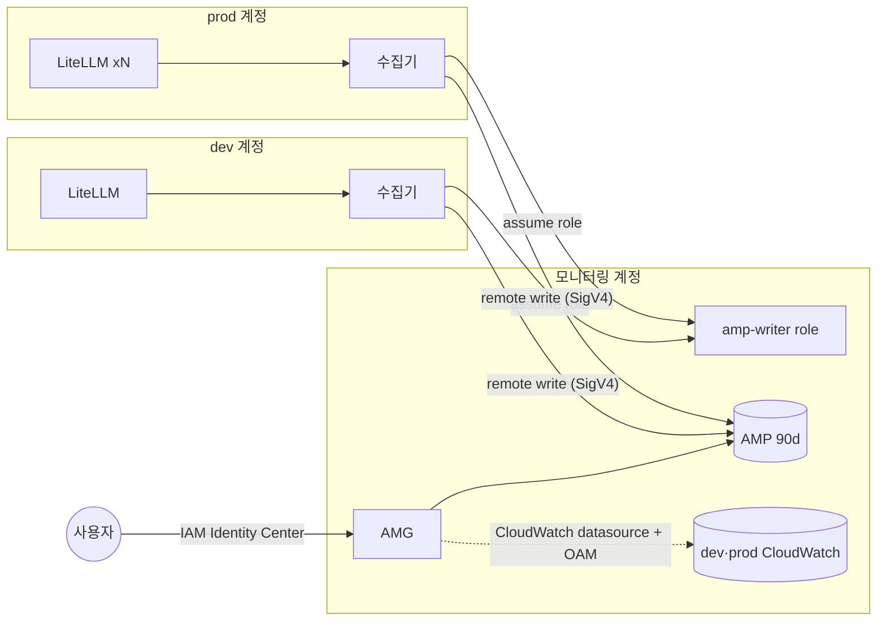

# 방안 4. Amazon Managed Service for Prometheus + Amazon Managed Grafana

방안 3의 저장소와 Grafana를 AWS 관리형으로 바꾼다. 수집기는 그대로 두고 remote write 목적지만 AMP로 바꾼다. 계정은 네트워크가 아니라 IAM으로 넘는다.

## 구조

방안 3에서 NLB·PrivateLink·VictoriaMetrics가 빠지고 IAM role과 AMP가 들어간다.



## 동작 원리

- 수집기는 `sigv4auth` extension으로 모니터링 계정의 `litellm-mon-amp-writer` role을 assume하고, 그 자격 증명으로 AMP에 서명해 쓴다
- AMP remote write 주소는 AWS 공개 endpoint다. 계정 사이에 PrivateLink·peering이 필요 없다
- role 신뢰 정책은 dev·prod 계정 전체가 아니라 수집기 task role ARN 2개만 허용한다
- AMP 보관 기간은 기본 150일이다. `aws_prometheus_workspace_configuration`으로 90일로 줄인다. 최대 1,095일
- AMG는 IAM Identity Center나 SAML로 로그인한다. 사용자마다 license가 붙는다

## 방안 3과 무엇이 다른가

| 기준 | 방안 3 (ECS 직접 운영) | 방안 4 (AMP + AMG) |
|---|---|---|
| 저장소 운영 | VictoriaMetrics 업그레이드, EFS 백업 직접 | AWS가 운영. 설정은 보관 기간과 한도뿐 |
| 계정을 넘는 방법 | 네트워크(PrivateLink·TGW) | IAM role assume |
| 인증 | Grafana 설정을 직접(SSO 연동 등) | IAM Identity Center·SAML 기본 |
| 비용 모델 | 고정비(task, LB, endpoint) | sample 수 + 로그인한 사용자 수 |
| 보관 | 디스크가 허락하는 만큼 | 설정값(최대 1,095일) |
| 질의 제한 | 저장소 사양만큼 | 한 질의 기간 최대 95일, 질의당 sample 한도 |
| Grafana | 원하는 버전(실습 13.2.2), plugin 자유 | AMG 지원 버전(12.4), plugin 일부만 |
| 고가용성 | single-node 교체 동안 공백 | 관리형 |

## 실습

`terraform.tfvars`에서 `enable_oam = true`, `enable_amp = true`로 apply한다. AMG를 쓰려면 `enable_amg = true`도 켠다. IAM Identity Center가 켜져 있어야 한다.

1. AMP에 LiteLLM series가 들어오는지 본다. `awscurl`은 SigV4로 서명하는 curl이다

```bash
ENDPOINT=$(terraform -chdir=terraform output -raw amp_query_endpoint)
uvx awscurl --service aps --region ap-northeast-2 --profile lab-monitoring \
  "${ENDPOINT}api/v1/query?query=count%20by%20(account,instance)(up)"
```

2. AMG 콘솔에서 workspace → Authentication → IAM Identity Center에서 자기 사용자를 Admin으로 배정한다
3. `amg_url` output으로 로그인한다
4. Connections → Data sources에서 두 개를 추가한다
   - Amazon Managed Service for Prometheus: 리전 ap-northeast-2, 위 workspace
   - CloudWatch: 리전 ap-northeast-2. 모니터링 계정이 OAM sink라 dev·prod가 계정 목록에 나온다
5. Dashboards → Import로 대시보드 3개를 가져온다. 대시보드마다 datasource를 드롭다운 변수로 받으므로 uid가 달라도 그대로 동작한다

| 대시보드 | 가져올 JSON |
|---|---|
| LiteLLM 운영 개요 | [local/grafana/dashboards/litellm-overview.json](../local/grafana/dashboards/litellm-overview.json) |
| LiteLLM 비용 | [local/grafana/dashboards/litellm-cost.json](../local/grafana/dashboards/litellm-cost.json) |
| LiteLLM 로그 | `terraform -chdir=terraform output -raw grafana_logs_dashboard` |

## 비용

기준 시나리오에서 공통 비용 외에 월 200.2 USD다.

| 항목 | 월 USD | 계산 |
|---|---:|---|
| AMP 수집 | 132.2 | 17,467 series × 30초 간격 = 월 1.51B sample, 1,000만 개당 0.90 USD |
| AMP 보관 | 0.0 | 90일 약 9GB, 10GB 무료 |
| AMG license | 68.0 | editor 2명 × 9 + viewer 10명 × 5 |

- AMG는 그 달에 로그인한 사용자만 과금한다. 한 달에 한 번 들어와도 5 USD다
- AMP 질의는 월 200B sample까지 무료라 대시보드 조회는 이 안에 든다고 가정했다
- scrape 간격을 60초로 늘리면 AMP 수집이 절반이 된다

## 장단점

| 장점 | 단점 |
|---|---|
| 서버가 없다. 저장소·Grafana 패치와 백업이 없다 | series에 비례해 비용이 는다. 대규모 시나리오에서 AMP 수집만 604.4 USD |
| 계정 간 네트워크 공사가 없다 | viewer마다 license. 가끔 보는 사람이 많으면 부담 |
| IAM Identity Center로 사내 계정 그대로 로그인 | IAM Identity Center가 없으면 도입부터 해야 한다 |
| LiteLLM 공식 Grafana 대시보드와 이 실습 대시보드를 가져와 쓴다 | AMG의 Grafana 버전과 plugin이 AWS 지원 범위로 제한 |

## 맞는 상황

- 이미 IAM Identity Center로 AWS에 로그인한다
- 전담 운영자 없이 90일 보관과 Grafana 화면이 필요하다
- series가 수만 개 수준이다
