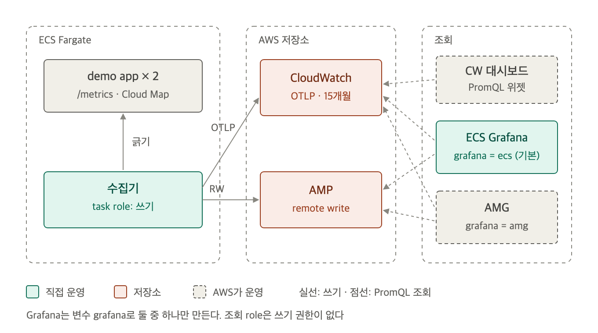

# 실습 환경

AWS 계정 하나에 terraform으로 전부 만듭니다. 리전은 ap-northeast-2입니다.



## 만들어지는 것

| 영역 | 리소스 |
|---|---|
| 수집 | ECS cluster, demo app service(task 2개), 수집기 service(task 1개), Cloud Map namespace |
| 저장 | AMP workspace(보관 30일). CloudWatch는 만들 것이 없음 |
| 조회 | CloudWatch 대시보드 `otlp-promql-amp-promql`. `grafana` 변수에 따라 ECS Grafana와 ALB, 또는 AMG workspace |
| IAM | task 실행 role, 수집기 role(쓰기), ECS Grafana role 또는 AMG role(조회) |

- 모든 task는 default VPC public subnet에서 공인 IP로 밖에 나갑니다. NAT gateway가 없습니다.
- ECS Grafana ALB는 apply한 PC의 공인 IP에서만 열립니다. 로그인 없이 Viewer로 열리고 Explore를 쓸 수 있습니다.

## 준비

- Terraform 1.11 이상, AWS CLI v2, `uv`(조회 스크립트가 `uvx awscurl`을 씁니다)
- 관리자 권한 AWS CLI profile. provider에는 profile을 적지 않으므로 먼저 export합니다
- `grafana = "amg"`를 쓰려면 계정에 IAM Identity Center가 켜져 있어야 합니다. 기본값 `ecs`는 필요 없습니다

Grafana 방식을 바꾸려면 예시 파일을 복사해 `grafana` 값을 고칩니다. 복사하지 않으면 기본값 `ecs`로 만듭니다. 방식별 차이는 [6-grafana-choice.md](6-grafana-choice.md)에 있습니다.

```bash
cp terraform/terraform.tfvars.example terraform/terraform.tfvars
```

terraform과 조회 스크립트는 환경 변수의 profile을 씁니다.

```bash
export AWS_PROFILE=terraform-awscli
```

## up

workspace 루트에서 실행합니다. AMP workspace 설정에 2분 안팎, AMG를 켜면 workspace 생성에 2분 안팎이 더 걸립니다.

```bash
terraform -chdir=terraform init && terraform -chdir=terraform apply -auto-approve
```

접속 주소는 output으로 확인합니다.

```bash
terraform -chdir=terraform output
```

`grafana = "amg"`로 만들었다면 datasource와 대시보드를 넣는 스크립트를 한 번 실행합니다. 이 스크립트는 AMG license 비용을 만듭니다. 실행하기 전에 [4-query.md](4-query.md)의 AMG 절을 읽습니다.

```bash
scripts/amg-setup.sh
```

## down

만든 리소스를 모두 지웁니다.

```bash
terraform -chdir=terraform destroy -auto-approve
```

## 로컬 확인

AWS에 올리기 전에 app과 수집기 설정만 확인할 때 씁니다. 수집기는 ECS와 같은 `collector/config.yaml`을 읽고, 목적지만 debug(stdout)로 바꿉니다. AWS로는 아무것도 보내지 않습니다.

```bash
docker compose up -d
```

`otelcol_exporter_sent_metric_points{exporter="debug"}`가 늘어나면 긁기와 두 파이프라인이 동작하는 것입니다.

```bash
curl -s localhost:8888/metrics | grep exporter_sent_metric_points
```

로컬 환경을 지웁니다.

```bash
docker compose down -v
```

## 켜 둔 동안의 비용

| 대상 | 요금 |
|---|---|
| Fargate ARM task 3개(app 2, 수집기 1) | 시간당 약 0.02 USD |
| 공인 IPv4 3개(task 3) | 시간당 0.015 USD |
| `ecs`: Grafana task, ALB, 공인 IPv4 3개 | 시간당 약 0.06 USD |
| CloudWatch OTLP 수집 | 0.50 USD/GB. 실습 수집량(GB)은 Cost Explorer로 `확인 필요` |
| AMP 수집 | 1,000만 sample당 0.90 USD. 첫 4,000만 sample 무료 |
| AMG | 그 달에 로그인하거나 API를 부른 사용자마다 editor·admin 9 USD, viewer 5 USD. service account도 사용자로 셉니다 |

`scripts/amg-setup.sh`는 Admin service account를 만들어 API를 부르므로 그 달에 API 사용자 license 1개(9 USD)가 붙습니다. 실행할 때마다 service account를 새로 만들므로 같은 달에 여러 번 실행하면 더 붙을 수 있습니다. 단가 출처와 계산은 [multi-account-litellm의 9-cost.md](../../multi-account-litellm/docs/9-cost.md)에 있습니다.
