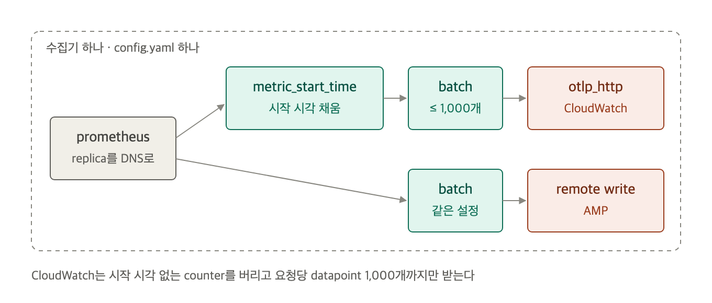

# 수집기 하나로 두 저장소에 보내기

수집기는 `otel/opentelemetry-collector-contrib:0.161.0` 하나입니다. 설정 파일 [collector/config.yaml](../collector/config.yaml)도 하나이고, ECS와 로컬 compose가 같은 파일을 읽습니다. 환경마다 다른 값(리전, AMP 주소, 긁을 DNS 이름)은 환경 변수로 받습니다.

## 파이프라인은 receiver 하나에서 두 갈래로 나뉩니다



`prometheus` receiver가 30초마다 app replica를 긁고, 같은 데이터를 두 파이프라인에 넘깁니다. CloudWatch 쪽에만 processor가 하나 더 붙습니다.

파이프라인 정의는 아래와 같습니다.

```yaml
service:
  pipelines:
    metrics/cloudwatch:
      receivers: [prometheus]
      processors: [metric_start_time, batch]
      exporters: [otlp_http/cloudwatch]
    metrics/amp:
      receivers: [prometheus]
      processors: [batch]
      exporters: [prometheus_remote_write/amp]
```

## 두 목적지의 차이는 endpoint와 SigV4 서비스 이름뿐입니다

`sigv4auth` extension을 저장소마다 하나씩 둡니다. 자격 증명은 AWS SDK 기본 순서로 찾으므로 ECS에서는 task role을 씁니다.

```yaml
extensions:
  sigv4auth/cloudwatch:
    service: monitoring
    region: ${env:AWS_REGION}
  sigv4auth/amp:
    service: aps
    region: ${env:AWS_REGION}

exporters:
  otlp_http/cloudwatch:
    metrics_endpoint: https://monitoring.${env:AWS_REGION}.amazonaws.com/v1/metrics
    compression: gzip
    auth:
      authenticator: sigv4auth/cloudwatch
  prometheus_remote_write/amp:
    endpoint: ${env:AMP_REMOTE_WRITE_URL}
    auth:
      authenticator: sigv4auth/amp
```

- CloudWatch endpoint는 HTTP만 받습니다. gRPC OTLP exporter로는 보낼 수 없습니다.
- 압축은 `gzip`과 없음만 받습니다.
- 수집기 task role 권한은 `cloudwatch:PutMetricData`와 AMP workspace ARN에 대한 `aps:RemoteWrite` 두 개입니다([terraform/iam.tf](../terraform/iam.tf)).

## CloudWatch는 시작 시각이 없는 counter를 버립니다

`metric_start_time` processor가 없으면 CloudWatch가 요청을 받긴 하지만 일부 datapoint를 버리고 partial success를 돌려줍니다. 수집기 로그에는 아래 경고가 남습니다.

```text
warn  otlphttpexporter  Partial success response
  "StartTimeUnixNano is required for metric 'process_cpu_seconds_total' ...
   (cumulative datapoints must carry a start time; metrics scraped from
   Prometheus endpoints do not provide one)"  "dropped_data_points": 10
```

OTLP의 cumulative counter는 "언제부터 센 값인지"를 `StartTimeUnixNano`로 함께 보내야 합니다. Prometheus 형식에는 이 필드가 없습니다. 대신 `prometheus_client`는 app이 만든 counter마다 `_created` series를 내고, receiver는 그 값으로 시작 시각을 채웁니다. 그래서 `demo_requests_total`은 통과하고, `_created`가 없는 `process_*`와 `python_gc_*`만 버려졌습니다. 같은 데이터를 받은 AMP는 시작 시각을 요구하지 않아서 아무것도 버리지 않았습니다.

CloudWatch 파이프라인에 processor를 넣어 시작 시각을 채웁니다. `true_reset_point`는 series를 처음 본 시점을 시작점으로 삼습니다.

```yaml
processors:
  metric_start_time:
    strategy: true_reset_point
```

이 경고는 수집기가 성공으로 세는 전송에서도 나옵니다. `otelcol_exporter_sent_metric_points`만 보면 놓치므로 수집기 로그의 `Partial success`를 따로 봅니다.

## batch 크기는 CloudWatch 한도에 맞춥니다

CloudWatch OTLP endpoint는 요청 하나에 datapoint 1,000개까지 받고, 넘으면 400으로 요청 전체를 거절합니다. `batch` processor 기본값은 8,192개라 series가 늘면 한도를 넘습니다.

```yaml
processors:
  batch:
    send_batch_size: 500
    send_batch_max_size: 1000
    timeout: 10s
```

그 밖의 metrics endpoint 한도는 계정당 초당 요청 500개, 10분에 새 series 100만 개, 요청 크기 5MB(압축 전), datapoint당 label 150개입니다.

## 설정을 환경 변수로 넘길 때 YAML flow 문법이 깨집니다

ECS에서는 설정 파일을 mount하지 않고 `--config=env:COLLECTOR_CONFIG`로 환경 변수에서 읽습니다. 이때 `names: [${env:SCRAPE_DNS_NAME}]`처럼 flow 문법 안에 `${env:...}`를 넣으면 수집기가 시작하지 못합니다.

```text
Error: failed to get config: cannot resolve the configuration: retrieved value
(type=string) cannot be used as a Conf: assuming string type since contents
are not valid YAML: yaml: line 21: did not find expected ','
```

block 문법으로 쓰면 해결됩니다.

```yaml
dns_sd_configs:
  - names:
      - ${env:SCRAPE_DNS_NAME}
    type: A
    port: 8000
```

## 로컬 compose는 자격 증명 없이 설정만 검증합니다

[compose.yaml](../compose.yaml)은 같은 `config.yaml`을 읽고 `--config=yaml:` 인자로 두 파이프라인의 exporter만 `debug`로 바꿉니다. `sigv4auth`는 쓰이지 않아도 수집기가 시작할 때 자격 증명을 찾으므로, 검증을 통과시키는 가짜 키(`local`)를 넣습니다. 실제 AWS 호출은 없습니다.
