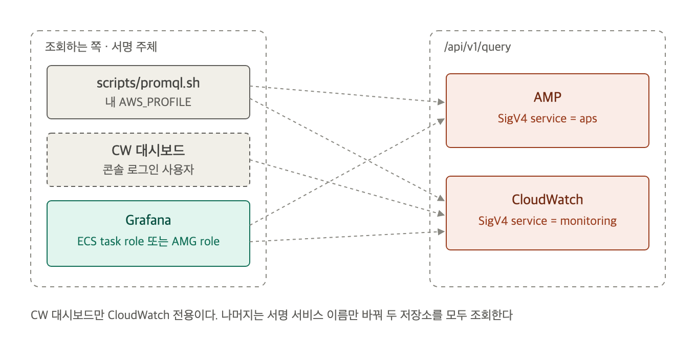
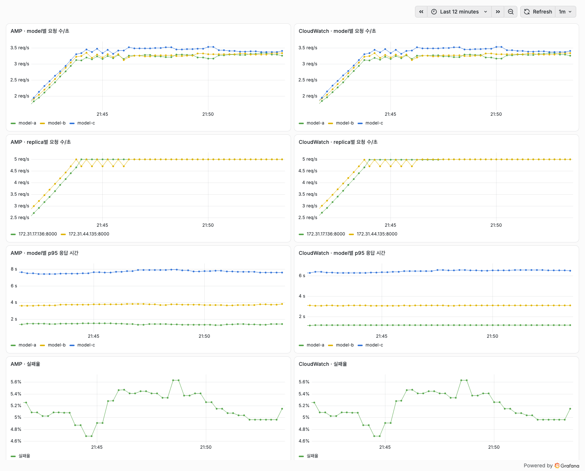

# PromQL로 두 저장소 조회하기

같은 PromQL을 CLI, CloudWatch 대시보드, Grafana에서 던집니다. Grafana는 `grafana` 변수로 고른 ECS Grafana나 AMG입니다. 환경은 [2-setup.md](2-setup.md)로 띄웁니다.



CloudWatch 대시보드만 CloudWatch 전용입니다. 나머지는 서명 서비스 이름만 바꿔 두 저장소를 모두 조회합니다.

## CLI: 서명 서비스 이름만 바꾸면 같은 API입니다

두 저장소 모두 Prometheus HTTP API(`/api/v1/query`)를 엽니다. [scripts/promql.sh](../scripts/promql.sh)는 `awscurl`로 서명해 보내고, `amp`면 `aps`로, `cw`면 `monitoring`으로 서명합니다. 서명에는 export한 `AWS_PROFILE`을 씁니다.

model별 초당 요청 수를 두 저장소에 물어봅니다.

```bash
scripts/promql.sh amp 'sum by (model) (rate(demo_requests_total[2m]))'
scripts/promql.sh cw  'sum by (model) (rate(demo_requests_total[2m]))'
```

실습에서 두 응답의 값은 소수점까지 같았습니다.

```json
{"metric":{"model":"model-a"},"value":[1790167304,"3.244444444444444"]}
{"metric":{"model":"model-a"},"value":[1790167305.166,"3.244444444444444"]}
```

위가 AMP, 아래가 CloudWatch입니다. counter와 rate는 두 저장소가 같은 값을 돌려줍니다. 달라지는 쿼리는 [5-compare.md](5-compare.md)에 모았습니다.

## CloudWatch 대시보드는 chart 위젯에 PromQL을 넣습니다

Grafana 없이 CloudWatch 콘솔만으로 보는 방법입니다. PromQL은 `chart` 위젯의 query에 `type: cloudwatch-metrics`, `language: PromQL`로 넣습니다. [terraform/cloudwatch_dashboard.tf](../terraform/cloudwatch_dashboard.tf)가 위젯 4개를 만듭니다.

위젯 하나의 형태는 아래와 같습니다.

```json
{
  "type": "chart",
  "properties": {
    "title": "model별 요청 수/초",
    "view": "line",
    "region": "ap-northeast-2",
    "data": {
      "queries": [{
        "id": "q1",
        "type": "cloudwatch-metrics",
        "language": "PromQL",
        "query": "sum by (model) (rate(demo_requests_total[5m]))"
      }]
    }
  }
}
```

- 주소는 `terraform -chdir=terraform output -raw cloudwatch_dashboard_url`로 확인합니다.
- 콘솔 **Query Studio**에서도 같은 PromQL을 바로 실행할 수 있습니다.
- 콘솔에서 위젯 4개가 PromQL 결과를 그리는 것을 확인했습니다.

## ECS Grafana(`grafana = "ecs"`)는 datasource 두 개가 plugin 하나를 씁니다

두 저장소 모두 `grafana-amazonprometheus-datasource` plugin으로 붙습니다. CloudWatch는 `jsonData.sigv4Service`를 `monitoring`으로 바꿉니다. 이 값을 비워 두면 plugin이 `aps`로 서명하고, CloudWatch는 `Credential should be scoped to correct service: 'monitoring'`으로 거절합니다.

[grafana/datasources.yaml](../grafana/datasources.yaml)의 CloudWatch datasource입니다.

```yaml
- name: CloudWatch PromQL
  uid: cloudwatch
  type: grafana-amazonprometheus-datasource
  url: https://monitoring.${AWS_REGION}.amazonaws.com
  jsonData:
    httpMethod: POST
    sigV4Auth: true
    sigV4AuthType: default
    sigV4Region: ${AWS_REGION}
    sigv4Service: monitoring
```

- `sigV4AuthType: default`는 AWS SDK 기본 순서로 자격 증명을 찾고, ECS에서는 Grafana task role을 씁니다.
- Grafana role 권한은 AMP 조회(`aps:QueryMetrics`, `aps:GetLabels`, `aps:GetSeries`, `aps:GetMetricMetadata`)와 CloudWatch 조회(`cloudwatch:GetMetricData`, `cloudwatch:ListMetrics`)입니다. CloudWatch PromQL 조회는 이 두 권한만으로 동작했습니다.
- 주소는 `terraform -chdir=terraform output -raw grafana_url`입니다.

**demo** 폴더의 "AMP와 CloudWatch 같은 질문 비교" 대시보드는 왼쪽에 AMP, 오른쪽에 CloudWatch를 둡니다.



요청 수, replica별 요청 수, 실패율은 두 저장소가 같은 선을 그립니다. p95만 다릅니다. 이유는 [5-compare.md](5-compare.md)에 있습니다.

## AMG(`grafana = "amg"`)는 workspace role로 서명하고, datasource는 API로 넣습니다

AMG workspace는 `permission_type = "CUSTOMER_MANAGED"`로 만들고 조회 전용 role을 붙입니다([terraform/amg.tf](../terraform/amg.tf)). 권한은 ECS Grafana role과 같고 주체만 `grafana.amazonaws.com`입니다.

AMG datasource는 terraform이 만들지 않습니다. 만들려면 Grafana API token이 필요하고, terraform으로 만들면 token이 state에 남습니다. 대신 [scripts/amg-setup.sh](../scripts/amg-setup.sh)가 아래 순서로 넣습니다.

1. 1시간짜리 Admin service account token을 CLI로 발급합니다.
2. datasource 두 개를 만듭니다. `sigV4AuthType`은 `ec2_iam_role`입니다. AMG 콘솔에서는 **Workspace IAM role**로 보입니다.
3. ECS Grafana와 같은 `grafana/compare.json` 대시보드를 넣습니다.
4. 종료할 때 service account를 지웁니다. token은 파일에도 남지 않습니다.

이 스크립트로 AMG에서도 두 datasource가 ECS Grafana와 같은 값을 돌려주는 것을 확인했습니다. 비용은 하나 있습니다. AMG는 service account도 API 사용자로 세어 Admin이면 그 달에 9 USD를 받습니다. 스크립트 대신 콘솔에서 직접 datasource를 만들어도 로그인한 사용자 license가 붙으므로, 한 달에 한 번은 license 비용이 생긴다고 보고 실행합니다.

사람이 로그인하려면 IAM Identity Center 사용자를 workspace에 배정합니다. 사용자 ID를 `amg_admin_user_ids`에 넣고 apply하거나, AMG 콘솔 **Authentication** 탭에서 배정합니다.

Identity Center 사용자 ID는 아래 명령으로 찾습니다.

```bash
aws identitystore list-users \
  --identity-store-id "$(aws sso-admin list-instances --query 'Instances[0].IdentityStoreId' --output text)" \
  --query 'Users[].[UserName,UserId]' --output text
```
