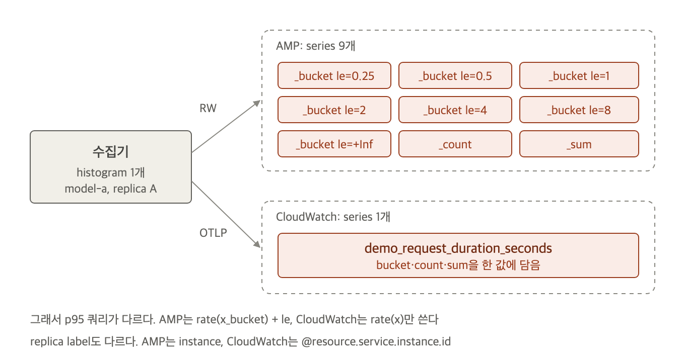

# 같은 데이터, 두 저장소의 차이

같은 수집기가 같은 30초 간격으로 보낸 데이터를 비교했습니다. counter와 rate는 두 저장소가 같은 값을 돌려줍니다. 차이는 label 이름, histogram 저장 방식, 쿼리 제약에서 나옵니다. 그래서 대시보드 쿼리를 한 저장소에서 다른 저장소로 옮길 때 이 세 가지만 고치면 됩니다.

## 한눈에 보는 차이

| 항목 | AMP | CloudWatch OTLP |
|---|---|---|
| replica 구분 label | `instance` | `@resource.service.instance.id` |
| scrape job label | `job` | `@resource.service.name` |
| 자동으로 붙는 label | `otel_scope_name`, `otel_scope_version` | `@aws.account`, `@aws.region`, `@instrumentation.@name`, `__type__`, `__temporality__` |
| histogram | `_bucket`(`le`별), `_count`, `_sum` series | 이름 하나에 native histogram |
| p95 쿼리 | `sum by (le, model) (rate(x_bucket[5m]))` | `sum by (model) (rate(x[5m]))` |
| 이름 없는 selector | 받음 | 거절: `Selector must have a metric name` |
| 조회 응답 한도 | `확인 필요` | 쿼리 응답당 series 500개 |
| 시작 시각 없는 counter | 받음 | 버림. [3-collector.md](3-collector.md) 참고 |

## label: replica 구분 label 이름이 다릅니다

같은 series를 두 저장소에서 꺼낸 결과입니다. AMP는 Prometheus가 붙이는 `job`과 `instance`를 그대로 둡니다. CloudWatch는 OTel resource 속성을 `@resource.` 접두어를 붙인 label로 저장합니다.

AMP에서 꺼낸 series입니다.

```json
{
  "__name__": "demo_requests_total",
  "instance": "172.31.17.136:8000",
  "job": "demo",
  "model": "model-a", "status": "200", "team": "chat",
  "otel_scope_name": "github.com/.../receiver/prometheusreceiver"
}
```

CloudWatch에서 꺼낸 series입니다. 계정 ID는 가렸습니다.

```json
{
  "__name__": "demo_requests_total",
  "@resource.service.instance.id": "172.31.17.136:8000",
  "@resource.service.name": "demo",
  "@aws.account": "<account-id>",
  "@aws.region": "ap-northeast-2",
  "__type__": "Sum", "__temporality__": "cumulative", "__monotonicity__": "true",
  "model": "model-a", "status": "200", "team": "chat"
}
```

replica별로 묶는 쿼리는 label 이름을 바꿔야 합니다. `@`와 `.`이 들어간 label은 따옴표로 감쌉니다.

```promql
# AMP
sum by (instance) (rate(demo_requests_total[5m]))
# CloudWatch
sum by ("@resource.service.instance.id") (rate(demo_requests_total[5m]))
```

## histogram: CloudWatch에는 `_bucket` series가 없습니다



AMP는 histogram 하나를 bucket 경계마다 series로 펼칩니다. CloudWatch는 OTLP histogram을 원형 그대로 한 series에 담습니다. 같은 histogram의 series 수를 세면 차이가 보입니다.

| metric 이름 | AMP series | CloudWatch series |
|---|---:|---:|
| `demo_requests_total` | 36 | 36 |
| `demo_tokens_total` | 18 | 18 |
| `demo_request_duration_seconds_bucket` | 42 | 없음 |
| `demo_request_duration_seconds_count` | 6 | 없음 |
| `demo_request_duration_seconds` | 없음 | 6 |

AMP의 42개는 model 3개 × replica 2개 × bucket 7개(6개 + `+Inf`)입니다. CloudWatch는 model 3개 × replica 2개인 6개입니다. CloudWatch는 series 수가 아니라 수집 GB로 과금하므로, series 수 차이가 곧 요금 차이는 아닙니다.

p95 쿼리도 달라집니다. CloudWatch 쿼리에는 `_bucket`도 `le`도 없습니다.

```promql
# AMP
histogram_quantile(0.95, sum by (le, model) (rate(demo_request_duration_seconds_bucket[10m])))
# CloudWatch
histogram_quantile(0.95, sum by (model) (rate(demo_request_duration_seconds[10m])))
```

## p95: 같은 bucket에서 다른 값이 나옵니다

demo app의 응답 시간은 지수분포라 실제 p95는 `평균 × ln 20`입니다. 10분 구간의 p95를 두 저장소에 물어 정답과 비교했습니다.

| model | 실제 p95 | AMP | CloudWatch |
|---|---:|---:|---:|
| model-a(평균 0.4초) | 1.20초 | 1.41초 | 1.17초 |
| model-b(평균 1.2초) | 3.59초 | 3.81초 | 3.11초 |
| model-c(평균 2.5초) | 7.49초 | 7.75초 | 6.50초 |

- AMP는 세 model 모두 실제보다 조금 높게 나왔습니다. Prometheus는 bucket 안에서 값이 고르게 퍼져 있다고 보고 선형 보간합니다.
- CloudWatch는 세 model 모두 AMP보다 낮았고, model-b와 model-c는 실제보다 약 13% 낮았습니다. CloudWatch가 bucket 안을 어떻게 추정하는지는 문서에서 찾지 못했습니다. `확인 필요`입니다.
- 두 값 모두 bucket 경계(0.25, 0.5, 1, 2, 4, 8초) 사이의 추정값입니다. 정확도가 필요하면 저장소보다 bucket 경계를 먼저 조정합니다.

실무에서는 같은 SLO 알람을 두 저장소에 걸거나 저장소를 옮길 때 이 차이가 문제가 됩니다. p95 임계값은 옮긴 뒤 다시 정합니다.

## 고르는 기준

| 상황 | 고를 저장소 |
|---|---|
| 이미 CloudWatch 대시보드·알람으로 운영하고, 저장소를 하나 더 늘리고 싶지 않음 | CloudWatch OTLP |
| 조직 전체 metric을 Grafana로 보고, 쿼리를 오픈소스 Prometheus와 똑같이 유지하고 싶음 | AMP |
| label 조합이 많아 series 수가 빠르게 늘어남 | CloudWatch OTLP. series 수가 아니라 GB로 과금 |
| Prometheus 도구(recording rule, alertmanager)를 그대로 쓰고 싶음 | AMP. rule과 alertmanager를 workspace에서 설정 |
| 계정 여러 개를 쿼리 하나로 합쳐 보고 싶음 | AMP에 remote write로 모음. CloudWatch는 Metrics Centralization으로 복사해야 함([multi-account-litellm 8-other-options.md](../../multi-account-litellm/docs/8-other-options.md)) |

어느 저장소를 골라도 수집기 설정은 같고 exporter 하나만 다릅니다. 그래서 처음에는 둘 다 보내 두고, 쿼리와 비용을 한 달 비교한 뒤 하나를 끄는 방법도 있습니다. 두 곳에 보내는 비용은 저장소 요금뿐이고 수집기는 늘지 않습니다.
