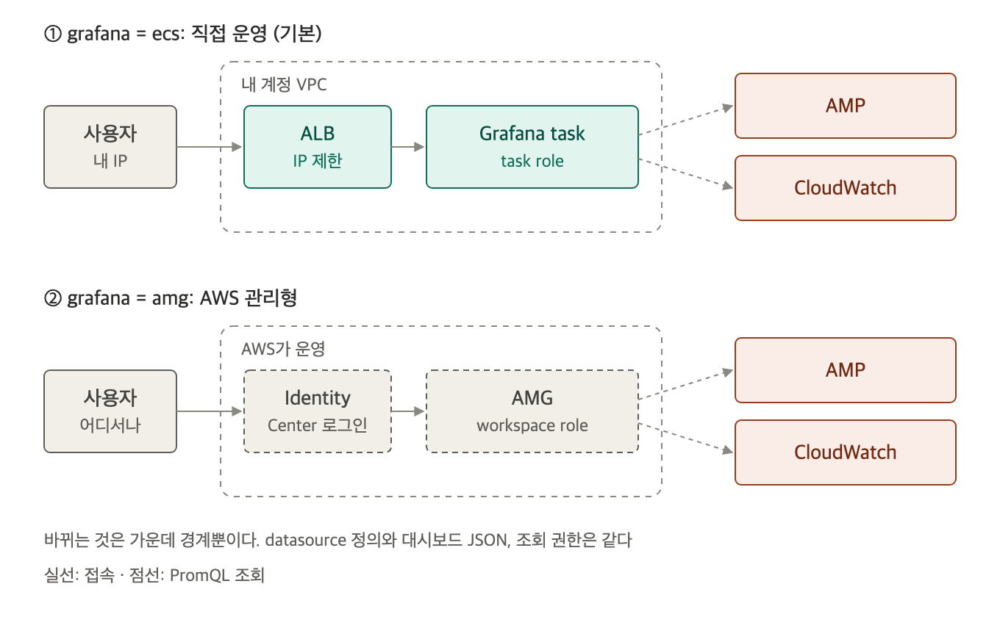

# Grafana 직접 운영과 AMG 비교

조회 화면은 terraform 변수 `grafana` 하나로 고릅니다. 기본값은 `ecs`입니다.

| 값 | 만들어지는 것 |
|---|---|
| `ecs` | ECS Grafana task, ALB, Grafana task role |
| `amg` | AMG workspace, workspace role. datasource는 `scripts/amg-setup.sh`로 넣음 |
| `none` | Grafana 없음. CloudWatch 대시보드와 CLI로만 조회 |

`terraform.tfvars`에 한 줄을 쓰고 apply합니다.

```hcl
grafana = "amg"
```

## 두 방식은 가운데 경계만 다릅니다



두 방식은 같은 plugin(`grafana-amazonprometheus-datasource`), 같은 datasource 정의, 같은 대시보드 JSON(`grafana/compare.json`)을 씁니다. 조회 role의 권한도 같습니다. 달라지는 것은 누가 Grafana를 띄우고, 사용자가 어떻게 들어오느냐입니다.

## 비교

| 기준 | 직접 운영(`ecs`) | AMG(`amg`) |
|---|---|---|
| 서버 운영 | Grafana 버전 업그레이드와 보안 패치를 직접 함 | AWS가 함 |
| Grafana 버전 | 원하는 버전(실습 13.2.2) | AWS가 지원하는 버전(실습 12.4) |
| plugin | 자유롭게 설치 | AWS가 제공하는 범위 |
| 로그인 | 직접 붙임. 실습은 ALB IP 제한 + 익명 Viewer | IAM Identity Center 또는 SAML |
| datasource와 대시보드 넣기 | 설정 파일 provisioning. apply로 끝남 | Grafana API가 필요해 token 발급 스크립트를 따로 실행 |
| 대시보드 수정 보존 | 이 실습 구성은 저장소가 없어 task를 교체하면 UI에서 고친 내용이 사라짐 | workspace에 보존 |
| 가용성 | task 1개. 교체하는 동안 접속 불가 | AWS가 관리 |
| 고정비 | 월 약 44 USD(task 약 16.6, ALB 약 16.4, 공인 IPv4 3개 약 11) | 없음 |
| 사용자 비용 | 없음 | 그 달에 활동한 사용자마다 editor·admin 9 USD, viewer 5 USD. service account도 셈 |

고정비 44 USD는 AMG editor 약 5명, viewer 약 9명의 license와 비슷합니다. 사용자가 이보다 적으면 AMG가 싸고, 많으면 직접 운영이 쌉니다. 단가는 [2-setup.md](2-setup.md)의 비용 표와 같은 서울 리전 값입니다.

## 직접 운영이 맞는 경우

- 보는 사람이 많고, 가끔만 들어오는 viewer가 많습니다. AMG는 한 달에 한 번만 로그인해도 1명분을 받습니다.
- 특정 Grafana 버전이나 AMG가 지원하지 않는 plugin이 필요합니다.
- 대시보드와 datasource를 코드(provisioning 파일)로만 관리하고 싶습니다. 이 실습에서도 ECS Grafana는 apply 한 번으로 조회까지 끝납니다.

운영으로 가져가려면 이 실습이 생략한 세 가지를 채워야 합니다. Grafana DB를 RDS나 EFS로 옮겨 UI 수정을 보존하고, 사내 SSO(OIDC 또는 SAML)를 붙이고, ALB에 HTTPS를 붙입니다.

## AMG가 맞는 경우

- 이미 IAM Identity Center로 AWS에 로그인하고 있습니다.
- Grafana 서버를 운영할 사람이 없습니다.
- 사용자가 적거나, 매달 들어오는 사람이 정해져 있습니다.

AMG에서는 datasource를 넣는 순간에도 license가 생깁니다. API를 부르려면 service account가 필요하고, service account도 사용자로 세기 때문입니다. 콘솔에서 직접 넣어도 로그인한 사람의 license가 붙으므로, AMG를 켠 달에는 최소 1명분(9 USD)이 든다고 보고 계획합니다.
