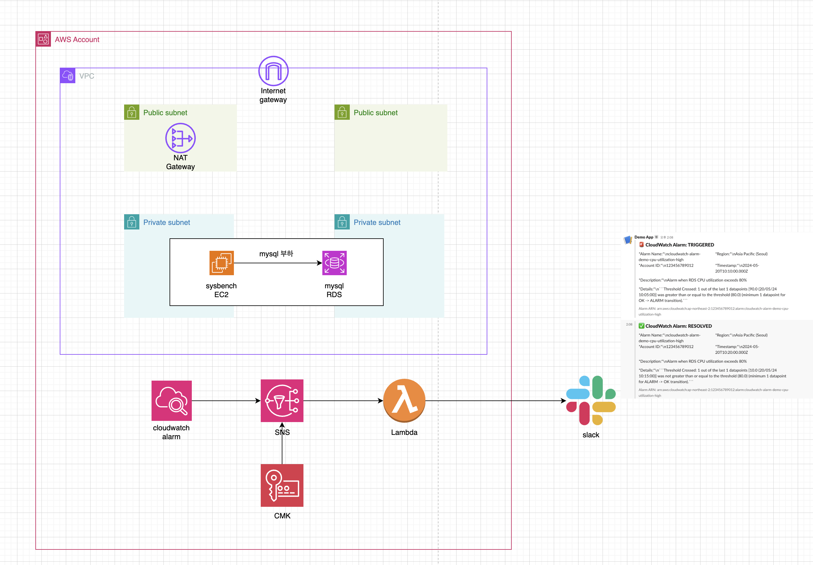
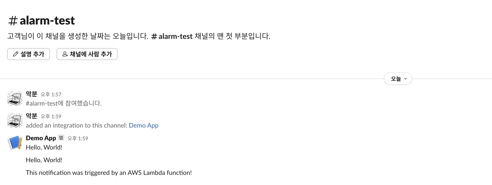
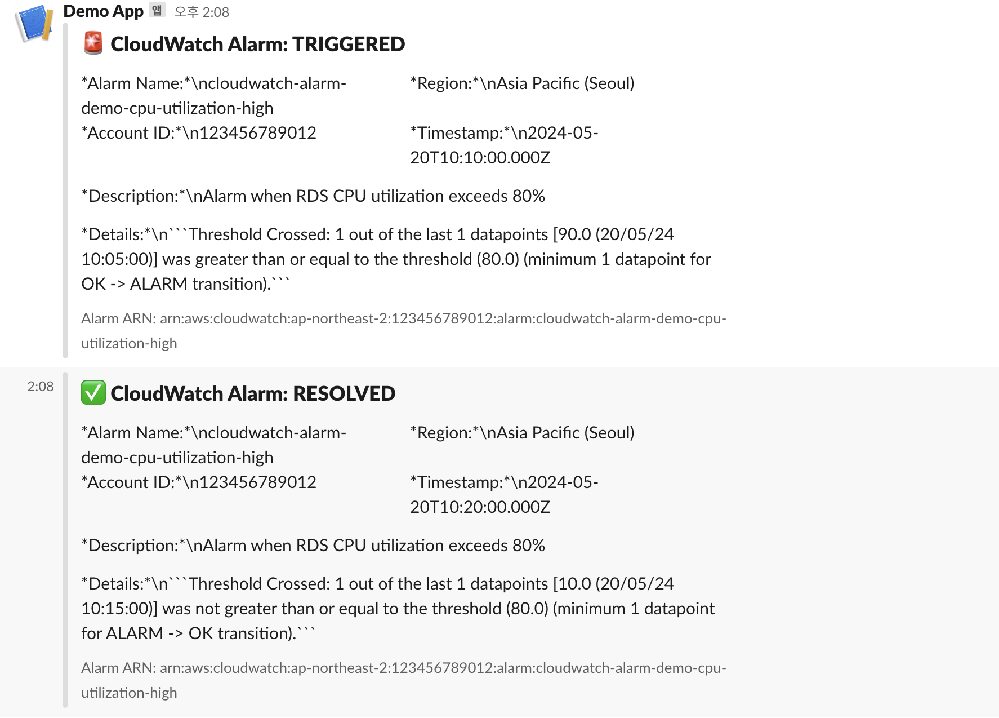

## 개요

* cloudwatch alarm이 울리면 slack 메세지 전송

## 시나리오

1. RDS CPU
2. ALB target 5xx에러

## 아키텍처



## 준비

### slack webhook 준비

1. slack webhook 생성

2. slack webhook 테스트

```sh
SLACK_WEBHOOK_URL=""
curl -X POST -H 'Content-type: application/json' --data '{"text":"Hello"}' $SLACK_WEBHOOK_URL
```



2. lambda 로컬 테스트

```sh
export SLACK_WEBHOOK_URL=""
python ./lambda_function/lambda_function.py
```



## 배포

3. 환경변수 slack

* slack webhook을 설정하는 테라폼 환경변수 설정

```sh
export TF_VAR_slack_webhook_url=""
```

* terraform init & apply

```sh
terraform init
terraform apply
```

## cloudwatch alarm 및 slack 메세지 전송 테스트

* [RDS 테스트 문서](./rds_stress_test/)참고

## 참고자료

* https://blog.shellnetsecurity.com/2023/04/585/cloudstuff/aws/how-to-use-terraform-to-deploy-a-python-script-to-aws-lambda/
* https://youtu.be/ox_HJ8w7FPI?feature=shared
