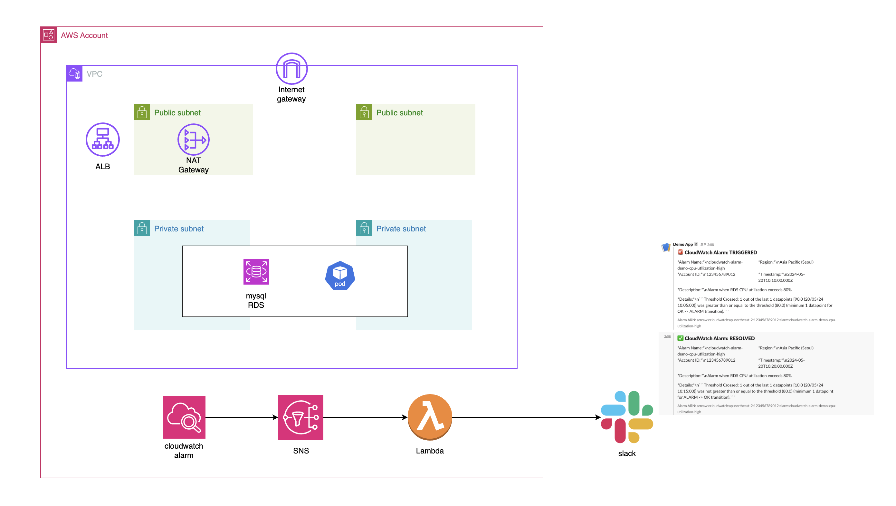

<!-- TOC -->

- [개요](#%EA%B0%9C%EC%9A%94)
- [시나리오](#%EC%8B%9C%EB%82%98%EB%A6%AC%EC%98%A4)
- [아키텍처](#%EC%95%84%ED%82%A4%ED%85%8D%EC%B2%98)
- [준비](#%EC%A4%80%EB%B9%84)
  - [slack webhook 준비](#slack-webhook-%EC%A4%80%EB%B9%84)
- [배포](#%EB%B0%B0%ED%8F%AC)
- [helmfile 배포](#helmfile-%EB%B0%B0%ED%8F%AC)
- [RDS 더미데이터 생성](#rds-%EB%8D%94%EB%AF%B8%EB%8D%B0%EC%9D%B4%ED%84%B0-%EC%83%9D%EC%84%B1)
- [cloudwatch alarm 및 slack 메세지 전송 테스트](#cloudwatch-alarm-%EB%B0%8F-slack-%EB%A9%94%EC%84%B8%EC%A7%80-%EC%A0%84%EC%86%A1-%ED%85%8C%EC%8A%A4%ED%8A%B8)
- [참고자료](#%EC%B0%B8%EA%B3%A0%EC%9E%90%EB%A3%8C)

<!-- /TOC -->

## 개요

* cloudwatch alarm으로 AWS 리소스기반 이상탐지
* [유투브 링크](https://youtu.be/V9uy5dbVsGo)

## 시나리오

1. RDS CPU 60%이상
2. ALB target 5xx에러 10%이상

## 아키텍처

* [아키텍처 draw.io](./arch.drawio)



## 준비

### slack webhook 준비

1. slack webhook 생성

2. slack webhook 테스트

```sh
SLACK_WEBHOOK_URL=""
curl -X POST -H 'Content-type: application/json' --data '{"text":"Hello"}' $SLACK_WEBHOOK_URL
```


3. lambda 로컬 테스트

```sh
export SLACK_WEBHOOK_URL=""
python ./lambda_function/lambda_function.py
```


## 배포

* 배포는 테라폼으로 합니다. 테라폼은 EKS, lambda, cloudwatch alarm(RDS alarm)를 배포합니다.

1. 환경변수 설정

* slack webhook을 설정하는 테라폼 환경변수 설정

```sh
export TF_VAR_slack_webhook_url=""
```

* EKS를 배포할 IAM role

```sh
export TF_VAR_assume_role_arn=""
```

2. terraform init & apply

```sh
cd ./terraform
terraform init
terraform apply
```

## helmfile 배포

* external-dns, ALB controller를 배포합니다. Route53 hostzone을 가지고 있어야 합니다.

1. ALB controller CRD 배포

* ALB controller helm chart에서는 CRD가 없어 수동으로 배포해야 합니다.

```sh
kubectl apply -f https://raw.githubusercontent.com/aws/eks-charts/refs/heads/master/stable/aws-load-balancer-controller/crds/crds.yaml
```

2. helmfile config 수정

```sh
vi helmfile
```

3. helmfile apply

```sh
helmfile apply
```

4. 확인

```sh
kubectl -n kube-system get deploy external-dns aws-load-balancer-controller
aws-load-balancer-controller   2/2     2            2           10m
external-dns                   1/1     1            1           10m
```

## RDS 더미데이터 생성

* `kubernetes job`을 사용하여 RDS에 더미데이터를 생성합니다. sysbench도구로 더미 데이터를 생성합니다.

1. mysql secret 생성

```sh

# RDS cluster endpoint를 MYSQL_HOST에 설정
$ vi ./kubernetes_manifests/mysql_secret.yaml

apiVersion: v1
kind: Secret
metadata:
  name: mysql-secrets
type: Opaque
data:
  # terraform output rds_cluster_endpoint
  # echo -n "{rds_cluster_endpoint}" | base64
  MYSQL_HOST: Y2xvdWR3YXRjaC1hbGFybS1kZW1vLmNsdXN0ZXItY2dkZmI1OW56NGV1LmFwLW5vcnRoZWFzdC0yLnJkcy5hbWF6b25hd3MuY29t


$ kubectl apply -f ./kubernetes_manifests/mysql_secret.yaml
```

2. mysql testdb 데이터베이스 생성

```sh
$ kubectl apply -f ./kubernetes_manifests/create_mysql_database_job.yaml
$ kubectl get job
NAME            STATUS     COMPLETIONS   DURATION   AGE
create-testdb   Complete   1/1           4s         25s
```

3. mysql 테스트 더미데이터 천만개 생성

```sh

$ kubectl apply -f ./kubernetes_manifests/insert_data_job.yaml
$ kubectl get pod
NAME                     READY   STATUS      RESTARTS   AGE
sysbench-prepare-45p6f   1/1     Running     0          6s

$ kubectl logs -f sysbench-prepare-45p6f
$ kubectl logs -f sysbench-prepare-45p6f
sysbench 1.0.17 (using bundled LuaJIT 2.1.0-beta2)

Creating table 'sbtest1'...
Inserting 10000000 records into 'sbtest1'
```

## cloudwatch alarm 및 slack 메세지 전송 테스트

* [cloudwatch alarm 테스트 문서](./rds_stress_test/)참고

## 참고자료

* https://blog.shellnetsecurity.com/2023/04/585/cloudstuff/aws/how-to-use-terraform-to-deploy-a-python-script-to-aws-lambda/
* https://youtu.be/ox_HJ8w7FPI?feature=shared
