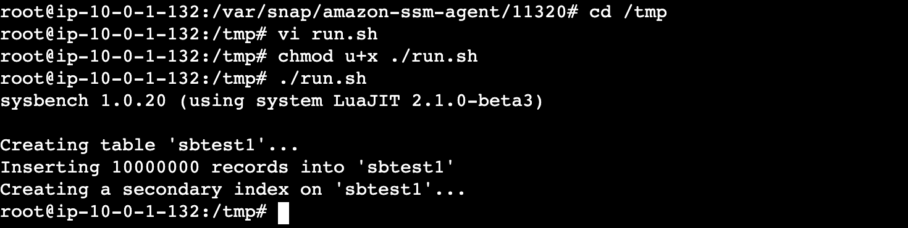

## 개요

* sysbench로 RDS 스트레스 설정

## 전제조건

* EC2인스턴스에 sysbench, mysql cli가 설치되어 있어야 합니다.
* EC2인스턴스는 RDS에 접근이 가능해야 합니다.
* [이 예제 테라폼](./sysbench_ec2.tf)으로 생성된 EC2 인스턴스는 1,2번 조건이 설정되어 있습니다.

## 아키텍처

## 준비

### 1. 테스트를 위한 db 생성

1. EC2인스턴스에서 mysql cli로 로그인

* 비밀번호: Password1234!!#

```sh
mysql -h {mysql_cluster writer endpoint} -uadmin -p
```

2. testdb 생성

```sh
CREATE DATABASE testdb;
```

### 2. mysql에 더미 데이터 생성

1. sysbench로 mysql에 더미데이터 천만개 생성

```sh
$ vi run.sh
sysbench oltp_read_write \
  --mysql-host="{mysql_cluster writer endpoint}" \
  --mysql-port=3306 \
  --mysql-user=admin \
  --mysql-password=Password1234!!# \
  --mysql-db=testdb \
  --tables=1 \
  --table-size=10000000 \
  prepare
$ chmod u+x ./run.sh
$ ./run.sh
```



2. 데이터 확인

```sh
mysql -h {mysql_cluster writer endpoint} -u admin -p

mysql> use testdb;
mysql> select c from sbtest1 limit 1;
```

### RDS CPU 스트레스 테스트

1. stress 테스트 스크립트에서 sql의 where을 수정

```sh
mysql -h {mysql_cluster writer endpoint} -u admin -p

mysql> use testdb;
mysql> select c from sbtest1 limit 1;
```

```sh
local query = "SELECT * FROM sbtest1 WHERE c = 'select c FROm sbtest1 where c='{수정}';'"
```

2. stress 스크립트를 EC2인스턴스에 복사

3. sysbench로 부하 테스트

```sh
sysbench test_query.lua \
  --mysql-host=cloudwatch-alarm-demo.cluster-cgdfb59nz4eu.ap-northeast-2.rds.amazonaws.com \
  --mysql-port=3306 \
  --mysql-user=admin \
  --mysql-password=Password1234!!# \
  --mysql-db=testdb \
  --threads=5 \
  --time=240 \
  --report-interval=10 \
  run
```
