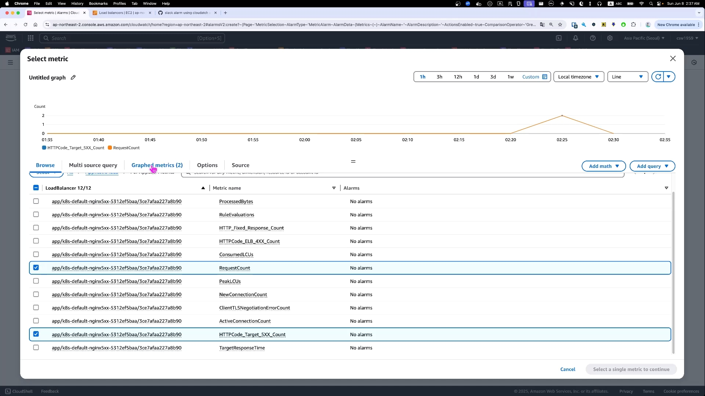

## 개요

* ALB errorr rate기반 cloud watch alarm을 트리거하기 위한, ALB target 5xx count 증가 방법

## 준비

* [nginx pod, ingress](../kubernetes_manifests/nginx.yaml)를 배포
* nginx는 헬스체크 API제외하고 모두 503에러를 발생시킵니다.


## cloudwatch alarm 생성 방법

* ALB error rate는 기본 cloudwatch metrics으로 생성못합니다. cloudwatch math expression을 사용하여 error rate를 생성합니다.




## 부하 주하는 방법

* nginx API를 호출하여 강제로 5xx에러를 발생시킵니다. 저는 shell script while문을 사용했습니다.
* ALB cloudwatch metric을 확인하면 target 5xx에러가 증가합니다.

```sh
nginx_domin={your_domain}
while true; do curl https://$nginx_domain; done
```


