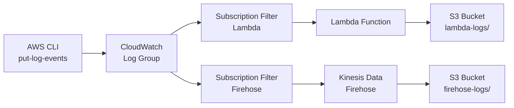

# 요약

- **CloudWatch Log Group의 로그를 S3로 저장하는 2가지 방법**을 실습합니다.
  - 방법 1: Subscription Filter + Lambda → S3
  - 방법 2: Subscription Filter + Kinesis Data Firehose → S3
- 하나의 CloudWatch Log Group에 두 가지 Subscription Filter를 동시에 걸어서 비교합니다.
- 더미 로그 생성 스크립트로 실시간 데이터 흐름을 확인합니다.
- Terraform으로 전체 인프라를 프로비저닝합니다.

# 목차

1. [배경](#배경)
2. [아키텍처](#아키텍처)
3. [사전 준비](#사전-준비)
4. [실습 1: 인프라 배포](#실습-1-인프라-배포)
5. [실습 2: 더미 로그 생성](#실습-2-더미-로그-생성)
6. [실습 3: S3 저장 확인](#실습-3-s3-저장-확인)
7. [두 방법의 차이점](#두-방법의-차이점)
8. [주의사항](#주의사항)
9. [리소스 정리](#리소스-정리)
10. [참고자료](#참고자료)

# 배경

CloudWatch Logs는 AWS에서 로그를 수집하는 핵심 서비스입니다. 그런데 로그를 장기 보관하거나 분석하려면 S3로 내보내야 하는 경우가 많습니다.

CloudWatch Logs에서 S3로 보내는 방법은 크게 2가지입니다.

1. **Subscription Filter + Lambda**: Lambda 함수가 로그를 받아서 S3에 저장
2. **Subscription Filter + Kinesis Data Firehose**: Firehose가 로그를 버퍼링해서 S3에 저장

**두 방법 모두 Subscription Filter를 사용합니다.** Subscription Filter는 CloudWatch Log Group에 들어오는 로그를 실시간으로 다른 서비스에 전달하는 기능입니다.

[아키텍처 그림: CloudWatch Log Group에서 Subscription Filter 2개가 나가서 하나는 Lambda → S3, 하나는 Kinesis Firehose → S3로 연결되는 구조]

# 아키텍처



## S3 저장 경로

| 방법 | S3 prefix | 경로 패턴 |
|------|-----------|-----------|
| Lambda | `lambda-logs/` | `lambda-logs/YYYY/MM/DD/HH/{logGroup}/{logStream}/{timestamp}.json` |
| Firehose | `firehose-logs/` | `firehose-logs/year=YYYY/month=MM/day=DD/hour=HH/` |

# 사전 준비

- AWS CLI 설정 (ap-northeast-2 리전)
- Terraform >= 1.11
- jq (더미 로그 스크립트에서 사용)

# 실습 1: 인프라 배포

```bash
cd aws/cloudwatchgroup_to_s3

terraform init
terraform plan
terraform apply
```

`terraform apply`가 완료되면 아래 output이 출력됩니다.

```
s3_bucket_name          = "cw-to-s3-logs-xxxxxxxxxxxx"
cloudwatch_log_group_name = "/cw-to-s3/app"
lambda_function_name    = "cw-to-s3-log-to-s3"
firehose_stream_name    = "cw-to-s3-log-stream"
```

# 실습 2: 더미 로그 생성

**Firehose는 실시간으로 로그를 수집하기 때문에 지속적으로 로그를 보내야 합니다.**

더미 로그 생성 스크립트를 실행합니다.

```bash
# 기본값: 5초 간격, 무한 반복 (Ctrl+C로 종료)
./scripts/put_dummy_logs.sh

# 3초 간격으로 보내기
./scripts/put_dummy_logs.sh --interval 3

# 20번만 보내기
./scripts/put_dummy_logs.sh --count 20

# 2초 간격으로 30번 보내기
./scripts/put_dummy_logs.sh --interval 2 --count 30
```

실행하면 이런 로그가 출력됩니다.

```
=== CloudWatch Dummy Log Generator ===
Log Group:  /cw-to-s3/app
Log Stream: dummy-stream-20260305143022
Interval:   5s
Count:      infinite
=======================================
Log stream created: dummy-stream-20260305143022

Sending dummy logs... (Ctrl+C to stop)

[14:30:23] Sent: [2026-03-05T05:30:23Z] INFO: Application started successfully (iteration=1)
[14:30:28] Sent: [2026-03-05T05:30:28Z] WARN: High memory usage detected - 85% (iteration=2)
[14:30:33] Sent: [2026-03-05T05:30:33Z] INFO: Cache hit ratio: 92.3% (iteration=3)
```

# 실습 3: S3 저장 확인

더미 로그를 1-2분 정도 보낸 뒤 S3에 저장된 결과를 확인합니다.

**Lambda 방식은 거의 즉시 S3에 저장됩니다. Firehose 방식은 버퍼링 때문에 약 60초 후에 저장됩니다.**

```bash
# Lambda + Firehose 모두 확인
./scripts/verify_s3.sh

# Lambda 방식만 확인
./scripts/verify_s3.sh --method lambda

# Firehose 방식만 확인
./scripts/verify_s3.sh --method firehose
```

또는 AWS CLI로 직접 확인할 수 있습니다.

```bash
# Lambda 방식 결과
aws s3 ls s3://$(terraform output -raw s3_bucket_name)/lambda-logs/ --recursive

# Firehose 방식 결과
aws s3 ls s3://$(terraform output -raw s3_bucket_name)/firehose-logs/ --recursive
```

# 두 방법의 차이점

| 비교 항목 | Lambda 방식 | Firehose 방식 |
|-----------|-------------|---------------|
| 지연 시간 | 거의 즉시 (초 단위) | 60초~ (버퍼링 간격) |
| 데이터 변환 | Lambda 코드로 자유롭게 가능 | 제한적 (Firehose 변환 기능) |
| 비용 | Lambda 호출 비용 | Firehose 데이터 처리 비용 |
| 관리 포인트 | Lambda 코드 관리 필요 | 관리형 서비스 (코드 불필요) |
| 대용량 처리 | Lambda 동시 실행 제한 있음 | 자동 스케일링 |
| S3 저장 형식 | 커스텀 가능 (JSON 등) | Firehose 기본 포맷 |
| 적합한 케이스 | 데이터 변환이 필요할 때 | 단순 저장 + 대용량일 때 |

**정리하면, 단순히 로그를 S3에 저장하는 것이 목적이라면 Firehose가 더 편합니다.** 로그 데이터를 가공하거나 필터링해야 한다면 Lambda가 적합합니다.

# 주의사항

## Subscription Filter 개수 제한

**하나의 CloudWatch Log Group에 Subscription Filter는 최대 2개까지만 설정할 수 있습니다.** 이 실습에서는 Lambda용 1개 + Firehose용 1개로 정확히 2개를 사용합니다.

## Firehose 버퍼링

Firehose는 `buffering_interval`(초)과 `buffering_size`(MB) 중 먼저 도달하는 조건에서 S3로 전송합니다. 이 실습에서는 60초 / 1MB로 설정했습니다. 즉, **로그를 보낸 직후에는 S3에 파일이 없을 수 있습니다.**

## CloudWatch Logs 데이터 형식

Subscription Filter를 통해 전달되는 데이터는 **base64 인코딩 + gzip 압축** 형태입니다. Lambda에서는 직접 디코딩해야 하고, Firehose는 자동으로 처리합니다.

## 비용

이 실습은 소규모 테스트이므로 비용이 거의 발생하지 않습니다. 하지만 더미 로그 스크립트를 장시간 실행하면 CloudWatch Logs 수집 비용과 S3 저장 비용이 발생할 수 있습니다.

# 리소스 정리

```bash
terraform destroy
```

# 참고자료

- https://docs.aws.amazon.com/AmazonCloudWatch/latest/logs/SubscriptionFilters.html
- https://docs.aws.amazon.com/firehose/latest/dev/what-is-this-service.html
- https://docs.aws.amazon.com/lambda/latest/dg/services-cloudwatchlogs.html
- https://docs.aws.amazon.com/AmazonCloudWatch/latest/logs/SubscriptionFilters.html#FirehoseExample
