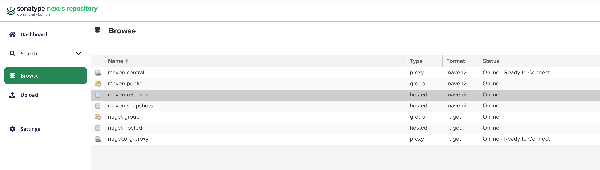
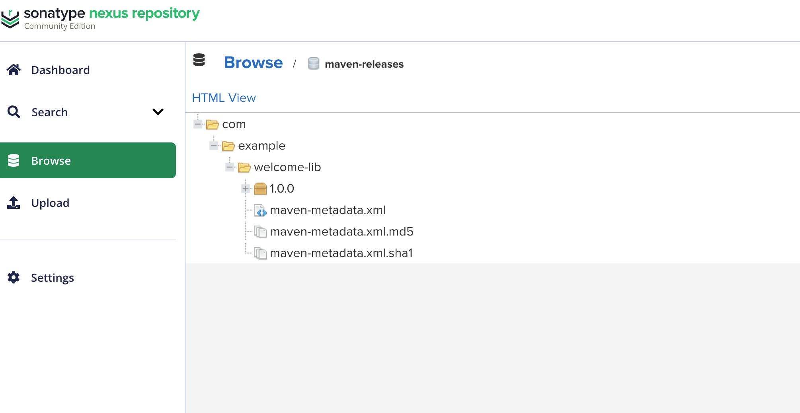

# Welcome Library

간단한 환영 메시지를 출력하는 Java 라이브러리입니다.

## 빌드 방법

```bash
mvn clean package
```

## Nexus에 배포하기

### 1. Maven Settings 파일 설정

**중요:** 401 Unauthorized 에러를 방지하려면 반드시 인증 정보를 설정해야 합니다!

`~/.m2/settings.xml` 파일 생성:

```bash
mkdir -p ~/.m2
vi ~/.m2/settings.xml
```

**최소 설정:**

```xml
<?xml version="1.0" encoding="UTF-8"?>
<settings xmlns="http://maven.apache.org/SETTINGS/1.0.0"
  xmlns:xsi="http://www.w3.org/2001/XMLSchema-instance"
  xsi:schemaLocation="http://maven.apache.org/SETTINGS/1.0.0 http://maven.apache.org/xsd/settings-1.0.0.xsd">

  <servers>
    <server>
      <id>nexus-releases</id>
      <username>admin</username>
      <password>YOUR_NEXUS_PASSWORD</password>
    </server>
    <server>
      <id>nexus-snapshots</id>
      <username>admin</username>
      <password>YOUR_NEXUS_PASSWORD</password>
    </server>
  </servers>
</settings>
```

**핵심 포인트:**

- `<id>nexus-releases</id>`: pom.xml의 repository id와 정확히 일치해야 함
- `<password>`: terraform.tfvars에 설정한 nexus_admin_password 사용

### 2. pom.xml 확인

`pom.xml`에서 Nexus URL이 올바른지 확인:

```xml
<distributionManagement>
  <repository>
    <id>nexus-releases</id>
    <url>https://nexus.example.com/repository/maven-releases/</url>
  </repository>
</distributionManagement>
```

### 3. 배포 실행

```bash
mvn clean deploy
```





성공 시:

```
[INFO] BUILD SUCCESS
[INFO] Uploading to nexus-releases: https://example.com/repository/maven-releases/...
```

자세한 내용은 [../../nexus.md](../../nexus.md) 참조

## 사용 방법

```java
import com.example.welcome.WelcomeMessage;

public class Main {
  public static void main(String[] args) {
    WelcomeMessage.printWelcome();

    String message = WelcomeMessage.getWelcome();
    System.out.println(message);
  }
}
```
