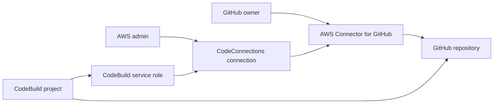
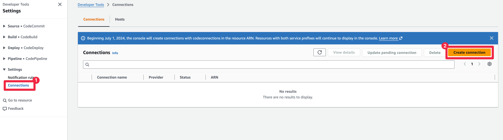
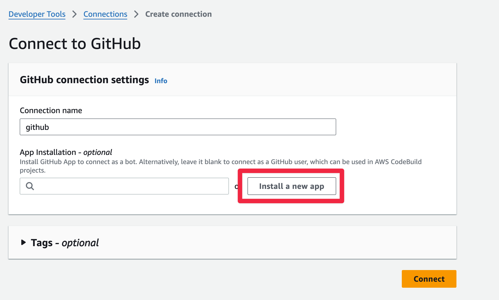
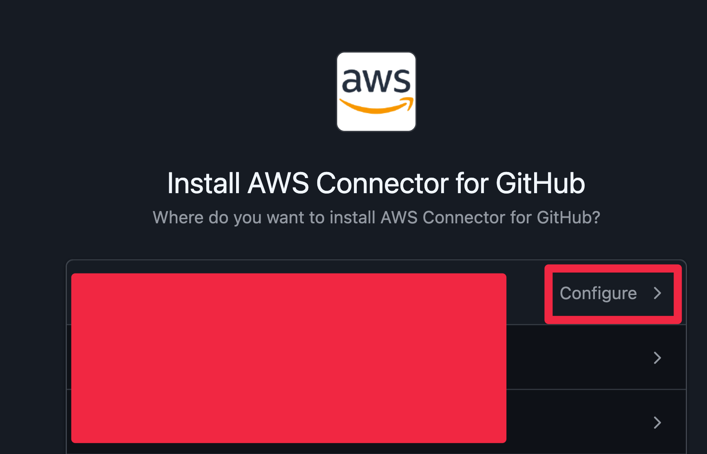
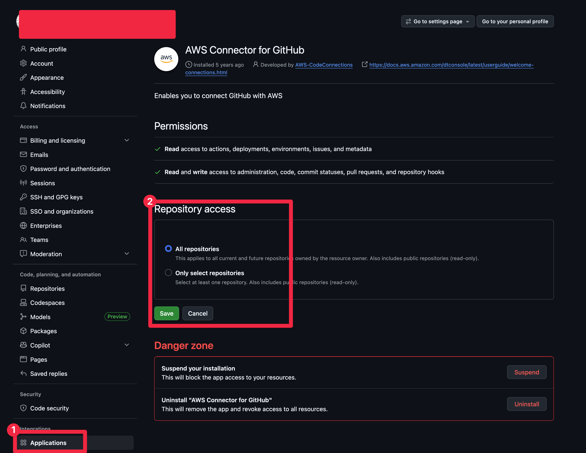

# GitHub App connection 직접 만들기

AWS CodeBuild가 GitHub private repository를 읽으려면 GitHub repository에 접근할 인증 경로가 필요합니다. 이 핸즈온은 GitHub App connection을 처음 만드는 흐름만 다룹니다. CodeBuild project에 붙이는 과정은 다음 문서에서 진행합니다.

## TL;DR

- GitHub App connection은 AWS CodeConnections가 GitHub App installation과 AWS 리소스를 연결하는 구조입니다.
- 처음 만들 때는 AWS console에서 GitHub authorization과 GitHub App installation을 끝내는 편이 가장 이해하기 쉽습니다.
- CLI나 Terraform으로 connection ARN을 만들 수 있어도 GitHub 쪽 연결을 완료하기 전에는 `PENDING` 상태로 남을 수 있습니다.
- 이 예제에서는 connection 리소스를 Terraform으로 만들지 않고, 직접 만든 connection ARN을 Terraform 변수로 전달합니다.
- repository URL은 connection에 설정하지 않습니다. GitHub App installation에서 접근 가능한 repository 범위만 선택합니다.

## 만들기 전에 이해할 구조

CodeBuild가 GitHub repository를 clone하려면 GitHub 쪽 권한과 AWS 쪽 권한이 모두 필요합니다. GitHub App connection에서는 `AWS Connector for GitHub` App installation과 CodeConnections connection ARN이 권한 경로의 중심이 됩니다.



repository URL은 이 connection 안에 저장하지 않습니다. connection은 GitHub App installation과 연결되고, CodeBuild project가 repository URL과 connection ARN을 함께 참조합니다.

## AWS console에서 connection 만들기

처음 만드는 경우에는 console을 사용합니다. GitHub 권한 승인 화면과 AWS connection 상태를 같이 확인할 수 있기 때문입니다.

1. AWS console에서 `Developer Tools > Settings > Connections`로 이동합니다.
2. region을 CodeBuild project를 만들 region으로 맞춥니다. 이 예제의 기본 region은 `ap-northeast-2`입니다.
3. `Create connection`을 선택합니다.
4. provider로 `GitHub`를 선택합니다.
5. connection 이름을 입력합니다.
6. `Connect to GitHub`를 선택합니다.
7. GitHub 화면에서 `AWS Connector for GitHub`를 authorize합니다.
8. GitHub App installation 대상 account 또는 organization을 선택합니다.
9. 앞에서 만든 private repository만 허용합니다.
10. AWS console로 돌아와 connection 생성을 완료합니다.

connection이 준비되면 상태가 `AVAILABLE`이어야 합니다. `PENDING`이면 GitHub authorization 또는 app installation이 아직 끝나지 않은 상태로 봅니다.









## CLI로 상태 확인하기

connection ARN을 복사한 뒤 상태를 확인합니다.

```shell
aws codeconnections get-connection \
  --connection-arn arn:aws:codeconnections:ap-northeast-2:123456789012:connection/example
```

응답의 `ConnectionStatus`가 `AVAILABLE`이면 CodeBuild에서 사용할 준비가 된 상태입니다.

## Terraform 코드를 주석으로만 둔 이유

이 저장소의 Terraform 예제에는 connection 생성 코드가 주석으로만 있습니다. connection은 단순한 AWS 리소스 생성으로 끝나지 않고 GitHub App 설치와 authorization을 완료해야 하기 때문입니다.

Terraform으로 connection ARN만 만들면 상태가 `PENDING`에 머물 수 있습니다. 처음 실습에서는 console에서 전체 흐름을 눈으로 확인하는 편이 덜 헷갈립니다.

참고용 코드는 [connection.example.tf](../terraform/connection.example.tf)에 있습니다. 이 파일은 주석만 포함하므로 Terraform이 실제 connection을 만들지 않습니다.

## 확인할 것

- CodeConnections connection 상태가 `AVAILABLE`인지 확인합니다.
- GitHub의 installed GitHub Apps에서 `AWS Connector for GitHub`가 보이는지 확인합니다.
- 대상 repository가 GitHub App installation 범위에 들어있는지 확인합니다.
- webhook을 쓸 예정이면 GitHub App permission 업데이트 요청이 없는지 확인합니다.

## 참고자료

- [AWS CodeBuild - GitHub App connections for GitHub and GitHub Enterprise Server](https://docs.aws.amazon.com/codebuild/latest/userguide/connections-github-app.html)
- [AWS Developer Tools Console - Create a connection to GitHub](https://docs.aws.amazon.com/dtconsole/latest/userguide/connections-create-github.html)
- [GitHub Docs - Generating an installation access token for a GitHub App](https://docs.github.com/en/apps/creating-github-apps/authenticating-with-a-github-app/generating-an-installation-access-token-for-a-github-app)
