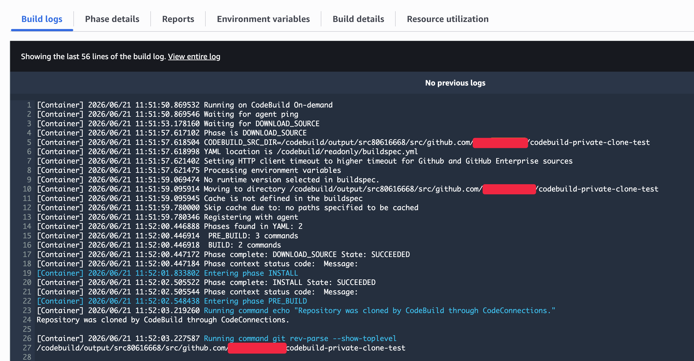

# CodeBuild project에서 GitHub App connection 사용하기

이 핸즈온은 직접 만든 GitHub App connection ARN을 Terraform 변수로 받아 CodeBuild project source에 연결합니다. CodeBuild project source에는 GitHub private repository URL과 connection ARN을 함께 명시합니다.

## TL;DR

- project 단위로 GitHub App connection을 검증할 수 있습니다.
- Terraform은 CodeBuild project, service role, CloudWatch Logs group만 만듭니다.
- GitHub connection 자체는 직접 만든 ARN을 입력합니다.
- private repository URL은 GitHub에서 복사해서 `github_repository_url`에 입력합니다.
- build가 성공하면 CodeBuild가 connection을 통해 private repository를 clone한 것입니다.

## 준비물

- `AVAILABLE` 상태의 GitHub App connection ARN
- CodeBuild가 읽을 GitHub private repository URL
- AWS CLI 인증
- Terraform `>= 1.11`

GitHub connection ARN은 다음처럼 생겼습니다.

```text
arn:aws:codeconnections:ap-northeast-2:123456789012:connection/00000000-0000-0000-0000-000000000000
```

## Terraform 변수 입력

예제 디렉터리로 이동한 뒤 변수 파일을 만듭니다.

```shell
cd aws/codebuild/github_connection/terraform
cp terraform.tfvars.example terraform.tfvars
```

`terraform.tfvars`에는 직접 만든 connection ARN과 GitHub private repository URL을 넣습니다.

```hcl
github_connection_arn   = "arn:aws:codeconnections:ap-northeast-2:123456789012:connection/00000000-0000-0000-0000-000000000000"
github_repository_url   = "https://github.com/owner/codebuild-private-clone-test.git"
github_branch           = "main"
```

`github_repository_url`은 CodeBuild가 만들지 않습니다. AWS CodeConnections connection에도 이 URL을 직접 저장하지 않습니다. GitHub repository의 HTTPS clone URL을 복사해서 CodeBuild project source location으로 전달합니다.

## 배포하기

Terraform은 CodeBuild가 GitHub private repository를 source로 clone할 수 있는 project와 IAM role을 만듭니다. CodeBuild image는 Amazon Linux 2023 managed image인 `aws/codebuild/amazonlinux-x86_64-standard:6.0`을 기본값으로 사용합니다.

```shell
terraform init
terraform plan
terraform apply
```

성공하면 `codebuild_project_name` output이 나옵니다.

## Build 실행하기

수동 build를 실행합니다.

```shell
aws codebuild start-build \
  --project-name codebuild-github-connection
```

build ID를 확인한 뒤 상세 상태를 조회합니다.

```shell
aws codebuild batch-get-builds \
  --ids codebuild-github-connection:build-id
```

CloudWatch Logs를 보려면 log group을 tail합니다.

```shell
aws logs tail /aws/codebuild/codebuild-github-connection --follow
```



로그에서 `git rev-parse`, `git remote -v`, `git status --short` 결과가 보이면 CodeBuild가 GitHub private repository를 clone한 것입니다. 이 예제는 repository 안의 `buildspec.yml`을 읽지 않고, Terraform의 `buildspec = file("${path.module}/inline-buildspec.yml")`로 CodeBuild project에 inline buildspec을 전달합니다.

## 왜 project source에 connection을 직접 지정하는가

처음 실습에서는 project source에 connection ARN을 직접 지정합니다. 이렇게 하면 이 CodeBuild project가 어떤 repository URL을 어떤 connection으로 읽는지 Terraform 코드에서 바로 볼 수 있습니다.

장점은 구조가 명확하다는 점입니다. repository URL은 `source.location`에 있고, 인증 경로는 `source.auth.resource`에 있습니다.

단점은 project마다 connection ARN을 반복해서 써야 한다는 점입니다. 여러 project가 같은 connection을 공유해야 한다면 계정 기본 source credential 방식을 검토할 수 있습니다.

## 정리하기

실습 리소스를 지웁니다.

```shell
terraform destroy
```

이 명령은 Terraform이 만든 CodeBuild project, IAM role, CloudWatch Logs group만 삭제합니다. 직접 만든 GitHub App connection은 삭제하지 않습니다.

## 참고자료

- [AWS CodeBuild - GitHub App connections for GitHub and GitHub Enterprise Server](https://docs.aws.amazon.com/codebuild/latest/userguide/connections-github-app.html)
- [AWS CodeBuild API - SourceAuth](https://docs.aws.amazon.com/codebuild/latest/APIReference/API_SourceAuth.html)
- [AWS CodeConnections - Actions, resources, and condition keys](https://docs.aws.amazon.com/service-authorization/latest/reference/list_awscodeconnections.html)
