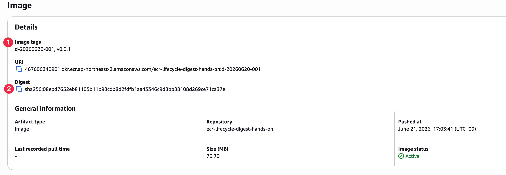

# 시나리오 1: 수동 개발환경 tag 삭제와 shared digest

## 목적

같은 ECR image digest에 개발환경(d-*) tag와 운영환경(vx.x.x) tag가 함께 붙을 수 있음을 확인합니다. 그 뒤 `batch-delete-image imageTag=...`로 개발환경 tag만 수동 삭제하면 개발환경 tag pull은 실패하지만, 운영환경 tag pull은 성공하는지 확인합니다.

이 시나리오는 lifecycle 삭제 실험이 아닙니다. 수동 tag 삭제와 lifecycle expire의 차이를 분리해서 보기 위한 기초 실험입니다.

## 사전 준비

- [공통 준비](./00-setup.md)를 먼저 완료합니다.
- lifecycle policy는 아직 활성화하지 않습니다.

## 절차

같은 로컬 image를 개발환경(d-*) tag와 운영환경(vx.x.x) tag로 push합니다.

```bash
DEV_TAG=d-20260620-001
PROD_TAG=v0.0.1

docker build \
  --build-arg IMAGE_REVISION=same-artifact \
  -t "${IMAGE}:${DEV_TAG}" \
  ./app

docker tag "${IMAGE}:${DEV_TAG}" "${IMAGE}:${PROD_TAG}"

docker push "${IMAGE}:${DEV_TAG}"
docker push "${IMAGE}:${PROD_TAG}"
```

두 tag가 같은 digest를 가리키는지 확인합니다.

```bash
aws ecr describe-images \
  --repository-name "$REPO_NAME" \
  --image-ids imageTag="$DEV_TAG" \
  --query 'imageDetails[0].imageDigest' \
  --output text

aws ecr describe-images \
  --repository-name "$REPO_NAME" \
  --image-ids imageTag="$PROD_TAG" \
  --query 'imageDetails[0].imageDigest' \
  --output text
```



개발환경 tag만 삭제합니다.

```bash
aws ecr batch-delete-image \
  --repository-name "$REPO_NAME" \
  --image-ids imageTag="$DEV_TAG"
```

이 시나리오에서는 `imageDigest=...`로 삭제하지 않습니다. digest 기준 삭제는 같은 image digest에 붙은 모든 tag에 영향을 줄 수 있으므로 운영환경 tag 영향 검증에 부적합합니다.

개발환경 tag 삭제 뒤 운영환경 tag가 같은 digest를 계속 가리키는지 확인합니다.

```bash
aws ecr describe-images \
  --repository-name "$REPO_NAME" \
  --image-ids imageTag="$PROD_TAG" \
  --query 'imageDetails[0].{tags:imageTags,digest:imageDigest}' \
  --output json
```

pull 결과를 확인합니다.

```bash
docker pull "${IMAGE}:${DEV_TAG}"
docker pull "${IMAGE}:${PROD_TAG}"
```

## 성공 기준

- `DEV_TAG` pull은 실패합니다.
- `PROD_TAG` pull은 성공합니다.
- 같은 digest에 붙은 tag 중 하나를 삭제해도 다른 tag가 남아 있으면 image는 계속 pull 가능합니다.
- 이 결과를 lifecycle expire에도 그대로 적용하면 안 됩니다. lifecycle은 tag만 제거하는 기능이 아니라 image를 expire하는 기능입니다.

## 다음 단계

- [시나리오 2](./02-lifecycle-dev-cleanup-without-guard.md)
