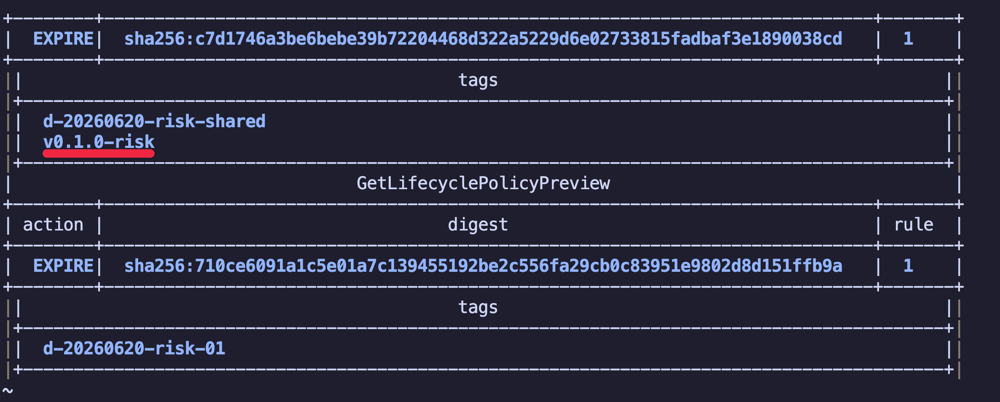
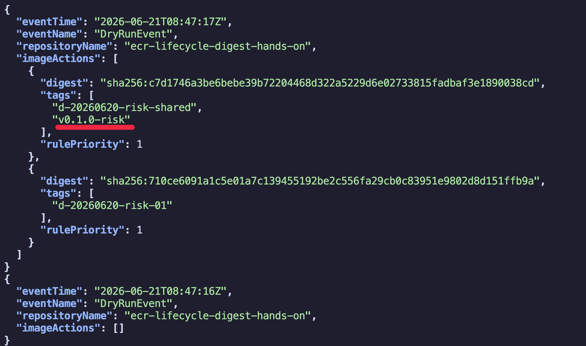

# 시나리오 2: guard 없는 lifecycle preview

## 목적

개발환경(d-*) lifecycle rule만 있을 때, 개발환경(d-*) tag와 운영환경(vx.x.x) tag가 같은 digest를 가리키는 image가 개발환경 cleanup 대상이 될 수 있음을 preview로 확인합니다. 이 실험은 실제 lifecycle policy를 repository에 적용하지 않고 preview policy text만 사용합니다.

## 사전 준비

- [공통 준비](./00-setup.md)를 먼저 완료합니다.
- 시나리오 1과 같은 repository를 이어서 사용해도 됩니다.
- 이 시나리오에서는 운영 보호 rule이 없으므로 실제 policy로 적용하지 않습니다.

## 절차

먼저 개발환경(d-*) tag와 운영환경(vx.x.x) tag가 함께 붙은 오래된 shared image를 만듭니다. Python 파일을 실제로 바꿔서 image digest가 코드 변경을 반영하도록 합니다.

```bash
SHARED_DEV_TAG=d-20260620-risk-shared
SHARED_PROD_TAG=v0.1.0

printf 'IMAGE_MESSAGE = "shared risk artifact"\n' > app/version.py

docker build \
  --build-arg IMAGE_REVISION=risk-shared \
  -t "${IMAGE}:${SHARED_DEV_TAG}" \
  ./app

docker tag "${IMAGE}:${SHARED_DEV_TAG}" "${IMAGE}:${SHARED_PROD_TAG}"

docker push "${IMAGE}:${SHARED_DEV_TAG}"
docker push "${IMAGE}:${SHARED_PROD_TAG}"
```

이후 Python 파일을 매번 바꿔 개발환경 전용 image를 11개 push합니다. 이렇게 하면 label만 다른 image가 아니라 실제 애플리케이션 코드 파일이 다른 image를 만들 수 있습니다.

```bash
for i in 01 02 03 04 05 06 07 08 09 10 11; do
  TAG="d-20260620-risk-${i}"
  printf 'IMAGE_MESSAGE = "dev only %s"\n' "$i" > app/version.py
  docker build \
    --build-arg IMAGE_REVISION="risk-dev-${i}" \
    -t "${IMAGE}:${TAG}" \
    ./app
  docker push "${IMAGE}:${TAG}"
done

printf 'IMAGE_MESSAGE = "ecr lifecycle hands-on"\n' > app/version.py
```


운영환경(vx.x.x) image가 사용하는 digest 삭제를 방지하는 guard가 없는 lifecycle preview policy를 만듭니다. 이 policy는 실제 repository policy로 적용하지 않습니다.

```bash
cat > /tmp/ecr-dev-cleanup-without-guard.json <<'JSON'
{
  "rules": [
    {
      "rulePriority": 1,
      "description": "Risk preview: keep latest development images only",
      "selection": {
        "tagStatus": "tagged",
        "tagPrefixList": ["d"],
        "countType": "imageCountMoreThan",
        "countNumber": 10
      },
      "action": {
        "type": "expire"
      }
    }
  ]
}
JSON
```

preview를 실행합니다.

```bash
aws ecr start-lifecycle-policy-preview \
  --repository-name "$REPO_NAME" \
  --lifecycle-policy-text file:///tmp/ecr-dev-cleanup-without-guard.json

aws ecr get-lifecycle-policy-preview \
  --repository-name "$REPO_NAME" \
  --query 'previewResults[].{tags:imageTags,digest:imageDigest,action:action.type,rule:appliedRulePriority}' \
  --output table
```



shared 운영환경 tag가 preview 결과에 포함되는지 좁혀서 확인합니다.

```bash
aws ecr get-lifecycle-policy-preview \
  --repository-name "$REPO_NAME" \
  --query 'previewResults[?contains(imageTags, `v0.1.0`)].{tags:imageTags,digest:imageDigest,action:action.type,rule:appliedRulePriority}' \
  --output table
```

CloudTrail에서도 preview 결과가 digest 단위로 기록됐는지 확인합니다. Lifecycle preview는 `DryRunEvent`로 남습니다.

```bash
aws cloudtrail lookup-events \
  --lookup-attributes AttributeKey=EventName,AttributeValue=DryRunEvent \
  --max-results 20 \
  --output json \
  | jq -r --arg repo "$REPO_NAME" '
      .Events[].CloudTrailEvent
      | fromjson
      | select(.eventSource == "ecr.amazonaws.com")
      | select(.serviceEventDetails.repositoryName == $repo)
      | {
          eventTime,
          eventName,
          repositoryName: .serviceEventDetails.repositoryName,
          imageActions: [
            .serviceEventDetails.lifecycleEventImageActions[]?
            | {
                digest: .lifecycleEventImage.digest,
                tags: .lifecycleEventImage.tagList,
                rulePriority
              }
          ]
        }
    '
```



## 성공 기준

- preview 결과에서 `SHARED_PROD_TAG`가 붙은 shared digest가 expire 대상으로 잡히면, guard 없는 개발환경(d-*) lifecycle rule이 운영환경 tag까지 위험하게 만들 수 있음을 확인한 것입니다.
- CloudTrail `DryRunEvent`의 `lifecycleEventImageActions[].lifecycleEventImage.digest`와 `tagList`에 shared digest와 `SHARED_PROD_TAG`가 함께 보이면, tag 하나가 아니라 image digest 단위로 expire 후보가 기록됐음을 확인한 것입니다.
- 이 경우 실제 expire가 수행되면 tag 하나만 지워지는 것이 아니라 image가 만료됩니다. 따라서 같은 digest를 가리키던 운영환경 tag도 pull 불가능해질 수 있습니다.
- `batch-delete-image imageTag=...`로 개발환경 tag만 지우는 시나리오 1과 결과가 다르다는 점을 확인합니다.

## 결론

장점: 운영환경 tag가 붙은 shared digest가 왜 위험한지 preview로 직접 확인할 수 있습니다.

단점: 실수로 실제 policy에 적용하면 운영환경 tag가 붙은 image까지 expire될 수 있으므로, 운영 repository에서는 실행하면 안 됩니다.

## 다음 단계

- [시나리오 3](./03-lifecycle-dev-cleanup-prod-guard.md)
