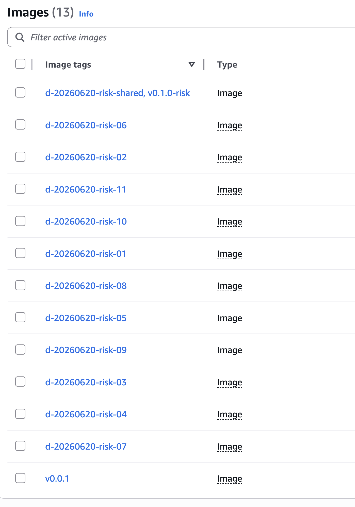
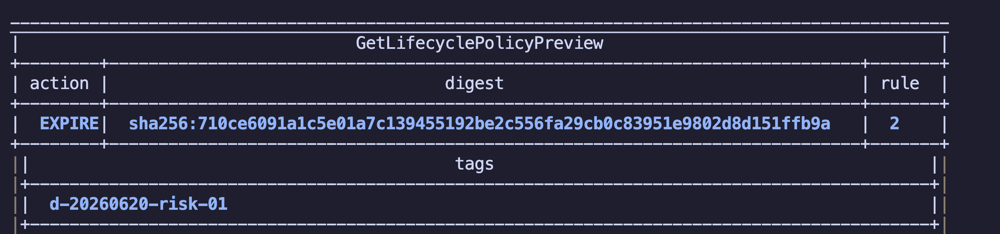

# 시나리오 3: lifecycle로 개발환경(d-*) cleanup과 운영환경(vx.x.x) guard 확인

## 목적

[시나리오 2](./02-lifecycle-dev-cleanup-without-guard.md)에서 만든 shared image를 그대로 사용합니다. 운영환경(vx.x.x) guard rule을 적용하면, guard가 없을 때 expire 후보였던 shared digest가 개발환경(d-*) cleanup 대상에서 제외되는지 확인합니다.

## 사전 준비

- [공통 준비](./00-setup.md)를 먼저 완료합니다.
- [시나리오 2](./02-lifecycle-dev-cleanup-without-guard.md)를 먼저 완료해야 합니다.
- 시나리오 2에서 만든 `d-20260620-risk-shared`, `v0.1.0`, `d-20260620-risk-01`부터 `d-20260620-risk-11` tag를 그대로 사용합니다.

## 절차

시나리오 2에서 만든 shared image와 개발환경 전용 image가 남아 있는지 확인합니다.

```bash
aws ecr describe-images \
  --repository-name "$REPO_NAME" \
  --query 'sort_by(imageDetails,&imagePushedAt)[].{pushed:imagePushedAt,tags:imageTags,digest:imageDigest}' \
  --output table
```

시나리오 2의 shared image tag 값을 다시 환경 변수로 둡니다.

```bash
SHARED_DEV_TAG=d-20260620-risk-shared
SHARED_PROD_TAG=v0.1.0
```

운영환경(vx.x.x) guard rule이 포함된 lifecycle policy를 활성화합니다.

```bash
cd terraform
terraform apply \
  -var enable_lifecycle_policy=true \
  -var enable_prod_guard_rule=true
cd ..
```



lifecycle preview를 실행합니다. 이번 preview는 repository에 적용된 실제 lifecycle policy를 사용합니다.

```bash
aws ecr start-lifecycle-policy-preview \
  --repository-name "$REPO_NAME"

aws ecr get-lifecycle-policy-preview \
  --repository-name "$REPO_NAME" \
  --query 'previewResults[].{tags:imageTags,digest:imageDigest,action:action.type,rule:appliedRulePriority}' \
  --output table
```

시나리오 2에서 expire 후보였던 shared 운영환경 tag가 이번 preview 결과에서 제외되는지 확인합니다.

```bash
aws ecr get-lifecycle-policy-preview \
  --repository-name "$REPO_NAME" \
  --query 'previewResults[?contains(imageTags, `v0.1.0`)].{tags:imageTags,digest:imageDigest,action:action.type,rule:appliedRulePriority}' \
  --output table
```



CloudTrail `DryRunEvent`에서도 shared 운영환경 tag가 expire 후보에 들어가지 않았는지 확인합니다.

```bash
aws cloudtrail lookup-events \
  --lookup-attributes AttributeKey=EventName,AttributeValue=DryRunEvent \
  --max-results 20 \
  --output json \
  | jq -r --arg repo "$REPO_NAME" --arg prod_tag "$SHARED_PROD_TAG" '
      .Events[].CloudTrailEvent
      | fromjson
      | select(.eventSource == "ecr.amazonaws.com")
      | select(.serviceEventDetails.repositoryName == $repo)
      | [
          .serviceEventDetails.lifecycleEventImageActions[]?
          | select(.lifecycleEventImage.tagList[]? == $prod_tag)
          | {
              digest: .lifecycleEventImage.digest,
              tags: .lifecycleEventImage.tagList,
              rulePriority
            }
        ]
    '
```

운영환경 tag pull을 확인합니다.

```bash
docker pull "${IMAGE}:${SHARED_PROD_TAG}"
```

## 성공 기준

- 개발환경(d-*) count rule은 개발환경 전용 오래된 image를 expire 대상으로 잡습니다.
- 개발환경(d-*) tag와 운영환경(vx.x.x) tag가 함께 붙은 shared digest는 `rulePriority=1`의 운영환경 guard 때문에 `rulePriority=2` 개발환경 cleanup 대상이 되지 않습니다.
- CloudTrail `DryRunEvent`에서 `SHARED_PROD_TAG`가 붙은 shared digest가 `lifecycleEventImageActions`에 없어야 합니다.
- `SHARED_PROD_TAG`는 계속 pull 가능해야 합니다.
- 시나리오 2의 guard 없는 preview와 비교했을 때, 같은 shared digest가 expire 대상에서 빠져야 합니다.

## 결론

장점: 시나리오 2에서 만든 동일한 image set을 사용하므로 guard 유무에 따른 lifecycle preview 차이만 비교할 수 있습니다.

단점: 운영환경(vx.x.x) `countNumber=9999`는 완전한 영구 보존 기능이 아닙니다. 운영환경(vx.x.x) image 개수가 9999개를 넘으면 guard rule 자체가 오래된 운영 image를 expire 대상으로 잡을 수 있습니다.

## 다음 단계

- [시나리오 4](./04-metadata-digest.md)
