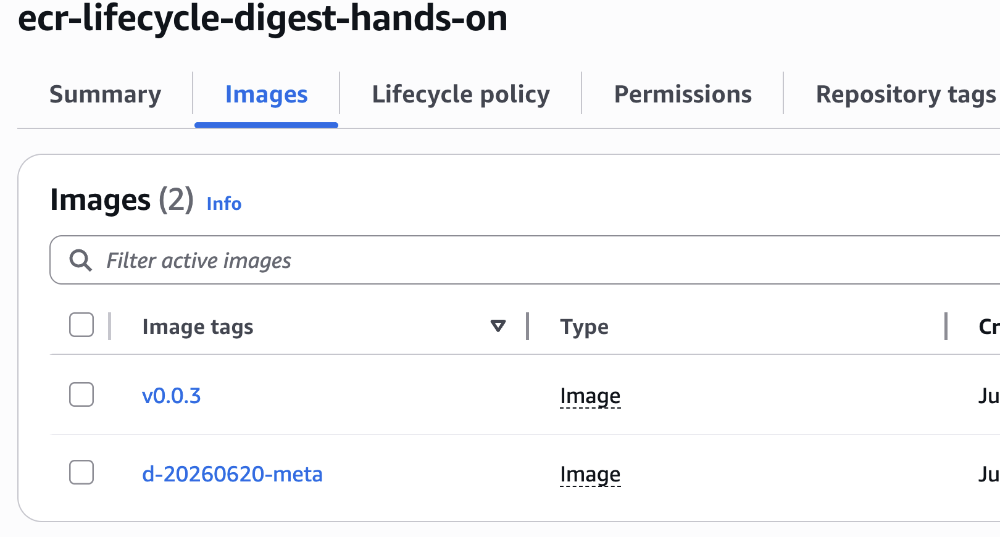

# 시나리오 4: metadata 차이로 digest 다르게 만들기

## 목적

애플리케이션 코드가 같아도 image metadata가 달라지면 ECR image digest가 달라질 수 있음을 확인합니다.

## 사전 준비

- [공통 준비](./00-setup.md)를 먼저 완료합니다.
- ECR repository와 Docker login이 준비되어 있어야 합니다.

## 절차

같은 FastAPI 코드로 metadata만 다르게 두 번 build합니다.

```bash
DEV_META_TAG=d-20260620-meta
PROD_META_TAG=v0.0.3

docker build \
  --build-arg IMAGE_REVISION=dev-commit-example \
  -t "${IMAGE}:${DEV_META_TAG}" \
  ./app

docker build \
  --build-arg IMAGE_REVISION=main-commit-example \
  -t "${IMAGE}:${PROD_META_TAG}" \
  ./app

docker push "${IMAGE}:${DEV_META_TAG}"
docker push "${IMAGE}:${PROD_META_TAG}"
```

두 tag의 digest가 다른지 확인합니다.

```bash
aws ecr describe-images \
  --repository-name "$REPO_NAME" \
  --image-ids imageTag="$DEV_META_TAG" \
  --query 'imageDetails[0].imageDigest' \
  --output text

aws ecr describe-images \
  --repository-name "$REPO_NAME" \
  --image-ids imageTag="$PROD_META_TAG" \
  --query 'imageDetails[0].imageDigest' \
  --output text
```

image label 값을 확인합니다.

```bash
docker pull "${IMAGE}:${DEV_META_TAG}"
docker image inspect "${IMAGE}:${DEV_META_TAG}" \
  --format '{{ index .Config.Labels "org.opencontainers.image.revision" }}'

docker pull "${IMAGE}:${PROD_META_TAG}"
docker image inspect "${IMAGE}:${PROD_META_TAG}" \
  --format '{{ index .Config.Labels "org.opencontainers.image.revision" }}'
```



## 성공 기준

- 같은 코드라도 `org.opencontainers.image.revision` label 값이 다르면 digest가 달라집니다.
- digest는 코드 동일성을 직접 증명하는 값이 아니라 image artifact 동일성을 증명하는 값입니다.
