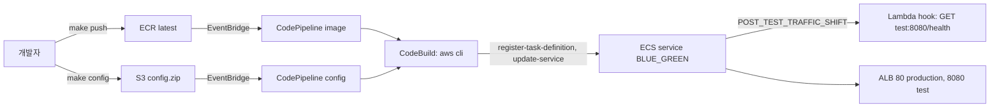

# Problem

ECS 서비스를 운영하다 보면 배포 방식에 대해 두 가지 아쉬움이 생겨요.

## rolling 배포의 아쉬움

기본 rolling 배포는 새 task가 healthy가 되는 대로 옛 task를 하나씩 지워요. 단순하고 비용도 적지만, 새 버전이 사용자 트래픽을 받기 전에 "정말 괜찮은지" 확인할 지점이 없어요. 문제를 알아채는 시점에는 이미 절반이 새 버전이고, 되돌리려면 옛 버전 task를 다시 띄우는 시간이 걸려요.

## CodeDeploy 기반 blue/green의 아쉬움

그래서 blue/green을 쓰려면 지금까지는 CodeDeploy를 붙여야 했어요. CodeDeploy application, deployment group, appspec.yaml을 따로 관리하고, 배포 이력도 CodeDeploy 콘솔에서 봐야 했죠. ECS 서비스 하나 배포하는데 관리 지점이 셋(CodePipeline, CodeDeploy, ECS)이 되는 게 부담이었어요.

## ECS가 직접 blue/green을 지원한다

2025년부터 ECS 서비스 자체에 blue/green 배포 전략과 lifecycle hook이 들어왔어요. 서비스에 target group 두 개와 listener rule 두 개(production, test)를 알려주면, ECS가 green을 띄우고, test listener로 먼저 붙여보고, 원하는 단계에서 Lambda를 호출해 주고, production 트래픽을 넘긴 뒤 bake time 동안 blue를 살려둬요. 그 사이 문제가 생기면 blue로 즉시 돌아가요.

그러면 파이프라인은 어떻게 짜야 할까요? 이 핸즈온의 답은 이래요.

- 이력은 CodePipeline이 가진다. 배포 한 번이 파이프라인 실행 한 번이에요.
- 배포 자체는 CodeBuild 안에서 AWS CLI로 한다. 현재 task definition을 읽어 바꿀 것만 바꾸고 새 revision을 등록한 뒤 update-service를 부르고, 배포가 SUCCESSFUL 또는 ROLLBACK이 될 때까지 기다려요. CodeBuild가 성공/실패로 끝나야 파이프라인 이력이 배포 결과와 같아져요.
- 파이프라인은 두 개다. 바뀌는 것이 다르기 때문이에요.

| 파이프라인 | 트리거 | 바꾸는 것 | 바꾸지 않는 것 |
| --- | --- | --- | --- |
| image | ECR에 latest tag push | container image (버전 tag) | environment |
| config | S3에 config.zip 업로드 | container environment | image |

## 전체 그림

두 파이프라인이 같은 CodeBuild 프로젝트와 같은 ECS 서비스로 모이는 구조예요.

이제 [setup.md](./setup.md)로 환경을 만들고 [2-handson.md](./2-handson.md)에서 배포를 눈으로 따라가 봐요.
