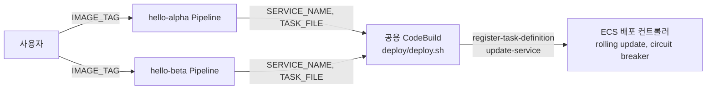

# ECS 배포 파이프라인: task definition은 Git으로, 이미지 태그는 입력으로

- ECS 설정 중 이미지를 뺀 나머지는 Git JSON, ECR 이미지 태그는 파이프라인 실행 입력.
- 최초 task definition과 service만 Terraform으로 생성. 이후에는 추출한 JSON을 Bash로 배포.
- 서비스별 CodePipeline 2개가 공용 CodeBuild 1개를 실행. 롤백 판단은 ECS circuit breaker.

## 구조

서비스별 Pipeline이 대상 서비스를 고정하고, 이미지 태그만 실행할 때 입력:



| 경로 | 역할 |
| --- | --- |
| `foundation/` | VPC, ECR, ECS cluster, IAM, GitHub connection, S3 |
| `workload/` | 최초 task definition·service, CodeBuild, CodePipeline |
| `deploy/export-taskdef.sh` | service가 쓰는 task definition을 Git JSON으로 추출 |
| `deploy/diff-taskdef.sh` | 운영 중 task definition과 Git JSON 비교. PR comment에서도 사용 |
| `deploy/task-definitions/*.json` | 서비스별 설정. image는 `__IMAGE__` |
| `deploy/deploy.sh` | JSON + 이미지 digest로 revision 등록, service 갱신, 결과 판정 |
| `scripts/` | 이미지 준비, Pipeline 실행, 서비스 상태 조회 |

## 실습

1. [AWS 환경 준비와 정리](docs/1-setup.md)
2. [이미지 배포와 설정 변경](docs/2-deploy.md)
3. [롤백](docs/3-rollback.md)

## 로컬 테스트

AWS 호출 없이 스크립트와 Terraform 계약 확인:

```bash
make test
make validate
```
