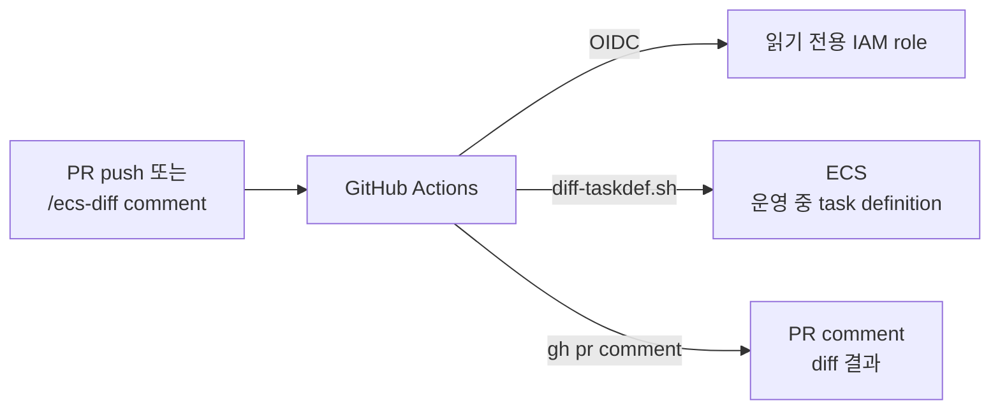

# PR에서 ECS task definition diff 보기

- 상태: 참고용. 워크플로 `.github/workflows/ecs-task-diff.yml`은 전체 주석 처리되어 실행되지 않음.

## 목적

- Git JSON을 고친 PR이 merge·배포되면 ECS에 무엇이 바뀌는지 리뷰 시점에 확인.
- task definition revision을 등록하기 전에 운영 상태와의 차이 확인.
- 콘솔 수정이나 circuit breaker 롤백으로 생긴 Git과 ECS의 어긋남도 함께 발견.

## 설계

GitHub Actions가 diff 스크립트를 실행하고 결과를 PR comment로 남김:

- 실행 내용은 로컬의 `deploy/diff-taskdef.sh`와 같음. 운영 정의를 `normalize.jq`로 Git 형식으로 바꾼 뒤 `diff -u`.
- 이미지는 배포 입력이라 비교하지 않고 현재 `app_version`만 표시.
- 트리거: task definition JSON이 바뀐 PR push, PR에 `/ecs-diff`로 시작하는 comment.
- AWS 인증: 저장된 키 없이 OIDC. role 권한은 `DescribeServices`, `DescribeTaskDefinition`뿐.
- comment는 매번 새로 달지 않고 같은 comment를 갱신.
- CodePipeline 승인 단계에 넣지 않은 이유: 승인 화면은 diff를 직접 보여 주지 못하고 배포마다 대기가 생김.

## public 저장소에서 지킬 것

- fork PR과 저장소 권한 없는 사람의 comment로는 실행하지 않음.
- comment 트리거는 기본 branch의 워크플로로 실행. PR에서는 JSON만 가져오고 스크립트는 기본 branch 것을 사용.
- 비밀값을 `environment`에 평문으로 넣으면 public comment에 노출. 비밀은 `secrets`(`valueFrom`)로만 넣음.

## 다시 켜기

1. `workload/github-diff.tf`의 role이 있는지 확인 (`terraform -chdir=workload output github_task_diff_role_arn`).
2. 워크플로 파일의 주석을 풀고 `ROLE_ARN`을 1번 값으로 바꿈.
3. comment 트리거는 기본 branch에 merge한 뒤부터 동작.
