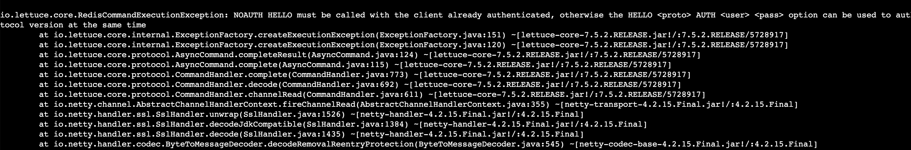

# AUTH token 강제

TL;DR: `ROTATE`로 무인증과 AUTH token을 함께 허용하는 호환 구간을 만들고, auth 컨테이너로 트래픽을 옮긴 뒤 `SET`으로 무인증을 막는다. 각 Terraform 변경 중 현재 트래픽 컨테이너의 Hurl gate가 끝나지 않아야 한다.

[3-setup.md](./3-setup.md)까지 마치면 8080 무인증 컨테이너와 gate가 돌고 있다. 아래 `terraform apply` 대신 AWS 콘솔·CLI로 클러스터를 바꾸려면 [6-console-runbook.md](./6-console-runbook.md)를 본다.

| 단계 | migration_phase | ElastiCache 상태 | 트래픽 컨테이너 | 다음 단계 조건 |
| --- | --- | --- | --- | --- |
| 시작 | `unauthenticated` | TLS만 | 8080 noauth | 8080 gate 정상 |
| 호환 | `auth_overlap` | `ROTATE` | 8080 → 8081 auth | 두 컨테이너 cache 정상 |
| 강제 | `auth_required` | `SET` | 8081 auth | 8081 gate 정상, 무인증 거부 |

## 1. ROTATE 후 auth 컨테이너 배포

8080 gate를 유지한 채 로컬에서 `ROTATE`를 적용한다. 새 token을 등록하면서 기존 무인증 연결도 함께 허용한다.

```bash
export TF_VAR_elasticache_auth_token='<16-128자 token>'
terraform -chdir=terraform apply -var migration_phase=auth_overlap
```

8080 gate가 계속 돌면 기존 컨테이너의 Redis 오류는 0건이다. 끝났다면 배포하지 않는다.

EC2 세션에서 auth 컨테이너를 8081에 띄운다. token은 위와 같은 값을 넣는다.

```bash
export ELASTICACHE_ENDPOINT=$(terraform -chdir=terraform output elasticache_primary_endpoint)
export AUTH_TOKEN='<same token>'
sudo docker run -d --name auth -p 8081:8080 \
  -e ELASTICACHE_ENDPOINT="$ELASTICACHE_ENDPOINT" \
  -e ELASTICACHE_AUTH_TOKEN="$AUTH_TOKEN" \
  choisunguk/elasticache-auth-client:auth-1.0.0
```

두 컨테이너가 같은 cache 값을 읽는지 확인한다.

```bash
hurl --retry 3 --retry-interval 1s --variable server_port=8081 ~/hurl/cache-read.hurl
hurl --variable server_port=8080 ~/hurl/cache-read.hurl
```

성공하면 별도 세션에서 `server_port=8081`로 gate를 시작한다. 8081 gate가 정상인 상태에서 8080 gate를 `Ctrl-C`로 끝내고 컨테이너를 종료한다.

```bash
sudo docker rm -f noauth
```

이 종료는 정리 작업이 아니라 다음 단계의 선행 조건이다. 무인증 컨테이너를 남긴 채 `SET`을 적용하면 이미 맺힌 연결이 살아 있어 cache 요청이 계속 성공한다. gate가 초록불이라 무중단에 성공한 것처럼 보이지만, 그 컨테이너는 다음 재연결에서 `NOAUTH`로 끊긴다. 이유는 [2-concepts.md](./2-concepts.md)에 있다.

## 2. SET으로 강제

무인증 컨테이너가 0대이고 8081 gate가 정상일 때만 `SET`을 적용한다. token 변수는 매 apply마다 필요하다. `SET`은 여기 넣은 token 하나만 남기므로 `ROTATE` 때와 같은 값이어야 8081 auth 컨테이너가 그대로 인증된다. 새 세션이면 같은 token을 다시 export한다.

```bash
export TF_VAR_elasticache_auth_token='<same token>'
terraform -chdir=terraform apply -var migration_phase=auth_required
```

적용 중 8081 gate가 계속 돌면 살아 있는 컨테이너의 오류는 0건이다. 인증 컨테이너를 한 번 더 확인한다.

```bash
hurl --variable server_port=8081 ~/hurl/cache-read.hurl
```

무인증이 막혔는지는 `SET` 이후에 새로 띄운 컨테이너로 확인한다. 새 컨테이너는 새 연결을 열기 때문에 첫 요청에서 `NOAUTH`를 받는다. 앞서 내린 8080을 살려두고 확인하지 않는 이유가 여기 있다. 살아 있던 연결로는 거부를 재현할 수 없다. 8083은 트래픽을 받지 않으므로 여기서 나는 인증 오류는 무중단 실패로 세지 않는다.

```bash
export ELASTICACHE_ENDPOINT="<terraform output elasticache_primary_endpoint>"
sudo docker run -d --name reject-noauth -p 8083:8080 \
  -e ELASTICACHE_ENDPOINT="$ELASTICACHE_ENDPOINT" \
  choisunguk/elasticache-auth-client:noauth-1.0.0
hurl --retry 60 --retry-interval 1s --variable server_port=8083 ~/hurl/cache-rejected.hurl
sudo docker rm -f reject-noauth
```

`cache-rejected.hurl`은 5xx를 기대한다. Hurl이 성공하고 8083 로그에 `NOAUTH`가 보이면 무인증이 거부됐다.



## 성공 조건

- `ROTATE` 적용 중 8080 gate가 끝나지 않는다.
- auth 배포 뒤 8080과 8081이 같은 cache 값을 읽는다.
- 8081 gate를 시작한 뒤 8080 gate와 컨테이너를 종료한다.
- `SET` 적용 시점에 무인증 컨테이너가 0대다.
- `SET` 적용 중 8081 gate가 끝나지 않는다.
- 전환 뒤 8081은 성공하고, `SET` 이후 새로 띄운 무인증 8083은 거부된다.

여기까지가 AUTH token 강제다. 이 상태(=`auth_required`, 8081 auth 컨테이너)에서 [5-rbac-iam.md](./5-rbac-iam.md)로 이어 RBAC와 IAM으로 넘어간다.
