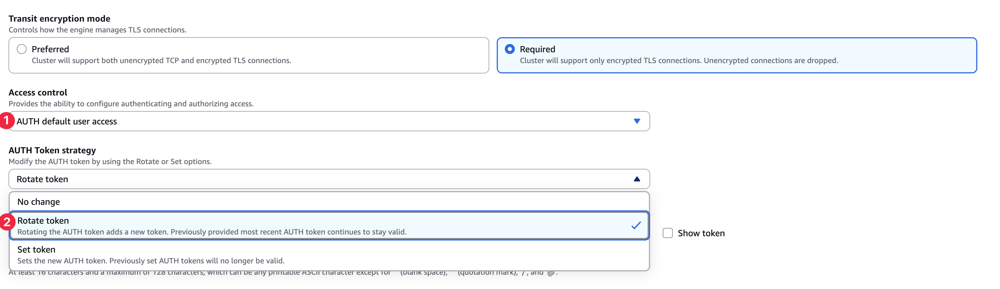
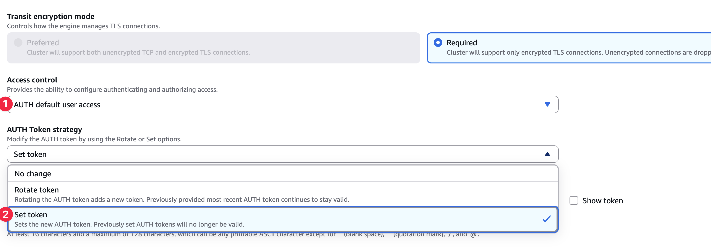
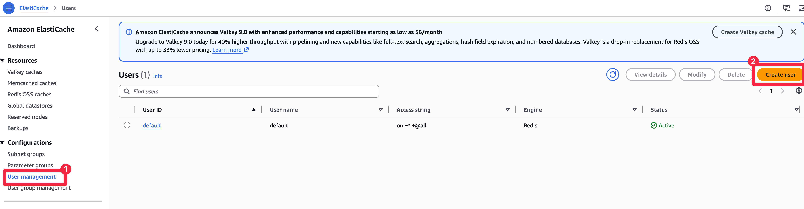
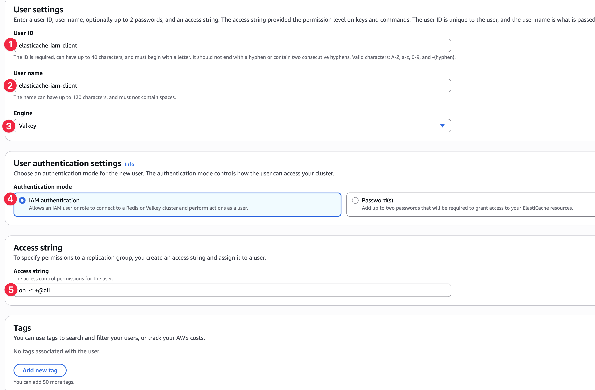
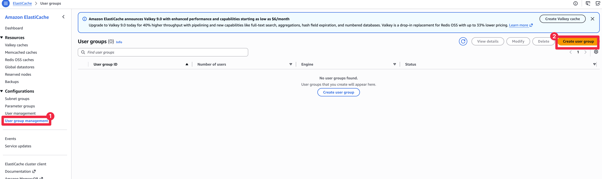
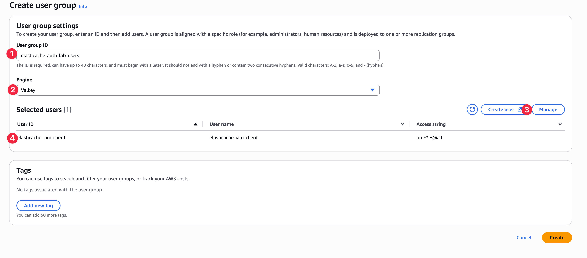
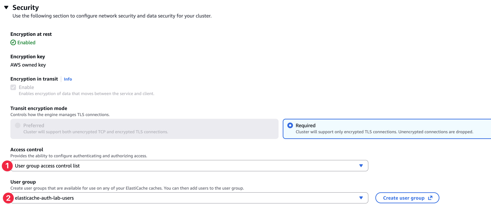

# 부록: AWS 콘솔과 CLI로 인증 전환

TL;DR: 4·5단계에서 `terraform apply -var migration_phase=...`로 하던 클러스터 변경을 콘솔과 CLI로 바꾼 문서다. EC2 컨테이너를 띄우고 Hurl gate를 돌리고 검증하는 절차는 4·5와 똑같고, 여기서는 ElastiCache 클러스터를 바꾸는 부분만 다룬다.

Terraform 없이 콘솔로 전환하려는 사람을 위한 문서다. `terraform apply` 한 줄에 가려져 있던 실제 클러스터 변경을 단계별로 풀어 쓴다. 규칙은 4·5와 같다. 어떤 변경을 걸든 그 사이에 지금 트래픽을 받는 컨테이너의 Hurl gate가 멈추면 다음 단계로 넘어가지 않는다.

## 단계마다 클러스터에 무슨 일이 일어나나

ElastiCache에 붙는 방법은 세 가지다. 아무 인증 없이(무인증), 공유 비밀번호(AUTH token)로, 사용자별 권한(사용자 그룹)으로. 이 실습은 무인증에서 시작해 사용자 그룹까지 네 단계로 옮겨간다. 각 단계에서 클러스터에 실제로 걸리는 변경은 아래와 같다. 괄호 안은 4·5 문서에서 쓰는 `migration_phase` 값이다.

| 단계 | 클러스터에 일어나는 일 |
| --- | --- |
| 1. 비밀번호 추가 (`auth_overlap`) | 비밀번호(AUTH token)를 새로 넣되, 기존처럼 비밀번호 없이 붙는 연결도 당분간 함께 허용한다 |
| 2. 무인증 차단 (`auth_required`) | 비밀번호 없는 연결을 막고 방금 넣은 비밀번호만 받는다 |
| 3. 사용자 그룹으로 전환 (`rbac_overlap`) | 비밀번호 로그인을 사용자 그룹 방식으로 바꾼다. 그룹에 비밀번호 사용자와 IAM 사용자를 함께 넣는다 |
| 4. IAM 전용 (`iam_required`) | 그룹에서 비밀번호 사용자를 빼 IAM 사용자만 남긴다. 이제 비밀번호 로그인은 막힌다 |

## 시작 전 확인과 이름

콘솔이든 CLI든 비밀번호(AUTH token)를 켜려면 조건이 두 가지다. 엔진이 Valkey 7.2 이상이어야 하고, 전송 구간 암호화가 켜져 있어야 한다. 이 실습은 둘 다 만족한다. 모든 변경은 즉시 적용한다. 콘솔은 Apply immediately, CLI는 `--apply-immediately`다.

콘솔에서 클러스터를 고르고 Modify를 열면 Access control에 선택지가 세 개 있다. No access control(무인증), AUTH default user access(비밀번호), User group access control list(사용자 그룹)다. 처음에는 No access control이다. AUTH default user access를 고르면 그 아래 AUTH Token strategy가 나오고, Rotate token과 Set 중 하나를 고른 뒤 AUTH token 칸에 비밀번호를 넣는다. Rotate는 기존 무인증 연결을 살려 둔 채 비밀번호를 더하는 방식이라, 무중단 전환의 핵심인 1단계를 여기서 만든다.

아래 이름은 `terraform/variables.tf`의 기본값이다. `project_name`을 바꿨다면 `terraform -chdir=terraform output`이나 콘솔 화면의 값으로 바꿔 읽는다.

| 대상 | 이름 |
| --- | --- |
| 클러스터(replication group) | `elasticache-auth-lab` |
| 비밀번호 사용자(default user) | user id `elasticache-auth-lab-password`, user name `default` |
| IAM 사용자 | user id·user name `elasticache-iam-client` |
| 사용자 그룹(user group) | `elasticache-auth-lab-users` |

사용자와 사용자 그룹은 엔진을 Valkey로 고르고, 권한(access string)은 `on ~* +@all`로 만든다. 이 값은 모든 키에 모든 명령을 허용한다는 뜻이다.

## 1. 비밀번호 추가 — 무인증도 함께 허용

8080 gate를 켜 둔 채로 지금 무인증인 클러스터에 비밀번호를 더한다. Rotate는 비밀번호를 새로 넣으면서 기존 무인증 연결을 끊지 않으므로 8080 gate가 그대로 돈다.

콘솔: 클러스터 → Modify → Access control에서 AUTH default user access를 고른다. AUTH Token strategy를 Rotate token으로 두고 AUTH token 칸에 새 비밀번호(16~128자)를 넣은 뒤 Apply immediately로 저장한다.

같은 변경을 CLI로 하려면 이렇게 한다.

```bash
aws elasticache modify-replication-group \
  --replication-group-id elasticache-auth-lab \
  --auth-token '<16-128자 비밀번호>' \
  --auth-token-update-strategy ROTATE \
  --apply-immediately
```



적용하는 동안 8080 gate가 계속 돌면 기존 컨테이너의 cache 오류가 0건이다. 이어서 [4-auth-token.md](./4-auth-token.md) 1절대로 auth 컨테이너(8081)를 띄우고, 8081 gate를 켠 다음 8080 gate와 컨테이너를 내린다.

## 2. 무인증 차단 — 비밀번호만 받기

8081 gate가 정상이고 구버전 컨테이너를 내린 것을 확인한 뒤 같은 비밀번호를 Set으로 다시 건다. Set은 비밀번호 하나만 남겨 무인증 연결을 막는다.

정확히는 새로 들어오는 무인증 연결을 막는다. 이미 맺힌 연결은 끊지 않으므로, 무인증 컨테이너를 내리지 않은 채 Set을 걸면 그 컨테이너는 계속 성공하다가 다음 재연결에서 `NOAUTH`로 끊긴다. 구버전 종료가 Set의 선행 조건인 이유다([2-concepts.md](./2-concepts.md) 참고).

콘솔: 같은 Modify → Access control의 AUTH default user access에서 AUTH Token strategy만 Set으로 바꾸고 같은 비밀번호를 넣어 저장한다.

같은 변경을 CLI로 하려면 이렇게 한다.

```bash
aws elasticache modify-replication-group \
  --replication-group-id elasticache-auth-lab \
  --auth-token '<같은 비밀번호>' \
  --auth-token-update-strategy SET \
  --apply-immediately
```



적용하는 동안 8081 gate가 유지되는지 보고, [4-auth-token.md](./4-auth-token.md) 2절대로 Set 이후에 새로 띄운 검증 컨테이너(8083)로 무인증이 막혔는지 확인한다. 새 컨테이너여야 새 연결을 열어 `NOAUTH`를 받는다.


## 3. 사용자 그룹으로 전환

8081 gate를 켜 둔 채로 사용자 두 명과 사용자 그룹을 만들어 클러스터에 붙인다. 비밀번호 사용자(default)의 비밀번호를 기존 비밀번호와 똑같이 맞추는 게 무중단의 핵심이다. 그래야 지금 `AUTH <비밀번호>`로 붙어 있는 8081 컨테이너가 이 default 사용자로 그대로 인증된다.

콘솔: ElastiCache → User management → Users에서 사용자 두 명을 만든다.

- 비밀번호 사용자: user id `elasticache-auth-lab-password`, user name `default`, 인증 방식 Password에 기존 비밀번호, 권한 `on ~* +@all`
- IAM 사용자: user id·user name `elasticache-iam-client`, 인증 방식 IAM, 권한 `on ~* +@all`

그다음 User groups에서 `elasticache-auth-lab-users`를 만들어 두 사용자를 넣는다. 마지막으로 클러스터 Modify → Access control을 User group access control list로 바꾸고 이 그룹을 고른 뒤 저장한다. 사용자 그룹으로 바꾸면 비밀번호(AUTH token)는 자동으로 지워지므로 따로 지울 필요가 없다.

같은 작업을 CLI로 하려면 이렇게 한다.

```bash
aws elasticache create-user --engine valkey \
  --user-id elasticache-auth-lab-password --user-name default \
  --access-string "on ~* +@all" \
  --authentication-mode Type=password,Passwords='<같은 비밀번호>'

aws elasticache create-user --engine valkey \
  --user-id elasticache-iam-client --user-name elasticache-iam-client \
  --access-string "on ~* +@all" --authentication-mode Type=iam

aws elasticache create-user-group --engine valkey \
  --user-group-id elasticache-auth-lab-users \
  --user-ids elasticache-auth-lab-password elasticache-iam-client

aws elasticache modify-replication-group \
  --replication-group-id elasticache-auth-lab \
  --user-group-ids-to-add elasticache-auth-lab-users \
  --auth-token-update-strategy DELETE \
  --apply-immediately
```

8081 gate가 계속 돌면 auth 컨테이너가 이 전환에 영향받지 않았다. gate가 멈추면 같은 클러스터를 그대로 바꾸는 방식을 중단하고 [5-rbac-iam.md](./5-rbac-iam.md) 끝의 blue-green(새 클러스터로 옮기기)으로 돌아선다. 이어서 5-rbac-iam.md 2절대로 iam 컨테이너(8082)를 띄우고, 8082 gate를 켠 다음 8081 gate와 컨테이너를 내린다.

## 4. IAM 전용으로

8081 컨테이너를 내리고 8082 gate가 정상인 것을 확인한 뒤 사용자 그룹에서 비밀번호 사용자(default)를 뺀다. Valkey 사용자 그룹은 default 사용자를 꼭 둬야 하는 제약이 없어서 IAM 사용자만 남겨도 된다. 이 사용자를 빼는 순간 default로 붙어 있던 연결이 끊기므로, 앞 단계에서 auth 컨테이너를 반드시 먼저 내려야 한다.

콘솔: ElastiCache → User management → User groups → `elasticache-auth-lab-users` → Modify에서 `elasticache-auth-lab-password`(default)를 빼고 저장한다.









같은 변경을 CLI로 하려면 이렇게 한다.

```bash
aws elasticache modify-user-group \
  --user-group-id elasticache-auth-lab-users \
  --user-ids-to-remove elasticache-auth-lab-password
```



8082 gate가 유지되면 IAM 컨테이너의 cache 오류가 0건이다. [5-rbac-iam.md](./5-rbac-iam.md) 3절의 검증 컨테이너(8084)로 비밀번호 로그인이 막혔는지 확인한다. 실습을 끝내면 콘솔에서 사용자 그룹·사용자·클러스터를 지우거나, terraform으로 관리했다면 `terraform -chdir=terraform destroy`로 정리한다.
