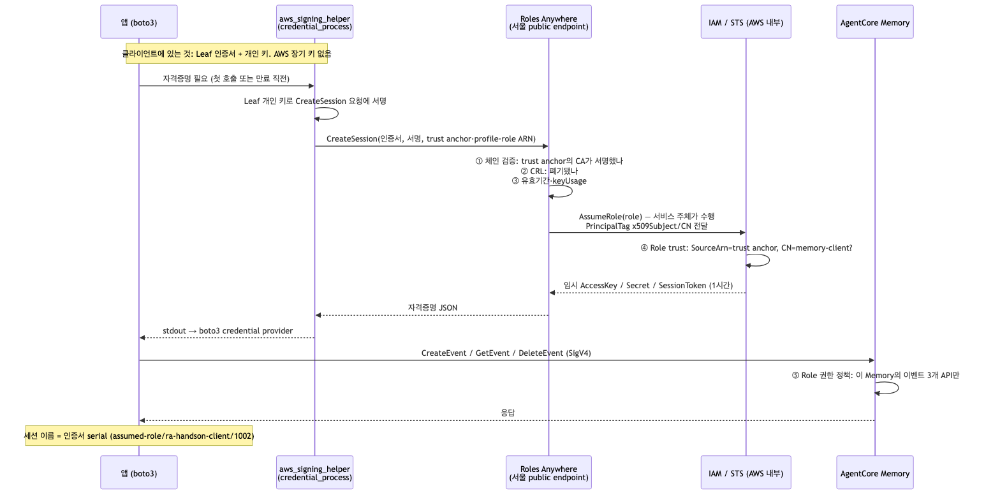
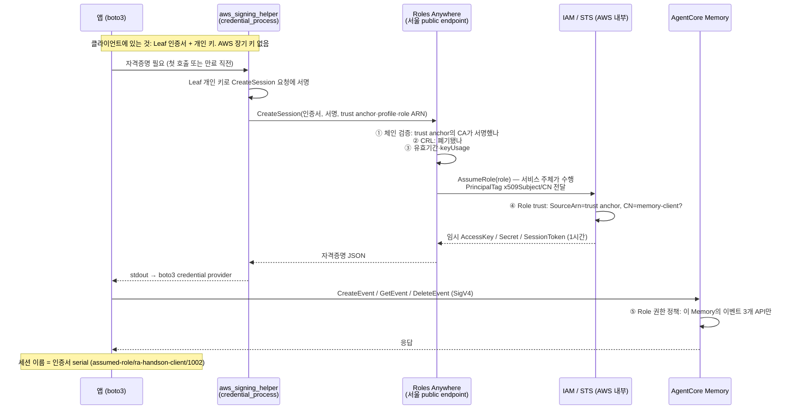
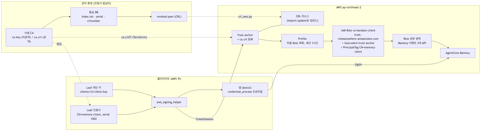

# IAM Roles Anywhere 개념

- 한 줄: **AWS 밖의 워크로드가 X.509 인증서로 IAM Role의 임시 자격증명을 받는 서비스**예요. AWS 장기 액세스 키를 배포하지 않아도 되고, 인증의 뿌리는 우리가 통제하는 CA예요.
- 이 문서는 30분 실습에 필요한 만큼만 다뤄요. 실행은 [핸즈온](2-handson.md), 실제 결과는 [검증](3-validation.md)에 있어요.

## 원리



Mermaid 원본은 `imgs/roles-anywhere-flow.mmd`예요.



- 두 번의 서명이 있어요. **CreateSession은 인증서의 개인 키**로, 이후 **AWS API 호출은 받은 임시 키로 SigV4** 서명해요. 인증서는 자격증명을 "받을 때"만 쓰여요.
- 클라이언트는 STS를 직접 부르지 않아요. AssumeRole은 Roles Anywhere 서비스가 자기 권한으로 수행하고, 결과만 돌려줘요. 그래서 Role trust의 principal이 `rolesanywhere.amazonaws.com`이에요.
- 인증서의 CN 같은 속성은 `aws:PrincipalTag/x509Subject/CN` 태그로 Role trust 조건에 들어가요. **CA를 신뢰하는 것과 그 CA가 발급한 모든 인증서를 허용하는 것은 달라요.** 실습에서 같은 CA의 `CN=other-client` 인증서는 ④에서 거부돼요.
- SDK는 응답의 `Expiration`을 보고 만료 전에 helper를 다시 실행해요. 앱은 세션·client를 재사용하기만 하면 자동 갱신돼요.
- 세션 이름이 인증서 serial이라 CloudTrail에서 "어느 인증서가 이 호출을 했나"를 바로 추적할 수 있어요.

## 왜 OIDC가 아니라 Roles Anywhere인가

| | OIDC federation (AssumeRoleWithWebIdentity) | Roles Anywhere |
| --- | --- | --- |
| 신뢰의 뿌리 | 우리 IdP의 서명 키 | 우리 CA |
| 검증 시 AWS가 하는 통신 | **STS가 IdP의 discovery·JWKS URL을 인터넷으로 호출** | 없음. trust anchor에 등록된 CA 인증서로 로컬 검증 |
| IdP/CA 쪽 inbound 요구 | IdP가 AWS에서 오는 요청을 받아야 함. AWS의 outbound 소스 IP 목록은 공개되지 않음 | 없음. CA는 오프라인이어도 됨 |
| 클라이언트가 가지는 비밀 | IdP가 발급한 짧은 토큰 | 개인 키 (장기) |
| 폐기 | 토큰 만료·IdP에서 발급 중단 | CRL 업로드 |

inbound를 열 수 없는 폐쇄망 IdP라면 OIDC는 검증 단계에서 막혀요. Roles Anywhere는 AWS가 밖으로 나가는 통신 없이 검증하므로 그 제약이 없어요. 대신 개인 키라는 장기 비밀을 클라이언트가 보관하게 되니, 아래 운영 항목이 중요해져요.

## IAM Role과 구성 요소



Mermaid 원본은 `imgs/roles-anywhere-components.mmd`예요.

| 구성 요소 | 어디 있나 | 역할 | 이 실습의 값 |
| --- | --- | --- | --- |
| 사설 CA (ca.key / ca.crt) | 관리 환경 | Leaf에 서명. 공개 인증서만 AWS로 | `pki.py init`, 7일 |
| 발급 DB (index.txt, serial, crlnumber) | 관리 환경 | 어떤 serial을 발급·폐기했는지의 원장. CRL의 근거 | OpenSSL `ca` 표준 구조 |
| Leaf 인증서 + 개인 키 | 클라이언트 | 워크로드 신원. CN이 Role 조건과 맞아야 함 | `clients/v1`, `v2`: CN=memory-client, 2일 |
| Trust anchor | Roles Anywhere | "이 CA가 서명한 인증서를 믿는다" | ca.crt를 CERTIFICATE_BUNDLE로 등록 |
| CRL | Roles Anywhere | trust anchor에 붙는 폐기 목록 | `crl_aws.py import` |
| Profile | Roles Anywhere | 받을 수 있는 Role 목록, 세션 길이, (선택) 세션 정책 | Role 1개, 3600초 |
| IAM Role | IAM | trust policy가 "누가"를, 권한 정책이 "무엇을"을 정함 | `ra-handson-client` |
| Role 권한 정책 | IAM | 실제 서비스 권한 | Memory 이벤트 3개 API |
| aws_signing_helper | 클라이언트 | 인증서로 CreateSession 서명. 공식 바이너리 | 1.8.5, `install_helper.py` |
| SDK 프로파일 | 클라이언트 | `credential_process`로 helper 연결 | `run.py`가 임시 파일로 생성 |

Role trust policy가 핵심이에요. 실습의 trust는 세 조건을 동시에 요구해요.

```json
{
  "Effect": "Allow",
  "Principal": { "Service": "rolesanywhere.amazonaws.com" },
  "Action": ["sts:AssumeRole", "sts:TagSession", "sts:SetSourceIdentity"],
  "Condition": {
    "ArnEquals":    { "aws:SourceArn": "<이 실습의 trust anchor ARN>" },
    "StringEquals": {
      "aws:SourceAccount": "<계정>",
      "aws:PrincipalTag/x509Subject/CN": "memory-client"
    }
  }
}
```

- `sts:TagSession`이 있어야 인증서 속성이 세션 태그로 들어오고, 그걸 조건에 쓸 수 있어요.
- `SourceArn`을 빼면 같은 계정의 다른 trust anchor(다른 CA)로도 이 Role을 받을 수 있게 돼요.
- Profile의 세션 정책은 Role 권한을 더 좁히기만 해요. Role에 없는 권한을 만들지 못해요.
- 세션 길이는 helper 요청값·profile 값 중 작은 쪽이고, Role의 MaxSessionDuration을 넘으면 오류예요. 실습은 셋 다 3600초예요.

## 운영 시 주의사항

| 주제 | 실습 구성 | 운영에서 바꿔야 하는 것 |
| --- | --- | --- |
| CA 개인 키 | 관리 PC 파일 | 발급 환경에만 보관(HSM·AWS Private CA). CA 키 유출은 CA 교체 = trust anchor 교체 |
| Leaf 개인 키 | 파일 0600 | 워크로드마다 개별 키. OS 키 저장소·TPM·PKCS#11(helper 지원). 장기 키 대신 장기 개인 키가 생긴 것이지 비밀이 사라진 게 아님 |
| 신원 설계 | CN 하나 = Role 하나 | 워크로드·환경별 CN/SAN을 발급 절차가 강제. 클라이언트가 CSR의 CN을 마음대로 쓰면 조건이 무의미 |
| 인증서 교체 | `pki.py issue v2` 후 경로 교체 | 새 키+새 인증서를 한 단위로 배포, 새 프로세스와 갱신 중인 프로세스 둘 다 확인 후 옛 것 폐기 |
| 유효기간 | CA 7일, Leaf 2일, 세션 1시간 | 세 수명을 따로 감시. CloudWatch `DaysToExpiry`는 trust anchor(CA)만 봄. Leaf 만료는 별도 |
| 갱신 | SDK가 helper 재실행 | 장시간 프로세스는 세션·client 재사용. 임시 키를 복사해 새 Session을 만들면 갱신 끊김. NTP 필수 |
| 감사 | CloudTrail CreateSession, 세션 이름 = serial | serial → 인증서 → 워크로드 매핑표를 유지 |
| 네트워크 | public endpoint | 아래 "필요한 네트워크" |

- helper의 stdout은 자격증명 통로예요. 로그로 남기지 않아요.
- 폐쇄망에서 helper 바이너리는 미리 반입하고 SHA256을 검증해요(`install_helper.py`가 하는 일).

## Revoke

폐기는 세 단계이고 각각 막는 것이 달라요.

| 단계 | 명령 | 막는 것 | 못 막는 것 |
| --- | --- | --- | --- |
| 1. 로컬 CA에서 폐기 | `python pki.py revoke v1` | 아무것도. 발급 DB와 CRL 파일만 바뀜 | |
| 2. CRL을 AWS에 업로드 | `python crl_aws.py import` (이후는 `update`) | 그 인증서의 **새** CreateSession | 이미 발급된 임시 키 |
| 3. 기존 세션 회수 | IAM Role의 Revoke sessions 또는 `aws:TokenIssueTime` Deny | 지정 시각 이전에 발급된 세션의 API 호출 | 같은 Role의 정상 세션도 함께 막힘 |

- **AWS는 CDP·OCSP를 스스로 조회하지 않아요.** CRL 업로드가 곧 폐기 채널이에요. 실습에서는 업로드 직후 첫 시도부터 `AccessDeniedException: Certificate revoked`였어요.
- CRL은 항상 전체 목록이에요. 새 폐기 하나를 올리는 게 아니라 발급 DB로 다시 만든 전체를 `update`해요. 발급 DB가 유실되면 CRL을 못 만들어요.
- CRL에도 `nextUpdate`가 있어요(실습 2일). 그 전에 재생성·업로드하는 배치가 필요해요.
- 급할 때 한 번에 새 인증을 다 끊는 스위치는 trust anchor 또는 profile 비활성화예요. 정상 워크로드의 새 인증도 함께 끊겨요.
- 폐기 뒤 기존 세션은 최대 세션 길이(1시간)만큼 살아 있어요. 세션 길이를 늘리면 갱신 부담은 줄지만 이 창도 길어져요.

## 필요한 네트워크

클라이언트가 실제로 접속하는 곳은 두 개뿐이에요.

| 목적지 | 언제 | 비고 |
| --- | --- | --- |
| `rolesanywhere.ap-northeast-2.amazonaws.com:443` | 자격증명 발급·갱신 (1시간마다) | CreateSession |
| `bedrock-agentcore.ap-northeast-2.amazonaws.com:443` | 실제 데이터 API | 워크로드가 쓰는 서비스마다 하나씩 추가 |

- STS로 나가는 통신은 없어요. AssumeRole은 AWS 안에서 일어나요.
- 인바운드는 필요 없어요. CA·IdP 쪽으로 AWS가 들어오는 통신이 없다는 점이 OIDC와의 차이예요.
- 관리 통신(Terraform, CRL 업로드, helper 다운로드)은 관리 환경의 별도 경로예요.
- outbound IP를 고정해야 하면 두 목적지에 [public NLB 고정 IP 실습](../../../vpc_endpoint/agentcore-memory-static-ip/README.md)의 S01 패턴을 그대로 적용해요. `rolesanywhere`도 interface endpoint를 지원해요. 인증서 인증은 HTTPS 서버 이름 검증을 바꾸지 않으므로 그쪽 제약(이름 유지, IP만 변경)이 그대로예요.
- 프록시를 써야 하면 helper(`--with-proxy` 또는 `HTTPS_PROXY`)와 boto3 양쪽에 설정해요. 한쪽만 하면 인증 또는 데이터 호출이 실패해요.
- interface endpoint를 쓸 때 CreateSession의 endpoint policy는 `Principal: "*"`가 필요해요. 인증 전이라 IAM 주체가 없기 때문이고, trust anchor ARN과 인증서 속성 조건으로 좁혀요.

## 개발자에게 전달할 것

Role ARN만으로는 부족해요. CreateSession은 trust anchor·profile·role ARN 세 개를 모두 요구해요.

| 항목 | 예 | 누가 만드나 |
| --- | --- | --- |
| Trust anchor ARN | `arn:aws:rolesanywhere:ap-northeast-2:123456789012:trust-anchor/…` | 인프라. CA 공개 인증서 등록 |
| Profile ARN | `arn:aws:rolesanywhere:ap-northeast-2:123456789012:profile/…` | 인프라 |
| Role ARN | `arn:aws:iam::123456789012:role/app-client` | 인프라. trust에 CN 조건, 권한 정책 |
| Leaf 인증서 + 개인 키 | CN이 Role trust 조건과 맞는 값 | PKI가 발급, 개발자가 보관 |
| aws_signing_helper | OS/CPU에 맞는 공식 바이너리 | 개발자 설치. 폐쇄망이면 반입 |
| 리전·endpoint | `ap-northeast-2` | |
| 허용 목적지 | `rolesanywhere.…`, `bedrock-agentcore.…` 443 | 네트워크 |

- 주지 말아야 할 것: CA 개인 키, 다른 워크로드의 인증서, AWS 액세스 키.
- 개발자는 코드를 바꾸지 않아요. 설정 파일의 프로파일 하나가 인터페이스예요. 모든 언어 SDK가 `credential_process`를 읽어요.

```ini
[profile app]
region = ap-northeast-2
credential_process = /opt/aws/aws_signing_helper credential-process --certificate /etc/app/client.crt --private-key /etc/app/client.key --trust-anchor-arn arn:aws:rolesanywhere:ap-northeast-2:123456789012:trust-anchor/… --profile-arn arn:aws:rolesanywhere:ap-northeast-2:123456789012:profile/… --role-arn arn:aws:iam::123456789012:role/app-client --region ap-northeast-2
```

```python
session = boto3.Session(profile_name="app")
memory = session.client("bedrock-agentcore")   # 갱신은 SDK가 helper를 다시 실행
```

- 세션·client를 재사용해요. 임시 키를 꺼내 다른 Session에 복사하면 자동 갱신이 끊겨요.
- helper 출력은 자격증명이에요. 로그에 남기지 않아요.
- 인증서 만료일, 교체 절차, 폐기 시 연락 창구를 함께 전달해요.
