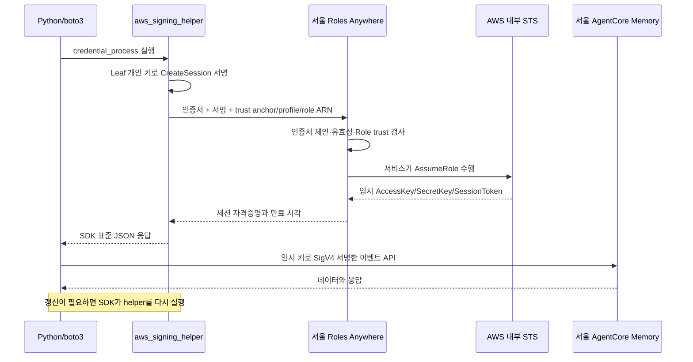

# 인증 원리와 구성 요소

- IAM Roles Anywhere는 AWS 밖의 애플리케이션이 X.509 인증서로 임시 AWS 자격증명을 받는 서비스예요.
- boto3는 인증서로 받은 임시 키를 사용해 서울 AgentCore Memory에 이벤트를 저장·조회·삭제해요.
- 이 기본 실습은 서울 public endpoint에 연결해요. 고정 IP 조건은 [NLB·VPN 실습](../../../vpc_endpoint/agentcore-memory-static-ip/docs/0-requirements.md)에서 다뤄요.

## 무엇을 신뢰할까?

| 구성 요소 | 역할 | 이 실습에서의 위치 |
| --- | --- | --- |
| CA, 인증 기관 | 애플리케이션 인증서에 서명 | 관리 PC의 로컬 실습 CA |
| Leaf 인증서 | 공개 키와 애플리케이션 식별 정보 보유 | 클라이언트 파일 |
| Leaf 개인 키 | 요청에 서명하고 키 소유 증명 | 클라이언트 파일, AWS로 전송하지 않음 |
| Trust anchor | AWS가 신뢰할 CA 공개 인증서 등록 | Roles Anywhere 리소스 |
| Roles Anywhere profile | 선택할 수 있는 Role·세션 길이·선택적 세션 정책 정의 | Roles Anywhere 리소스 |
| IAM Role | 인증서를 받아줄 조건과 Memory 접근 권한 정의 | IAM 리소스 |
| SDK profile | helper 실행 명령을 credential_process에 연결 | 임시 AWS 설정 파일 |

- Roles Anywhere profile과 SDK profile은 이름이 같아도 서로 다른 구성이에요.
- Trust anchor에 CA를 등록해도 모든 인증서에 같은 권한이 주어져서는 안 돼요.
- CA 개인 키를 가진 주체는 새로운 인증서를 발급할 수 있어요. Leaf 개인 키보다 넓은 신뢰 범위를 가져요. [PKI 원리](https://docs.aws.amazon.com/rolesanywhere/latest/userguide/public-key-infrastructure.html)

## 요청 흐름

처음 자격증명을 받을 때와 Memory를 호출할 때 사용하는 서명 키가 달라요.

- CreateSession은 인증서의 비대칭 키 서명을 사용해요.
- Memory 요청은 발급된 임시 Secret Access Key로 SigV4 서명해요.
- helper의 stdout은 자격증명을 전달하는 채널이에요. 애플리케이션 로그로 출력하지 않아요.
- 클라이언트의 필수 데이터 통신 대상은 Roles Anywhere와 Memory의 endpoint 2개예요.
- Role trust의 STS 권한은 Roles Anywhere 서비스가 사용하는 권한이에요. 이 클라이언트는 STS를 직접 호출하지 않아요. [CreateSession과 AssumeRole](https://docs.aws.amazon.com/rolesanywhere/latest/userguide/authentication-create-session.html)

## 인증과 권한을 나누기

| 검사 | 실패 예 |
| --- | --- |
| 인증서 서명·체인·기간 | 신뢰하지 않은 CA, 만료된 인증서, 개인 키 불일치 |
| Trust anchor/profile 활성 상태 | 비활성화된 설정으로 새 세션 요청 |
| IAM Role trust | 같은 CA가 발급했지만 CN이 다른 인증서 |
| Role의 서비스 권한 | 허용하지 않은 Memory API나 다른 Memory에 접근 |
| 추가 정책 계층 | SCP·permissions boundary·session policy의 제한 또는 명시적 Deny |

- Role trust는 `rolesanywhere.amazonaws.com`에 `sts:AssumeRole`, `sts:TagSession`, `sts:SetSourceIdentity`를 허용해요.
- 이 실습은 trust anchor ARN·계정·인증서 CN=`memory-client`를 함께 제한해요.
- Profile의 세션 정책은 Role의 권한을 더 좁히는 용도예요. Role에 없는 권한을 새로 부여하지 못해요.
- 최종 Role 권한은 실습 Memory 1개의 CreateEvent·GetEvent·DeleteEvent예요. [인증 조건과 Role trust](https://docs.aws.amazon.com/rolesanywhere/latest/userguide/trust-model.html)

## SDK가 갱신하는 방식

- `credential-process` 명령은 1번 실행되고 종료돼요.
- SDK는 응답의 `Expiration`을 읽고 필요할 때 그 명령을 다시 실행해요.
- 갱신 가능한 provider를 계속 사용하려면 같은 boto3 세션과 client를 유지해야 해요.
- 임시 키를 따로 복사해 `boto3.Session(aws_access_key_id=...)`를 만들면 원래 provider와 연결이 끊겨요.
- 실습에서는 SDK profile을 명시해 환경변수의 기존 AWS 키가 먼저 선택되지 않도록 해요.
- 실습은 helper 1.8.5와 1시간 자격증명을 사용해요. [공식 helper와 SDK 연결](https://docs.aws.amazon.com/rolesanywhere/latest/userguide/credential-helper.html)

## 3가지 수명

| 대상 | 실습 값 | 만료의 의미 |
| --- | --- | --- |
| CA 인증서 | 7일 | 신뢰 체인으로 새 인증을 수행할 수 있는 기간 |
| Leaf 인증서 | 2일 | 해당 인증서로 새 CreateSession을 요청할 수 있는 기간 |
| AWS 임시 자격증명 | 1시간 | 이미 받은 키로 AWS API를 호출할 수 있는 기간 |

- 세션 길이는 요청값과 profile 값 중 작은 값으로 결정돼요.
- 이렇게 정한 세션 길이가 IAM Role의 MaxSessionDuration을 넘으면 오류예요. Role 한도까지 자동으로 줄여 주는 방식은 아니에요.
- Leaf 인증서를 교체·폐기하는 작업과 이미 발급된 세션의 권한을 회수하는 작업은 별개예요. [세션 만료 계산](https://docs.aws.amazon.com/rolesanywhere/latest/userguide/authentication-create-session.html)

## 네트워크 제약

- Roles Anywhere는 HTTPS의 서버 인증서 검증을 대체하지 않아요.
- boto3의 TLS `client_cert`를 설정하는 mTLS 방식과 달라요.
- NLB 주소로 endpoint만 바꾸면 AWS 서버 인증서와 URL의 이름이 일치하지 않는 문제가 남아요.
- PrivateLink를 사용하면 Roles Anywhere의 인증 경로와 Memory의 데이터 경로를 각각 연결해야 해요.
- 고정 IP 경로는 [public NLB·hosts 변경](../../../vpc_endpoint/agentcore-memory-static-ip/docs/scenarios/s01/2-experiment.md)과 [public NLB·CONNECT proxy](../../../vpc_endpoint/agentcore-memory-static-ip/docs/scenarios/s07/2-experiment.md)에서 STS로 확인해요. Roles Anywhere를 그 경로에 얹는 것은 [심화학습](../../../vpc_endpoint/agentcore-memory-static-ip/README.md#심화학습)으로 남겨 두었어요.
