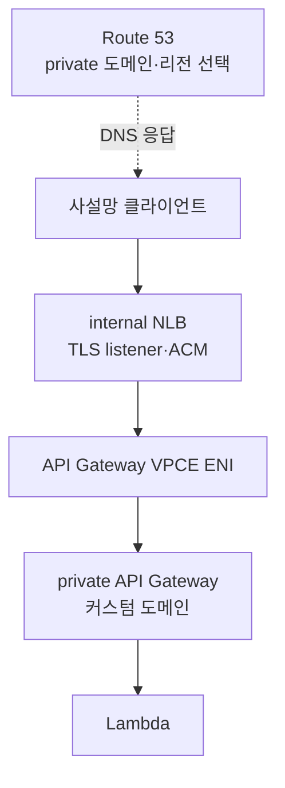
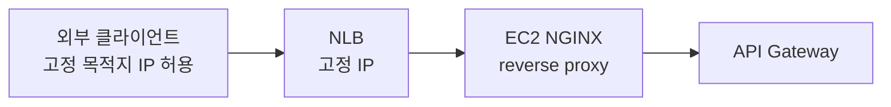
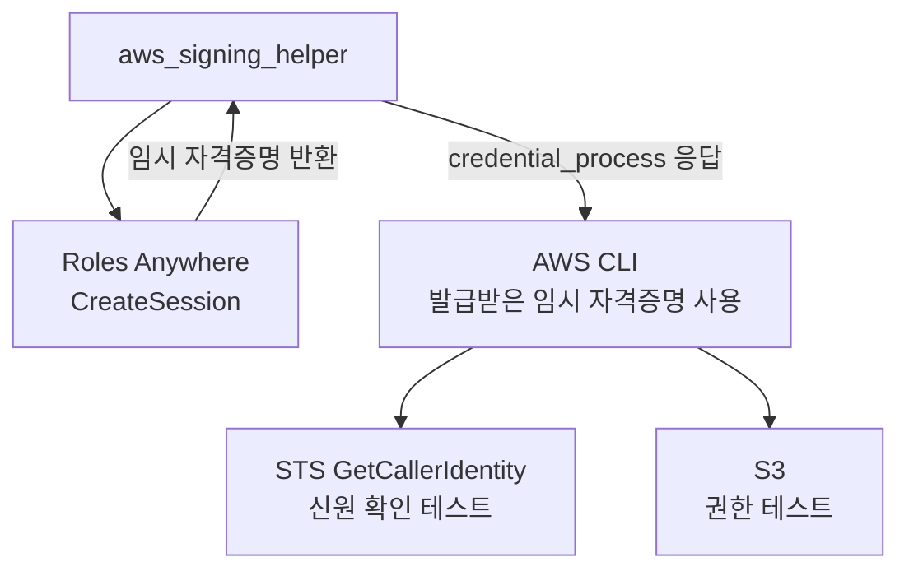
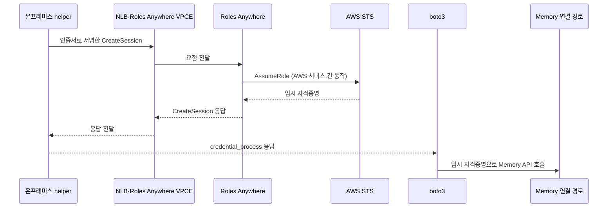

# NLB 고정 IP로 AWS API를 호출한 사례

- 조사 기준일: 2026-09-05.
- 가장 가까운 공개 구현은 AWS의 **IoT Core: EIP → NLB → interface VPC endpoint** 예제예요. outbound 방화벽에 목적지 IP를 고정 등록하려는 문제에서 출발해요. [AWS IoT 사례](https://aws.amazon.com/blogs/iot/creating-static-ip-addresses-and-custom-domains-for-aws-iot-core-endpoints/)
- Roles Anywhere는 클라이언트가 `CreateSession`을 호출하면 서비스가 `AssumeRole`로 받은 임시 자격증명을 반환해요. 기본 인증 흐름에서 클라이언트가 STS에 별도로 접속할 필요는 없어요. [CreateSession과 AssumeRole](https://docs.aws.amazon.com/rolesanywhere/latest/userguide/authentication-create-session.html)
- **Roles Anywhere·AgentCore Memory를 NLB 고정 IP로 호출한 동일 조건의 공개 성공 사례는 이번 조사에서 찾지 못했어요.** 아래 사례의 구현 사실과 이 실습에 적용한 설계 판단을 구분해요.

## 사례 비교

| 사례 | 자료 성격 | 공개된 연결 구조 | 이 실습과의 관계 |
| --- | --- | --- | --- |
| AWS IoT Core | AWS 공식 구현·배포 코드 | public NLB의 EIP → VPCE ENI → IoT Core | 목적지 고정 IP와 NLB → endpoint 구조가 가장 가까움 |
| Private API Gateway | AWS 공식 구현·배포 코드 | internal NLB → VPCE ENI → private API | 사설 NLB가 endpoint ENI를 대상으로 사용하는 사례 |
| API Gateway 프록시 | AWS 공식 지원 가이드 | NLB → EC2 NGINX → API Gateway | 고정 IP 뒤에 프록시를 두는 구성 |
| Oldcastle·Infor | 고객과 AWS가 공동 작성한 도입 사례 | public NLB의 EIP → EC2 router → RDS Proxy → Aurora | 외부 시스템의 허용 IP 목록 문제를 해결한 사례. AWS API 호출과는 구분 |
| Roles Anywhere demo | AWS Samples 코드 | helper → Roles Anywhere, 이후 STS·S3 테스트 | STS가 어떤 단계에서 호출되는지 확인할 수 있는 사례. NLB는 없음 |

- API Gateway 사례의 대상은 사용자가 배포한 API예요. AWS의 STS·Roles Anywhere 서비스 API와 같다고 볼 수는 없어요.
- 각 사례의 원문·코드와 적용 한계는 아래에 정리해요.

## 사례 1. IoT Core의 고정 IP와 커스텀 도메인

- 발행: 2022-02-09, AWS IoT Blog.
- 문제: 산업 현장의 outbound 방화벽은 IP·포트 허용 목록을 사용하지만 IoT endpoint의 IP는 바뀔 수 있어요.
- 구성: AZ별 EIP를 붙인 internet-facing NLB가 interface endpoint의 ENI 사설 IP로 TCP 트래픽을 전달해요.
- TLS: NLB에서 종료하지 않고 IoT Core까지 전달해요. IoT Core의 도메인 설정에 커스텀 도메인과 서버 인증서를 등록해요.
- 설정: endpoint로 전달하는 target group에서는 client IP preservation을 사용하지 않아요.
- 사설망 대안: 원문은 internal NLB와 Direct Connect·Site-to-Site VPN 조합도 설명해요. [원문](https://aws.amazon.com/blogs/iot/creating-static-ip-addresses-and-custom-domains-for-aws-iot-core-endpoints/)
- 재현 자료: [AWS Samples의 CDK·CloudFormation 코드](https://github.com/aws-samples/aws-iot-endpoint-with-static-ips).

NLB는 고정 IP를 제공하고, IoT Core가 커스텀 도메인의 TLS를 처리해요.

적용 판단:

- **NLB가 VPCE ENI를 대상으로 삼아 서비스에 연결하는 구조의 근거**로 사용할 수 있어요.
- 커스텀 URL이 동작하는 데에는 IoT Core의 도메인 설정도 관여해요. Route 53 레코드만 만들면 모든 AWS API가 그 이름을 받아 준다는 근거는 아니에요.
- Roles Anywhere로 확장할 때는 AWS 원래 이름을 유지하는 DNS 구성 또는 CONNECT 터널을 별도로 검증해야 해요.

## 사례 2. Internal NLB 뒤의 private API Gateway

- 발행: 2022-05-27, AWS Compute Blog.
- 목적: 여러 리전의 private API를 구성하고 DNS와 상태 확인으로 장애에 대응해요.
- 구성: internal NLB의 target group에 API Gateway interface endpoint의 ENI를 등록해요.
- TLS: NLB의 TLS listener에 ACM 인증서를 연결하고 API Gateway 커스텀 도메인도 구성해요.
- 검증: 사설 도메인을 조회한 뒤 HTTPS 요청으로 Lambda 응답을 확인해요. [원문](https://aws.amazon.com/blogs/compute/building-resilient-private-apis-using-amazon-api-gateway/)
- 재현 자료: [AWS Samples의 multiregional-private-api](https://github.com/aws-samples/serverless-samples/tree/main/multiregional-private-api).

리전별로 같은 구조를 배치하고 Route 53이 연결할 리전을 선택해요. 그림은 1개 리전의 경로예요.

적용 판단:

- **internal NLB → VPCE ENI → API**의 공개 구현 근거예요.
- 원문의 주목적은 장애 복구이며, 온프레미스 outbound 고정 IP 방화벽 실험은 아니에요.
- NLB에서 TLS를 종료하는 구성을 Roles Anywhere에 그대로 옮기면 안 돼요. 서비스의 도메인 처리와 요청 서명을 함께 확인해야 해요.

## 사례 3. NLB 뒤의 EC2 프록시로 API Gateway 호출

- 자료: AWS re:Post의 AWS 공식 Knowledge Center 가이드.
- 문제: API Gateway의 IP 변경을 방화벽 정책에 반영하기 어려운 환경이에요.
- 제안: 고정 IP를 제공하는 NLB가 EC2로 요청을 보내고, EC2의 NGINX reverse proxy가 API Gateway를 호출해요. [공식 지원 가이드](https://repost.aws/knowledge-center/api-gateway-manage-ip-changes)
- 자료 성격: 구성 방법을 안내하는 지원 문서예요. 특정 고객의 Roles Anywhere 운영 성공 보고는 아니에요.

NLB의 고정 IP로 받은 요청을 EC2의 reverse proxy가 API Gateway로 전달해요.

적용 판단:

- 고정 IP를 제공하는 NLB와 서비스에 연결하는 프록시의 역할을 나눈 사례예요.
- 이 문서의 NGINX reverse proxy와 실습의 HTTPS CONNECT proxy는 동작이 달라요.
- Roles Anywhere 요청에서는 서명 대상인 `Host` 등을 프록시가 바꾸면 서명이 일치하지 않을 수 있어요. 이 실습은 CONNECT 터널 안에서 AWS TLS·Host·서명을 유지하는 구성을 사용해요. [Roles Anywhere 서명 규칙](https://docs.aws.amazon.com/rolesanywhere/latest/userguide/authentication-sign-process.html)
- 연결 실습: 인터넷 경로는 [S07 public NLB·CONNECT proxy](../../../vpc_endpoint/agentcore-memory-static-ip/docs/scenarios/s07/2-experiment.md). internal NLB 변형은 [심화학습](../../../vpc_endpoint/agentcore-memory-static-ip/README.md#심화학습)으로 남겨 두었어요.

## 사례 4. Oldcastle의 Infor outbound 허용 목록

- 발행: 2026-04-21, AWS Architecture Blog. Oldcastle 담당자가 공동 작성했어요.
- 문제: Infor에서 사설 VPC에 직접 연결할 수 없고, outbound 연결에 사용할 안정적인 IP가 필요했어요.
- 구성: public NLB에 EIP를 붙이고 EC2 router를 거쳐 RDS Proxy·Aurora로 연결했어요.
- 효과: 데이터베이스의 주소가 장애 조치 중 바뀌어도 외부에 제공한 EIP를 유지해요. [고객 도입 사례](https://aws.amazon.com/blogs/architecture/real-time-analytics-oldcastle-integrates-infor-with-amazon-aurora-and-amazon-quick-sight/)

외부 Infor의 데이터베이스 연결은 NLB EIP로 들어오고, VPC 내부에서 Aurora까지 전달돼요.

적용 판단:

- **외부 시스템이 고정 목적지 IP를 요구해 NLB를 사용한 고객 사례**예요.
- 대상은 데이터베이스 연결이에요. Roles Anywhere의 인증서 서명이나 STS API가 NLB를 통해 검증됐다는 의미는 아니에요.

## 사례 5. Roles Anywhere 샘플에서 STS가 호출되는 이유

- 자료: [AWS Samples의 IAM Roles Anywhere demo](https://github.com/aws-samples/sample-aws-iam-roles-anywhere-demo).
- 코드: [demo.sh](https://github.com/aws-samples/sample-aws-iam-roles-anywhere-demo/blob/main/demo.sh).
- 설정 생성 단계: 관리용 자격증명으로 `aws sts get-caller-identity`를 호출해 계정 ID를 알아내요.
- 인증 단계: `credential_process`에 등록한 helper가 Roles Anywhere에서 임시 자격증명을 받아요.
- 검증 단계: 받은 자격증명으로 `aws sts get-caller-identity --profile roles-anywhere-demo`를 호출해 신원을 확인해요.
- 서비스 테스트: 이어서 S3 읽기·쓰기 권한을 확인해요.

인증 후의 검증 요청을 따로 그리면 STS 호출의 목적을 구분할 수 있어요.

이 샘플의 STS 호출은 실제 클라이언트 네트워크를 사용해요. 다만 **계정 ID 조회·발급 후 신원 확인을 위해 샘플이 추가한 호출**이며, helper가 자격증명을 발급받는 내부 단계와는 구분해야 해요. 샘플을 그대로 가져오면 STS·S3·설정 조회 API도 방화벽 허용 대상에 포함돼요. [해당 호출 코드](https://github.com/aws-samples/sample-aws-iam-roles-anywhere-demo/blob/main/demo.sh)

## Roles Anywhere와 STS의 호출 주체

기본 인증에서는 helper가 Roles Anywhere에 접속하고, Roles Anywhere 서비스가 STS와 연동해요. 아래의 STS 화살표는 AWS 서비스 간 동작이며 클라이언트의 NLB·VPCE를 지나는 경로가 아니에요. [공식 API 설명](https://docs.aws.amazon.com/rolesanywhere/latest/userguide/authentication-create-session.html)

- Role trust의 `sts:AssumeRole`은 Roles Anywhere 서비스가 Role을 맡도록 허용하는 권한이에요. 클라이언트가 STS endpoint에 연결하라는 네트워크 설정은 아니에요. [Roles Anywhere trust 모델](https://docs.aws.amazon.com/rolesanywhere/latest/userguide/trust-model.html)
- helper의 `--endpoint`는 Roles Anywhere endpoint를 지정해요. STS endpoint를 넣는 옵션이 아니에요.
- helper의 `--region ap-northeast-2`는 서명 리전을 지정해요. AWS 서비스 내부의 STS 통신 경로를 설정하는 옵션은 아니에요. [helper 옵션](https://docs.aws.amazon.com/rolesanywhere/latest/userguide/credential-helper.html)
- 애플리케이션이 추가로 `AssumeRole`을 호출해 Role을 바꾸거나 `GetCallerIdentity`를 실행한다면 그때는 클라이언트의 STS 연결 경로도 필요해요.

## 서울 리전에서 필요한 endpoint

아래는 Leaf 인증서를 준비한 뒤 클라이언트가 실행하는 인증·Memory 데이터 호출의 목적지예요. 인증서·helper 다운로드와 Terraform 관리 API는 별도 준비 단계예요.

| 용도 | 기본 서비스 이름 | PrivateLink 서비스 이름 | 클라이언트 연결 |
| --- | --- | --- | --- |
| 인증서로 자격증명 발급 | `rolesanywhere.ap-northeast-2.amazonaws.com` | `com.amazonaws.ap-northeast-2.rolesanywhere` | 필수 |
| Memory 이벤트 호출 | `bedrock-agentcore.ap-northeast-2.amazonaws.com` | `com.amazonaws.ap-northeast-2.bedrock-agentcore` | 필수 |
| 추가 Role 전환·신원 조회 | `sts.ap-northeast-2.amazonaws.com` | `com.amazonaws.ap-northeast-2.sts` | 해당 STS API를 직접 호출할 때 |

- 근거: [Roles Anywhere 리전 endpoint](https://docs.aws.amazon.com/general/latest/gr/rolesanywhere.html), [Roles Anywhere PrivateLink](https://docs.aws.amazon.com/rolesanywhere/latest/userguide/vpc-interface-endpoints.html), [AgentCore PrivateLink](https://docs.aws.amazon.com/bedrock-agentcore/latest/devguide/vpc-interface-endpoints.html), [AgentCore 서울 지원](https://docs.aws.amazon.com/bedrock-agentcore/latest/devguide/agentcore-regions.html), [STS 리전 endpoint](https://docs.aws.amazon.com/general/latest/gr/sts.html).
- STS에는 서울 Regional endpoint가 있어요. STS VPCE를 사용할 때도 같은 리전 endpoint로 호출해야 해요. 이 실습에서는 `sts.amazonaws.com`을 대상으로 삼지 않아요. [STS VPCE 구성](https://docs.aws.amazon.com/IAM/latest/UserGuide/reference_sts_vpc_endpoint_create.html)
- Roles Anywhere VPCE는 Memory 요청을 전달하지 않아요. 인증과 Memory 데이터 통신에 각각의 endpoint가 필요해요.

## NLB 주소로 endpoint만 바꾸면 될까?

- **TCP NLB 주소로 URL만 교체하는 것으로는 부족해요.** TCP 연결의 목적지, TLS 인증서의 이름, 서명에 들어가는 HTTP `Host`를 함께 맞춰야 해요.
- NLB IP target에는 AWS public endpoint의 공개 IP를 직접 등록할 수 없어요. 이 설계에서는 interface endpoint의 사설 ENI IP를 사용해요. [NLB target 제약](https://docs.aws.amazon.com/elasticloadbalancing/latest/network/load-balancer-target-groups.html)
- TCP listener는 암호화된 데이터를 그대로 전달해요. URL을 NLB 도메인으로 바꿔도 AWS 서버 인증서가 그 NLB 도메인용으로 바뀌지는 않아요. [NLB listener 동작](https://docs.aws.amazon.com/elasticloadbalancing/latest/network/load-balancer-listeners.html)
- Route 53 레코드는 이름을 IP로 연결해요. 그 이름에 대한 서버 인증서와 AWS 서비스의 커스텀 도메인 설정까지 만들어 주지는 않아요.
- NLB에 자체 인증서를 붙여 TLS를 종료해도 AWS 서비스의 Host 처리와 요청 서명 문제는 별도로 확인해야 해요. 서명 뒤 `Host`를 바꾸는 방식은 Roles Anywhere 서명 규칙과 맞지 않아요. [서명에 포함되는 Host](https://docs.aws.amazon.com/rolesanywhere/latest/userguide/authentication-sign-process.html)

다음 판정은 공개 사례와 프로토콜 제약을 바탕으로 한 설계 판단이에요. Roles Anywhere·Memory의 NLB 실통신 성공을 외부 사례로 입증한 결과는 아니에요.

| 클라이언트 조건 | 적용할 구성 | 판정 |
| --- | --- | --- |
| DNS 변경 가능, NLB 경유 필요 | AWS 원래 이름을 NLB IP로 해석하고 TCP로 VPCE까지 전달 | 조건부 가능. TLS·Host 유지 필요 |
| DNS 변경 불가, VPN 사용, endpoint 설정 가능 | helper와 boto3에 각 VPCE의 AWS 제공 DNS URL 지정 | 조건부 가능. NLB는 경유하지 않음 |
| DNS 변경 불가, NLB 필수, helper·SDK 프록시 설정 가능 | NLB → CONNECT proxy → 각 VPCE | 조건부 가능. AWS TLS를 터널 안에 유지 |
| DNS 변경 불가, NLB 필수, 서비스 URL만 NLB 주소로 변경 | TCP NLB → VPCE | 이 구성으로는 불가. 서버 인증서 이름 불일치 |
| DNS·endpoint·프록시 설정 모두 불가 | 클라이언트 설정으로 경로 변경 불가 | 애플리케이션 설정만으로는 불가. 네트워크 측 변경 필요 |

- DNS 변경 불가는 기존 AWS 이름의 응답을 바꾸지 못한다는 조건이에요. 사용할 프록시나 VPCE의 DNS 이름을 기존 환경에서 조회할 수 있는지는 별도로 확인해요.
- CONNECT 구성: helper의 `--with-proxy`·`HTTPS_PROXY`와 boto3의 프록시 설정을 모두 적용해요. [helper 프록시 지원](https://docs.aws.amazon.com/rolesanywhere/latest/userguide/credential-helper.html), [boto3 프록시 설정](https://docs.aws.amazon.com/boto3/latest/guide/configuration.html#using-proxies)
- VPN에서 VPCE를 직접 쓰면 endpoint ENI의 사설 IP는 해당 ENI의 수명 동안 유지돼요. endpoint 재생성까지 같은 IP를 보장하는 것은 아니에요. 고정 IP만 필요하고 NLB 경유는 필수가 아니라면 이 구성을 먼저 비교해요. [VPCE IP와 DNS](https://docs.aws.amazon.com/vpc/latest/privatelink/privatelink-access-aws-services.html)

## 기존 실습과 연결

- 전체 경로: [시나리오별 아키텍처·실험](../../../vpc_endpoint/agentcore-memory-static-ip/README.md).

| 확인할 조건 | 실습 |
| --- | --- |
| DNS 변경 + public NLB + STS | [S01 실험](../../../vpc_endpoint/agentcore-memory-static-ip/docs/scenarios/s01/2-experiment.md) |
| 자체 도메인 Route 53 레코드만으로 NLB를 호출했을 때의 TLS 실패 | [S05 실험](../../../vpc_endpoint/agentcore-memory-static-ip/docs/scenarios/s05/2-experiment.md) |
| DNS 변경 불가 + public NLB + CONNECT proxy | [S07 실험](../../../vpc_endpoint/agentcore-memory-static-ip/docs/scenarios/s07/2-experiment.md) |
| 인터넷 + public NLB + Roles Anywhere, VPN 변형 | [심화학습](../../../vpc_endpoint/agentcore-memory-static-ip/README.md#심화학습) (아직 없음) |

- 준비·정리는 각 실험에서 연결한 setup 문서를 사용해요.
- 최종 성공은 NLB의 target healthy만으로 판정하지 않아요. 허용한 목적지 IP만 사용하는 상태에서 CreateSession과 Memory 이벤트 저장·조회·삭제가 모두 성공해야 해요.
- 자격증명 갱신 때도 같은 경로를 사용하는지 확인해요. 인증 성공과 STS 진단 호출 실패를 구분해 기록해요.
- 저장소의 AWS 실통신 검증 상태: [네트워크 실습 검증 결과](../../../vpc_endpoint/agentcore-memory-static-ip/docs/4-validation.md), [Roles Anywhere 실습 검증 결과](5-validation.md).
