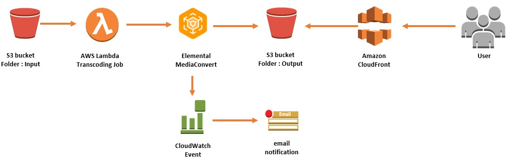
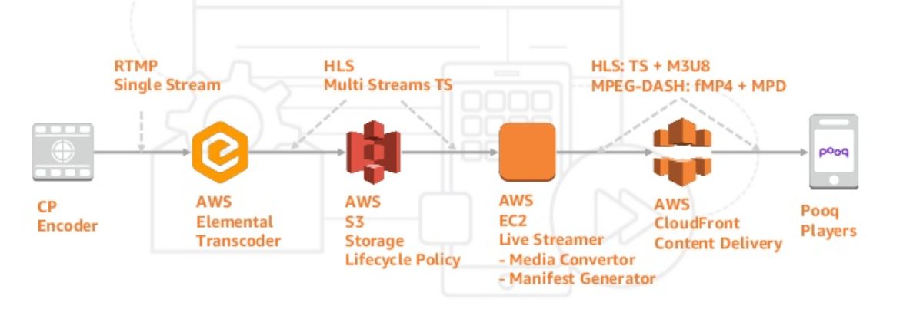
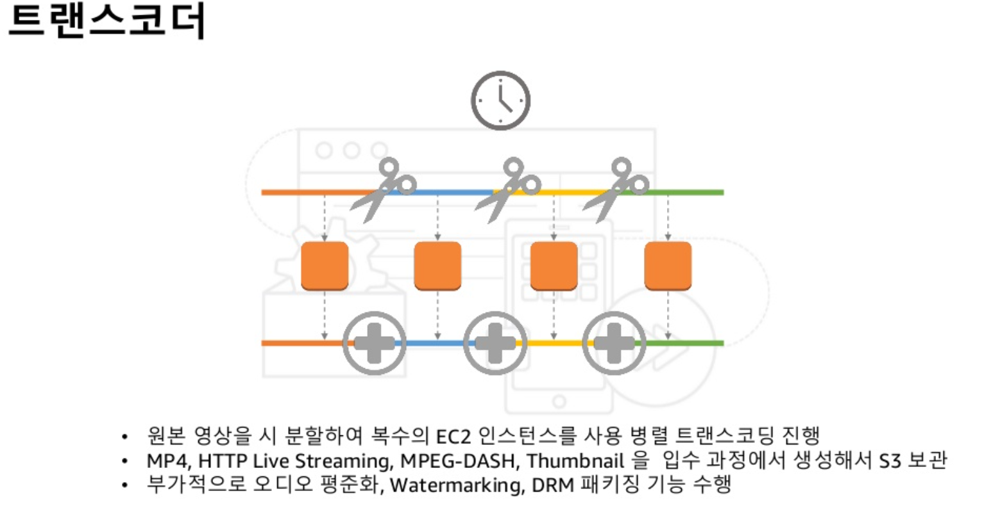
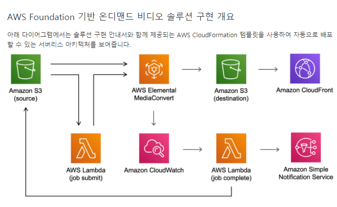
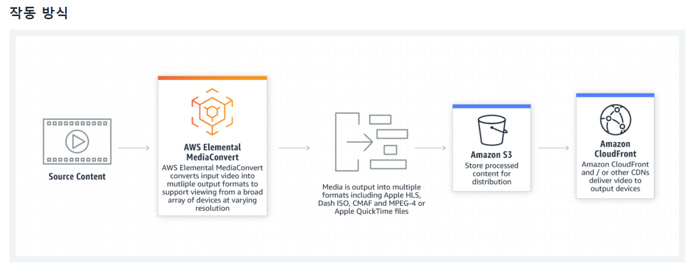

- [미디어 원본 파일 형식](#미디어-원본-파일-형식)
- [아키텍처1](#아키텍처1)
- [아키텍처2 - pooq사례](#아키텍처2---pooq사례)
- [아키텍처3](#아키텍처3)
- [아키텍처4](#아키텍처4)
- [aws 리소스](#aws-리소스)
  - [AWS Elemental MediaConvert](#aws-elemental-mediaconvert)
- [참고자료](#참고자료)


# 미디어 원본 파일 형식
* HLS: 아이폰
* MPEG DASH: 안드로이드

# 아키텍처1



출처 - https://aws.amazon.com/blogs/networking-and-content-delivery/serverless-video-on-demand-vod-workflow/

<br>

# 아키텍처2 - pooq사례






출처 - https://www.slideshare.net/awskorea/pooq-ott-case-for-live-vod-build-on-aws

<br>

# 아키텍처3


출처 - https://aws.amazon.com/ko/media/resources/education/


# 아키텍처4



<br>

# aws 리소스
## AWS Elemental MediaConvert
```
AWS Elemental MediaConvert는 브로드캐스트 수준의 기능을 제공하는 파일 기반 비디오 트랜스코딩 서비스입니다. 이 서비스를 사용하면 브로드캐스트와 멀티스크린 전달을 위한 VOD(주문형 비디오) 콘텐츠를 손쉽게 생성할 수 있습니다.
```



<br>

# 참고자료
* [1] [미디어 파일 포맷설명](https://docs.microsoft.com/ko-kr/azure/media-services/latest/dynamic-packaging-overview)
* [2] [Simple Serverless Video On Demand (VOD) Workflow](https://aws.amazon.com/blogs/networking-and-content-delivery/serverless-video-on-demand-vod-workflow/)
* [3] [pooq aws 도입사례](https://www.slideshare.net/awskorea/pooq-ott-case-for-live-vod-build-on-aws)