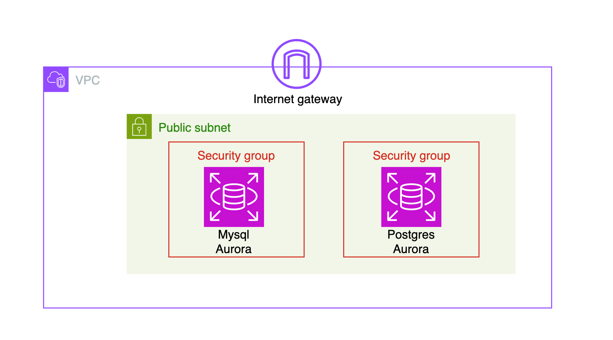

# 개요

* AWS RDS의 S3 import/export를 실습합니다.
* 실습 정리 블로그 링크: https://malwareanalysis.tistory.com/879
* 영상 정리
  * 1탄 공부 계기: https://youtu.be/FW2voayS620
  * 2탄 이론과 실습: https://youtu.be/529IkbRXI70

## 테라폼 아키텍처

* 테라폼 코드는 public subnet에 Aurora postgres, Aurora mysql를 생성합니다. 각 RDS security group은 테라폼을 실행한 PC에서만 접근하도록 inbound를 설정하고 있습니다.



```sh
cd terraform
terraform init

# 리소스 생성
terraform apply

# 실습 후 리소스 삭제
terraform destroy
```

## 샘플 데이터

* 샘플 데이터는 TPC-H를 사용합니다. TPC-H는 몇백만건에서 몇억건까지 샘플데이터를 간단히 생성할 수 있습니다.
* mysql, postgres 데이터를 생성하는 방법이 다릅니다.

1. git clone

```sh
git clone https://github.com/electrum/tpch-dbgen
cd tpch-dbgen
```

2. mysql

* dbgen바이너리 빌드

```sh
make
```

* 데이터 생성

```sh
./dbgen -s 1 -T
```

3. postgres

* makefile을 수정합니다. 칼럼 끝에 구분자를 삭제하는 옵션인 -DEOL_HANDLING를 추가합니다.

```sh
$ vi makefile
CFLAGS  = -g -DDBNAME=\"dss\" -D_FILE_OFFSET_BITS=64 -DEOL_HANDLING
```

```sh
make
```

* 데이터 생성

```sh
./dbgen -s 1 -T
```
