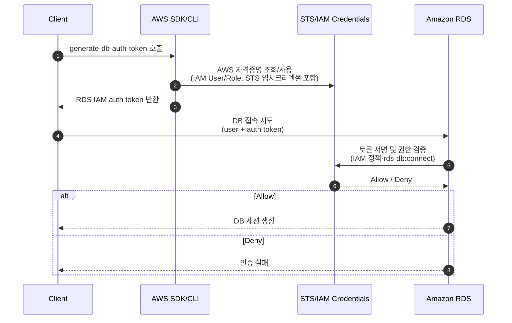
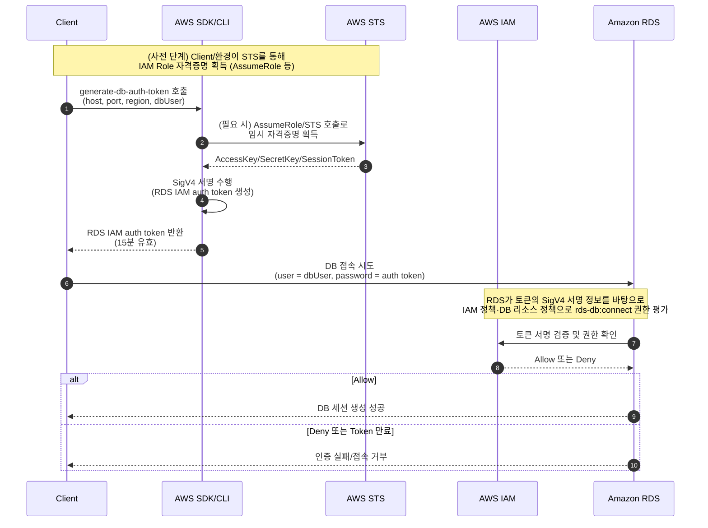

# 개요

- 이 글은 AWS RDS IAM 인증 실습을 위한 예제코드입니다. 테라폼 코드, 스프링부트 애플리케이션, DB 초기화 스크립트 등을 포함하고 있습니다.
- 이론 설명은 저의 블로그를 참고하세요.

블로그 링크: https://malwareanalysis.tistory.com/892

## 디렉터리 구조

- [terraform](./terraform/)
- [springboot](./app/springboot/iam-auth/)
- [DB 초기화 스크립트](./scripts/)
- [핸즈온 문서](./docs/)

## 아키텍처

- 간단한버전

- 자세한버전

