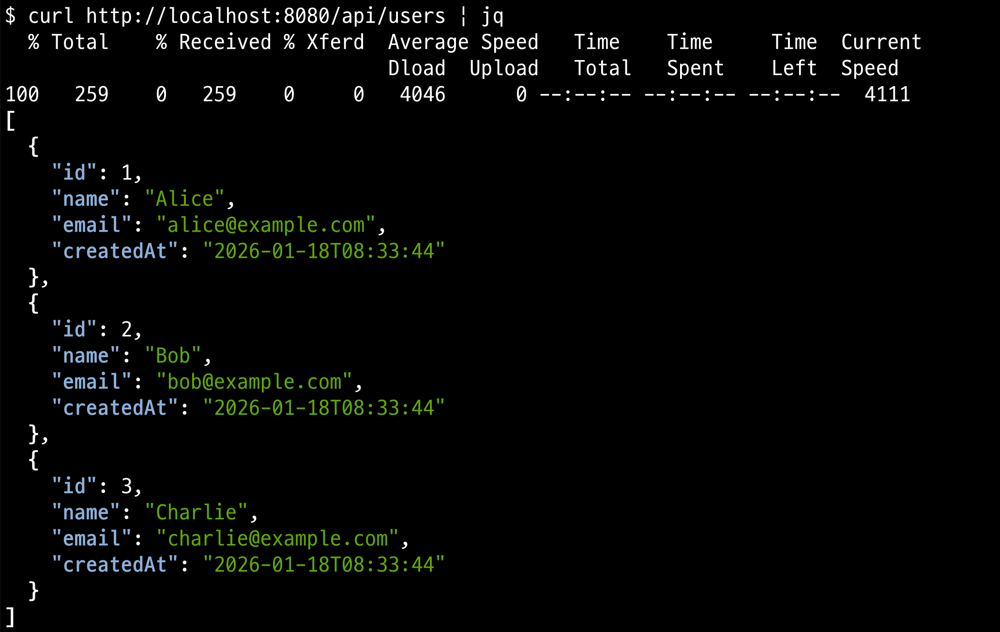
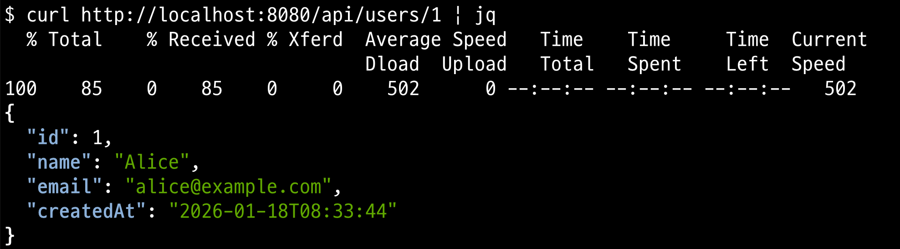
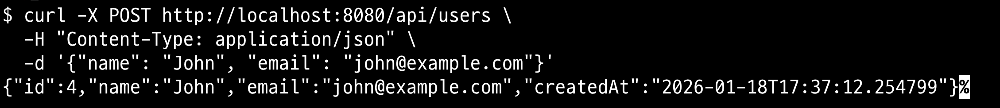
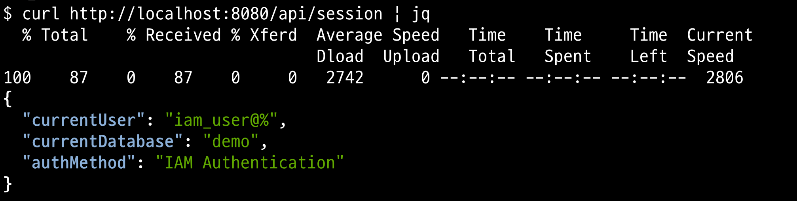

# Spring Boot RDS IAM Auth Demo

AWS Advanced JDBC Wrapper를 사용하여 RDS IAM 인증을 구현한 Spring Boot 애플리케이션입니다.

## 사전 요구사항

- Java 21
- Maven
- AWS CLI (IAM 자격 증명 설정)
- RDS IAM 인증이 활성화된 Aurora MySQL/PostgreSQL

## 실행 방법

### 환경 변수 설정

```bash
export RDS_HOSTNAME="your-cluster.cluster-xxx.ap-northeast-2.rds.amazonaws.com"
export RDS_PORT="3306"
export RDS_DATABASE="demo"
export RDS_USERNAME="iam_user"
export AWS_REGION="ap-northeast-2"
```

### 빌드 및 실행

```bash
# 빌드
./mvnw clean package -DskipTests

# 실행 (MySQL)
./mvnw spring-boot:run

# 실행 (PostgreSQL)
./mvnw spring-boot:run -Dspring.profiles.active=postgres
```

### Docker 실행

```bash
docker run -p 8080:8080 \
  -e RDS_HOSTNAME=your-cluster.cluster-xxx.ap-northeast-2.rds.amazonaws.com \
  -e RDS_DATABASE=demo \
  -e RDS_USERNAME=iam_user \
  -e AWS_REGION=ap-northeast-2 \
  choisunguk/springboot-rds-iam-auth:1.0
```

## API 엔드포인트

### 사용자 목록 조회

```bash
curl http://localhost:8080/api/users
```



### 사용자 상세 조회

```bash
curl http://localhost:8080/api/users/1
```



### 사용자 생성

```bash
curl -X POST http://localhost:8080/api/users \
  -H "Content-Type: application/json" \
  -d '{"name": "John", "email": "john@example.com"}'
```



### 현재 세션 정보 조회

```bash
curl http://localhost:8080/api/session
```

응답 예시:

```json
{
  "currentUser": "iam_user@10.0.1.123",
  "currentDatabase": "demo",
  "authMethod": "IAM Authentication"
}
```



### 헬스 체크

```bash
curl http://localhost:8080/api/health
```

## 주요 설정

### JDBC URL 형식

```
jdbc:aws-wrapper:mysql://<hostname>:<port>/<database>?wrapperPlugins=iam&iamRegion=<region>&sslMode=require
```

### 핵심 의존성

- `software.amazon.jdbc:aws-advanced-jdbc-wrapper` - AWS JDBC Wrapper
- `software.amazon.awssdk:rds` - RDS SDK (토큰 생성)
- `software.amazon.awssdk:sts` - STS SDK (자격 증명)

## 참고자료

- [AWS Advanced JDBC Wrapper](https://github.com/aws/aws-advanced-jdbc-wrapper)
- [RDS IAM Database Authentication](https://docs.aws.amazon.com/AmazonRDS/latest/UserGuide/UsingWithRDS.IAMDBAuth.html)
- https://zerone-code.tistory.com/19
