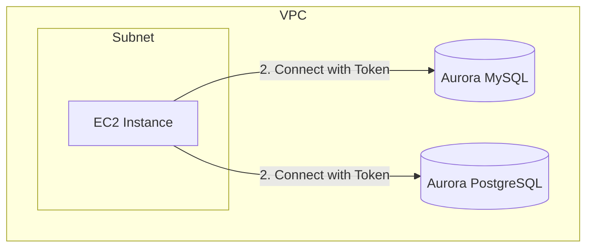

# 핸즈온

[terraform](../terraform/)으로 구축한 RDS에 접근할 때 IAM 인증을 사용하는 실습입니다.

## 테라폼으로 구축한 AWS 리소스 구조

VPC는 default VPC를 사용하고 default public subnet을 사용합니다. EC2, RDS security group으로 내 IP만 접근하도록 inbound를 설정했습니다.



## DB 초기화

### EC2 접속

```bash
aws ssm start-session --target <instance-id> --region ap-northeast-2
```

### DB CLI 설치

```sh
# MySQL Community 저장소 추가
sudo dnf install -y https://dev.mysql.com/get/mysql84-community-release-el9-1.noarch.rpm

# MySQL Client 설치
sudo dnf install -y mysql-community-client
```

### PostgreSQL CLI 설치

```sh
sudo dnf install -y postgresql16
```

### MySQL 초기화

- [MYSQL 초기화 스크립트 경로](../scripts/init_mysql.sh)

```bash
export MYSQL_HOST="<Aurora MySQL Endpoint>"
export MYSQL_PASSWORD="<master password>"

cd /home/ec2-user
chmod +x init_mysql.sh
./init_mysql.sh
```

### PostgreSQL 초기화

- [PostgreSQL 초기화 스크립트 경로](../scripts/init_postgres.sh)

```bash
export PGHOST="<Aurora PostgreSQL Endpoint>"
export PGPASSWORD="<master password>"

chmod +x init_postgres.sh
./init_postgres.sh
```

### IAM 인증 연결 테스트

#### MySQL 연결

```bash
# 토큰 생성
TOKEN=$(aws rds generate-db-auth-token \
  --hostname $MYSQL_HOST \
  --port 3306 \
  --region ap-northeast-2 \
  --username iam_user)

mysql -h $MYSQL_HOST \
  --port 3306 \
  --ssl-mode=DISABLED \
  --user=iam_user \
  --password="$TOKEN" \
  --enable-cleartext-plugin
```

연결 성공 시:

```sql
mysql> SELECT CURRENT_USER();
+------------------+
| CURRENT_USER()   |
+------------------+
| iam_user@%       |
+------------------+
```

### PostgreSQL 연결

```bash
# 토큰 생성
TOKEN=$(aws rds generate-db-auth-token \
  --hostname $PGHOST \
  --port 5432 \
  --region ap-northeast-2 \
  --username iam_user)

psql "host=$PGHOST port=5432 dbname=demo user=iam_user password=$TOKEN"
```

연결 성공 시:

```sql
demo=> SELECT current_user;
 current_user
--------------
 iam_user
```
