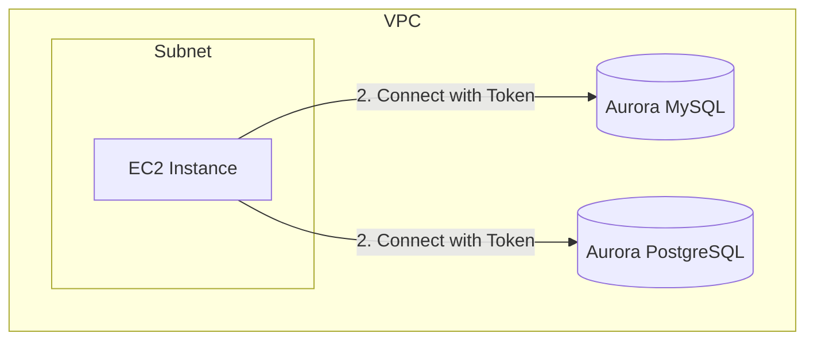

# 개요

테라폼이 생성하는 AWS 리소스: MySQL Aurora, PostgreSQL Aurora, EC2, Security Group

> VPC는 default VPC를 사용하고 default public subnet을 사용합니다. EC2, RDS security group으로 내 IP만 접근하도록 inbound를 설정했습니다.

```mermaid
graph TB
  subgraph "VPC"
    subgraph "Subnet"
      EC2[EC2 Instance]
    end

    MySQL[(Aurora MySQL)]
    PostgreSQL[(Aurora PostgreSQL)]
  end

  EC2 -->|2. Connect with Token| MySQL
  EC2 -->|2. Connect with Token| PostgreSQL

```
