# AWS Site to Site VPN 핸즈온 (TGW 기반)

이 예제는 AWS Site to Site VPN을 실습합니다. 이론 설명은 저의 블로그에 있습니다.

- 블로그 링크: https://malwareanalysis.tistory.com/893

## 시나리오

- AWS와 온프레미스는 각각 private subnet에 있는 nginx에 접근하기 위해, Site to Site VPN을 구축합니다. AWS와 온프레미스는 같은 회사가 운영하는 네트워크입니다.
- AWS는 Site to Site VPN을 구축합니다. TGW와 BGP를 통해 Active-Active VPN터널을 구성합니다.
- 온프레미스는 AWS EC2인스턴스에서 실행되고 strongSwan과 FRR을 설치하여 VPN 터널을 구성합니다. strongSwan은 VPN오픈소스이고 FRR은 오픈소스 BGP 라우터입니다.

## 실습

- Terraform으로 AWS cloud역할을 하는 VPC와 온프레미스 VPC를 생성합니다. 온프레미스 VPC에서는 VPN 역할을 하는 EC2인스턴스와 nginx역할을 하는 EC2인스턴스가 있습니다.
- Terraform으로 구축한 환경에서 AWS 콘솔에서 직접 TGW, Site to Site VPN을 구축합니다. 또한, EC2인스턴스 쉘에서 직접 strongSwan과 FRR을 설치하여 VPN 터널을 구성합니다.

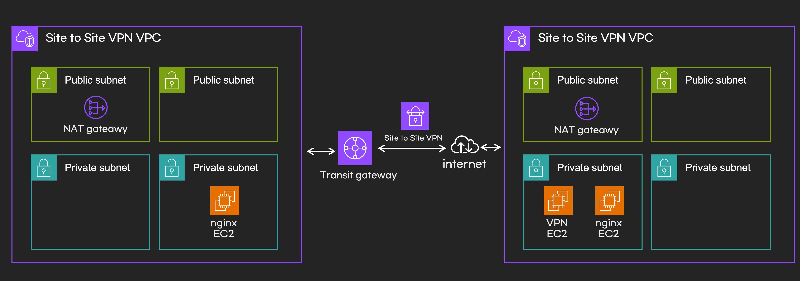

- Cloud VPC: `10.10.0.0/16`
- Onprem VPC: `10.20.0.0/16`

### Step 1: 인프라 배포 (Terraform)

Terraform 스크립트가 TGW, VPN 연결을 포함한 모든 AWS 리소스를 자동으로 생성합니다.

1. `terraform` 디렉터리로 이동하여 `init`과 `apply`를 실행합니다.

```bash
cd terraform
terraform init -upgrade
terraform apply --auto-approve
```

2. `apply`가 완료되면, 이후 단계에 필요한 출력 값들을 확인합니다.

```bash
# 온프레미스 VPN 장비의 Public IP (Customer Gateway IP로 사용됨)
terraform output on_prem_vpn_appliance_public_ip

# 각 EC2 인스턴스 접속용 SSM 명령어
terraform output
```

### Step 2: Site to Site VPN 생성

1. Customer Gateway 생성

- AWS 콘솔에서 **VPC > Customer Gateways**로 이동합니다.
- **Create customer gateway** 버튼을 클릭합니다.
- **BGP ASN**은 `65000`로 설정하고,
- **Public IP**은 `terraform output on_prem_vpn_appliance_public_ip`로 설정합니다.

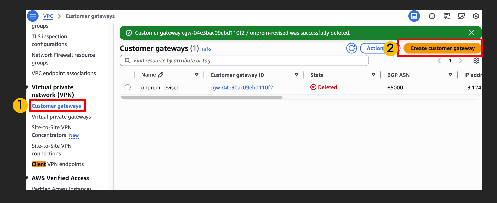

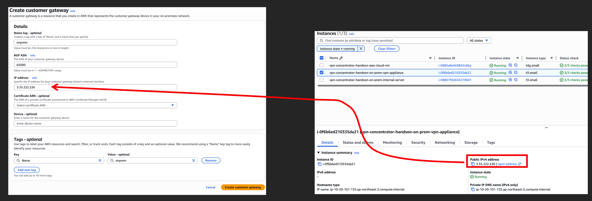

2. TGW 생성

- AWS 콘솔에서 **VPC > Transit Gateways**로 이동합니다.
- **Create transit gateway** 버튼을 클릭합니다.
- **BGP ASN**은 `65000`로 설정하고,
- ECMP를 설정하고,
- Default route table association, Default route table propagation은 해제하고,
- **Create** 버튼을 클릭합니다.

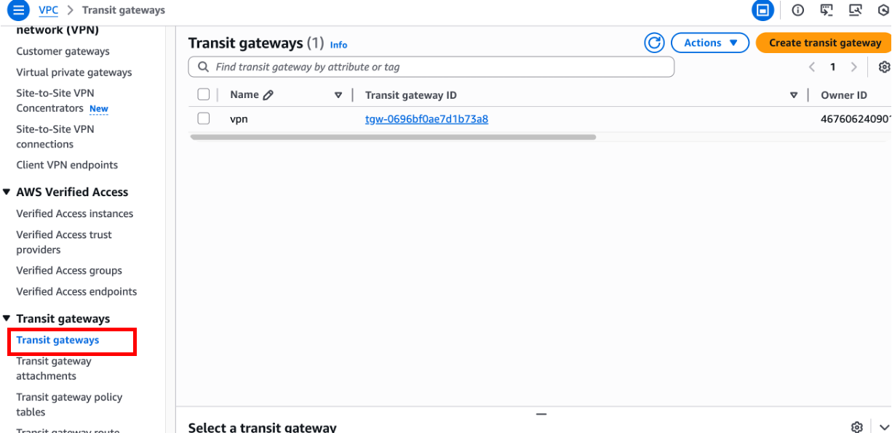

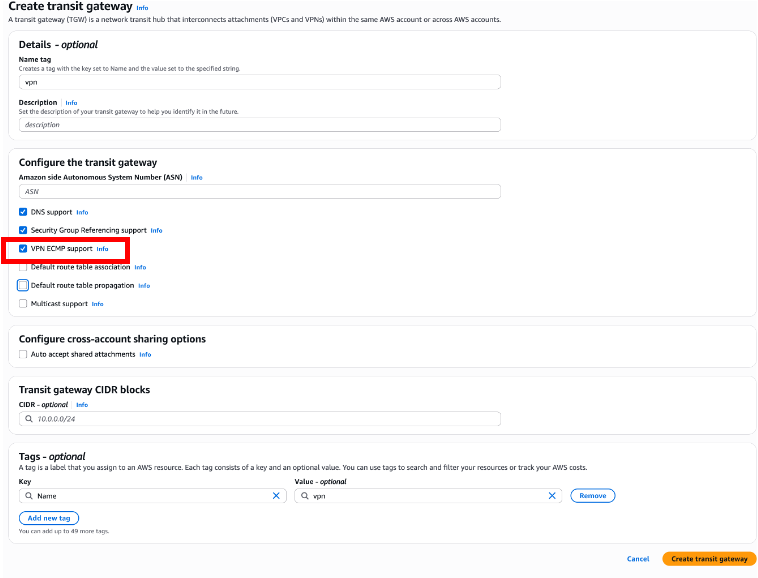

3. Site to Site VPN 생성

- AWS 콘솔에서 **VPC > Site-to-Site VPN Connections**로 이동합니다.
- **Create customer gateway** 버튼을 클릭합니다.
- **Customer gateway**는 이전 1번 과정에서 생성한 custer gateway를 선택합니다.
- **Transit gateway**는 이전 2번 과정에서 생성한 tgw를 선택합니다.
- **Routing options**은 Dynamic을 선택합니다.
- **Create** 버튼을 클릭합니다.

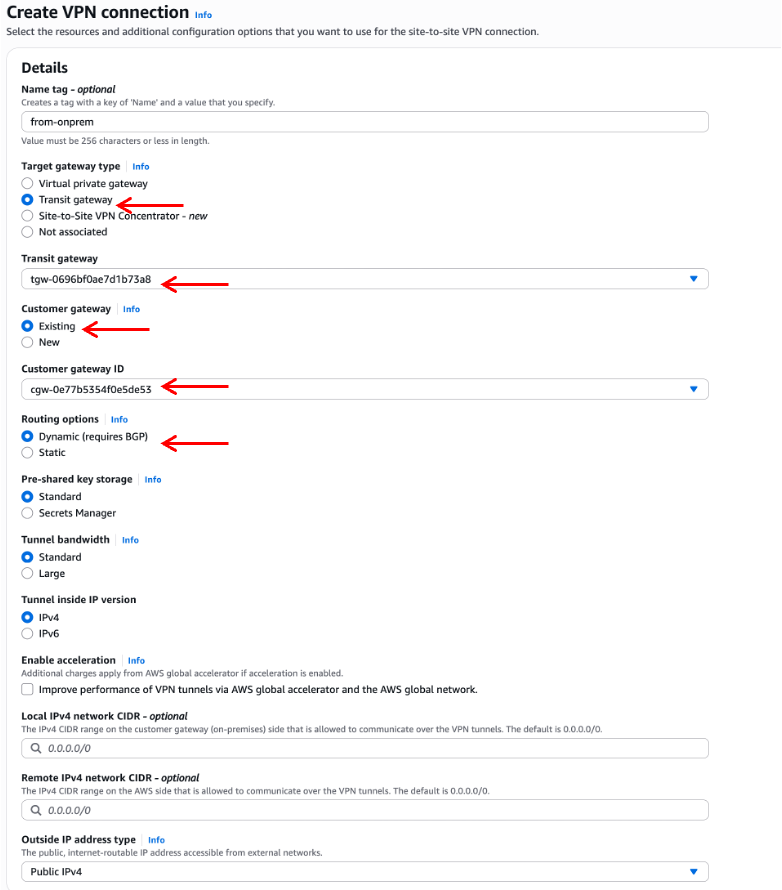

4. VPN 생성은 약 5분정도 소요됩니다. VPN이 생성되면 state가 Pending에서 Available로 변경됩니다.

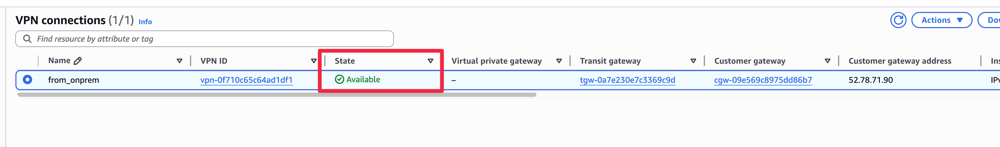

## Step 3: TGW 설정

1. TGW VPC attachment 생성

TGW VPC attachment는 TGW와 VPC를 연결하는 리소스입니다. TGW VPN attachment도 필요한데, 이전 단계에서 Site to Site VPN을 생성하면서 자동으로 VPN attachment가 생성되었습니다.

- AWS 콘솔에서 **VPC > Transit Gateways**로 이동합니다.
- **Transit gateway**는 이전 2번 과정에서 생성한 tgw를 선택합니다.
- **Create VPC attachment** 버튼을 클릭합니다.
- VPC를 선택하고 private subnet은 cloud private subnet을 선택합니다.
- **Create** 버튼을 클릭합니다.

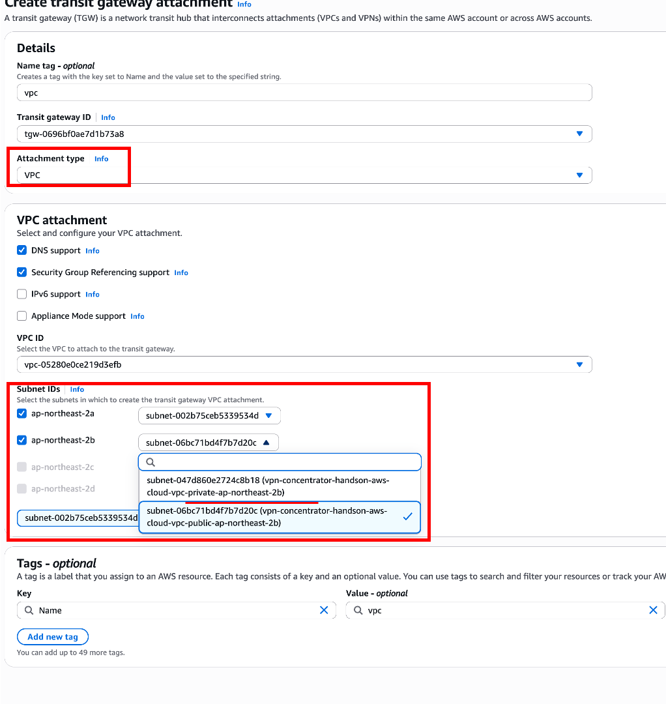

TGW attachment는 아래 그림처럼 VPN, VPC attachment가 생성되어 있어야 합니다.

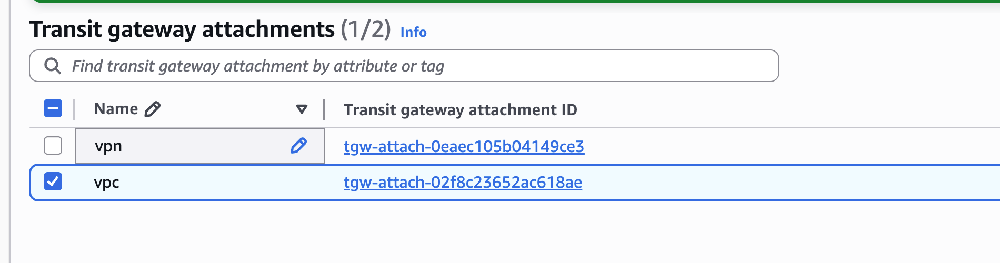

2. TGW route table 생성

TGW route table은 TGW의 라우팅 테이블입니다. TGW route table은 TGW attachment와 연결됩니다.

- AWS 콘솔에서 **VPC > Transit Gateways**로 이동합니다. .
- **Transit gateway route tables**를 선택합니다.
- **Create route table** 버튼을 클릭합니다.
- **Create** 버튼을 클릭합니다.

3. TGW route table Associations, Propagations 설정

TGW route table에 Associations과 Propagations을 설정에 이전 단계에서 생성한 VPN attachment와 VPC attachment를 연결합니다.

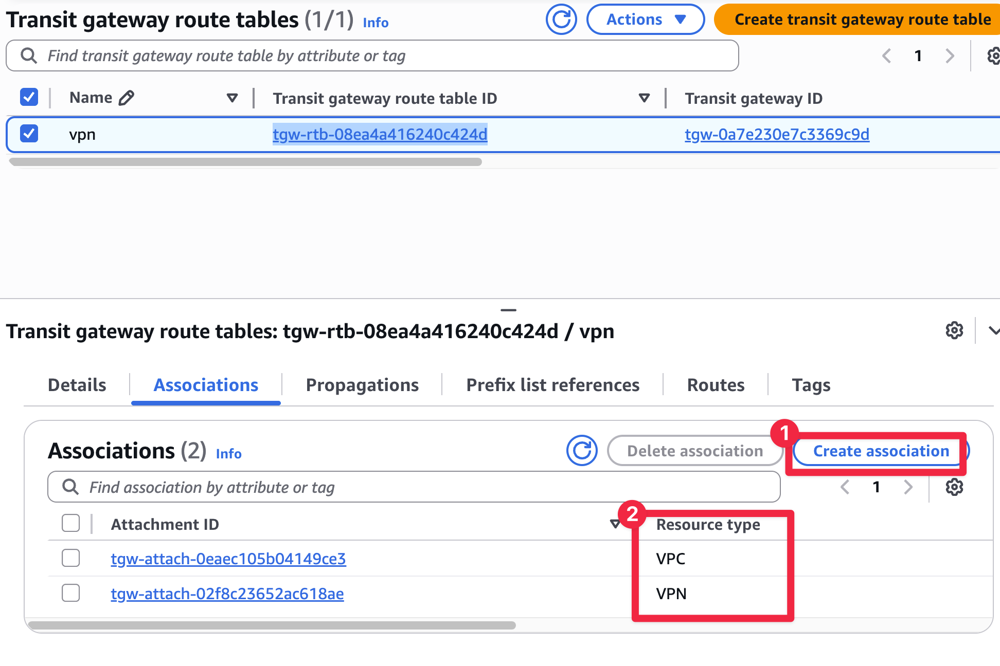

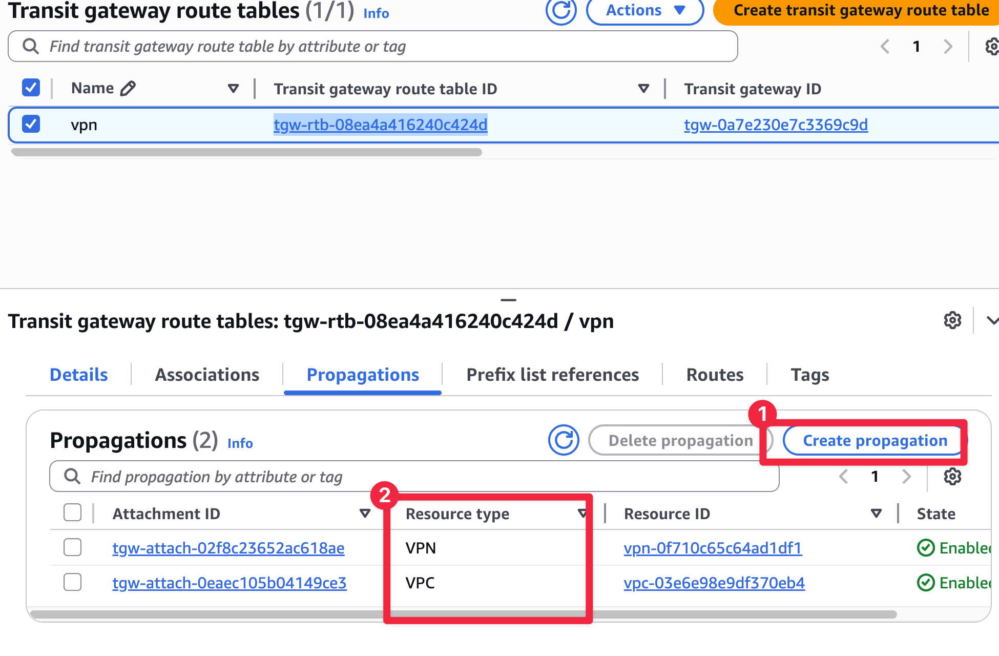

4. cloud역할 VPC subnet route table 설정

VPC subnet route table에 TGW를 추가합니다. 이 설정은 cloud vpc의 private subnet에서 onprem vpc로 트래픽을 보낼 때, VPN에 열결된 TGW로 트래픽을 보내기 위해서 필요합니다. routing 대역은 onprem VPC CIDR를 설정합니다.

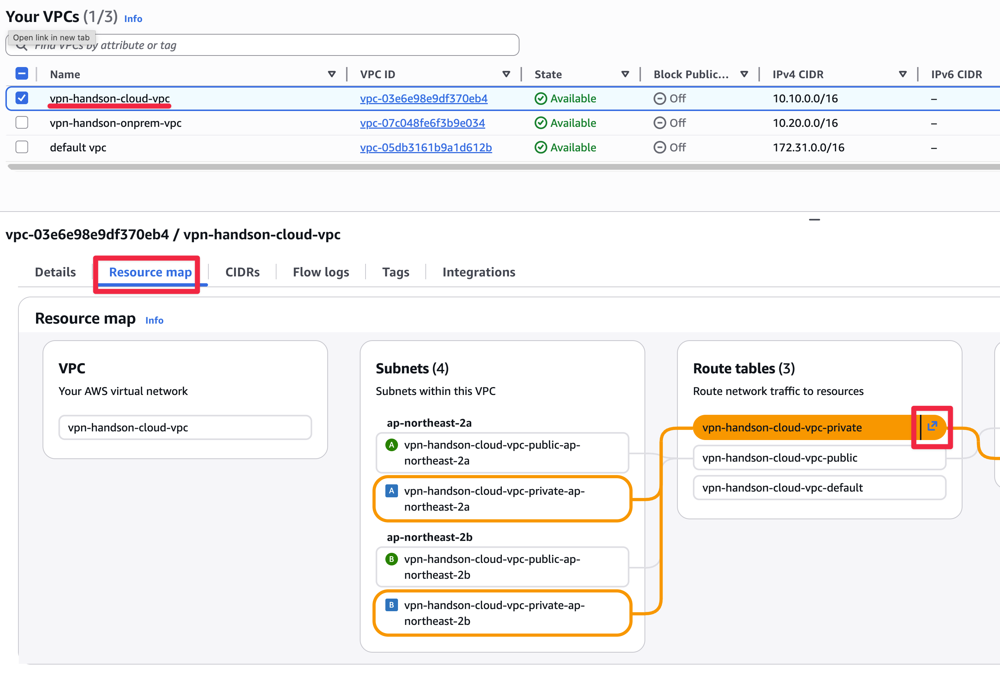

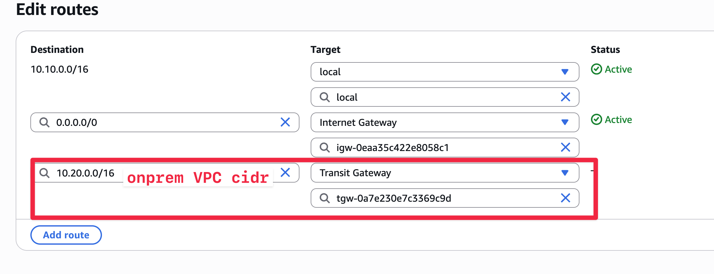

## Step 4: 온프레미스 VPN 장비 설정 (EC2 + strongSwan + FRR)

- 온프레미스 VPN 장비는 EC2 인스턴스에서 설정합니다. strongSwan은 IPSec VPN을 담당하고, FRR은 BGP 라우팅을 담당합니다.
- 설정 파일은 `on_prem_vpn_appliance` 인스턴스에 접속하여 설정합니다. 그리고 설정 파일은 [scripts](./scripts) 디렉터리에 템플릿형태로 있습니다. 템플릿으로 있는 이유는 AWS Site to Site VPN Connection에서 다운로드한 설정 파일을 기준으로 템플릿을 채우기 위해서입니다.

1. VPN 구성 파일 다운로드

AWS 콘솔에서 VPN 터널 설정을 위한 구성 정보를 다운로드합니다.

- AWS 콘솔에서 **VPC > Site-to-Site VPN Connections**로 이동합니다.
- **Download configuration** 버튼을 클릭합니다.
- **Vendor**를 `Generic`으로 선택하고 다운로드합니다. 이 텍스트 파일에는 **두 개의 VPN 터널**에 대한 Pre-Shared Key, AWS 측 Public IP(TGW의 엔드포인트), BGP 설정값 등 모든 필수 정보가 들어있습니다.

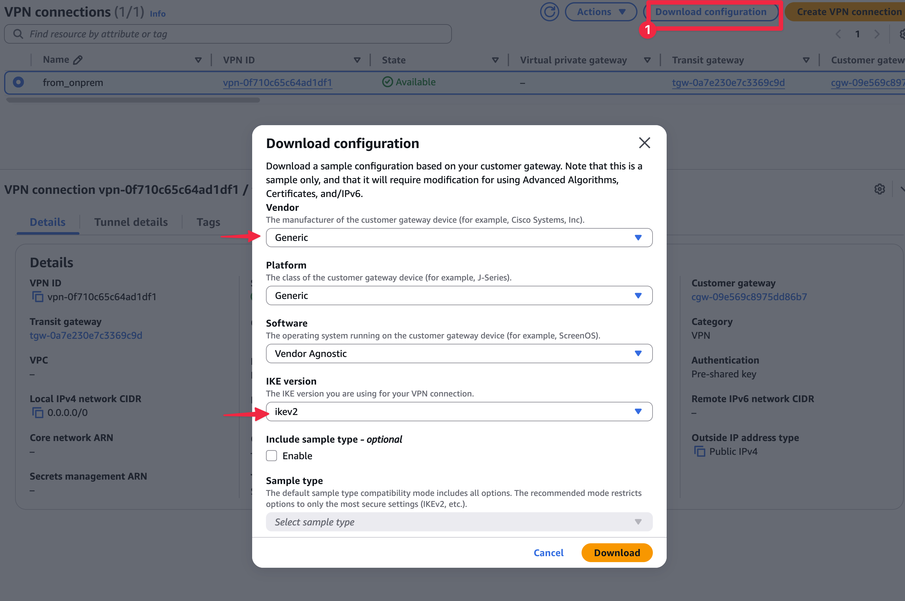

2. 온프레미스 EC2인스턴스 접속

Terraform 출력으로 확인한 SSM 명령어를 사용하여 `on_prem_vpn_appliance` 인스턴스에 접속합니다.

```sh
$ terraform output
onprem_vpn_appliance_ssm_command = "aws ssm start-session --target i-0322e0c81f094e1c3"

$ aws ssm start-session --target <on_prem_vpn_appliance의 인스턴스 ID>
(EC2 instance shell)$ sudo -i
```

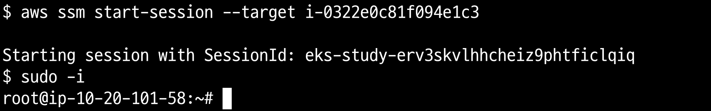

3. VPN 및 라우팅 소프트웨어 설치

접속한 인스턴스(Ubuntu 24.04)에서 IPSec VPN을 위한 `strongSwan`과 동적 라우팅(BGP)을 위한 `FRR`을 설치합니다.

```sh
apt-get update -y
apt-get install -y strongswan
```

4. strongSwan 파일 설정

strongSwan 즉 VPN통신에 필요한 설정을 채웁니다. AWS Site to Site Configuration을 참고로 제가 미리 만들어놓은 템플릿에 값을 채웁니다. 자세한 내용은 [scripts 가이드](./scripts/)를 참고하세요.

5. strongSwan 파일 실행

[scripts 가이드](./scripts/)대로 설정하고 strongSwan을 실행합니다.

```sh
systemctl restart strongswan-starter
```

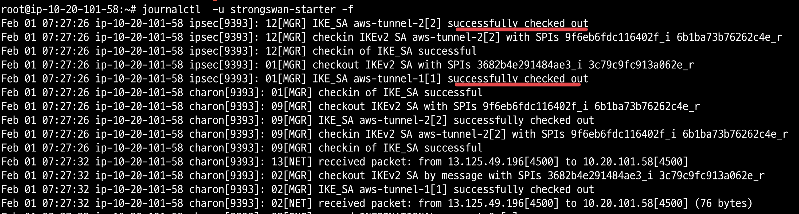

strongswan-starter 로그에서 successfully메세지가 보여야됩니다.

```sh
journal -u strongswan-starter -f
```

온프레미스 역할을 하는 EC2운영체제는 VPN통신을 위해 vti 네트워크 인터페이스가 생성됩니다.

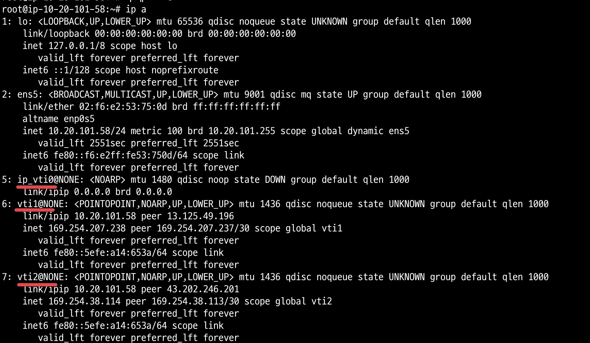

AWS 콘솔 Site to Site VPN에서 VPN 터널을 확인하면, IPSEC is UP이 보여야합니다.

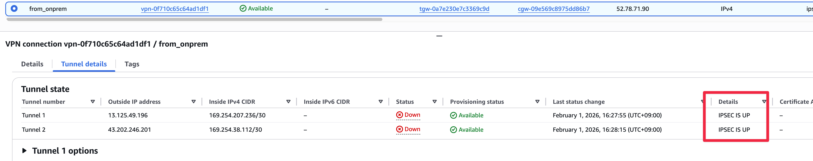

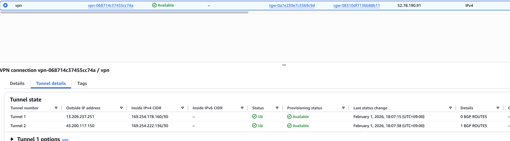

5. BGP(FRR) 설정

- IPSEC is UP이지만 BGP 설정 안되어 있어서 VPN 터널 상태가 Down입니다.

-  frr을 설치합니다. 그리고 [scripts 가이드](./scripts/)대로 설정하고 frr을 설정합니다.

```sh
apt-get install -y strongswan
```

6. BGP(FRR) 실행

frr을 실행합니다.

```sh
systemctl restart frr
```

frr로그에 에러로그가 없어야합니다.

```sh
tail -f /var/log/frr/frr.log
```

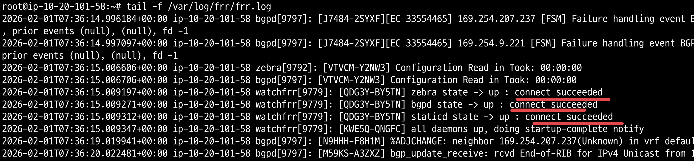

frr이 잘 적용되었으면 frr의 BGP에 이웃이 추가된게 보입니다.

```sh
sudo vtysh -c "show ip bgp"
```

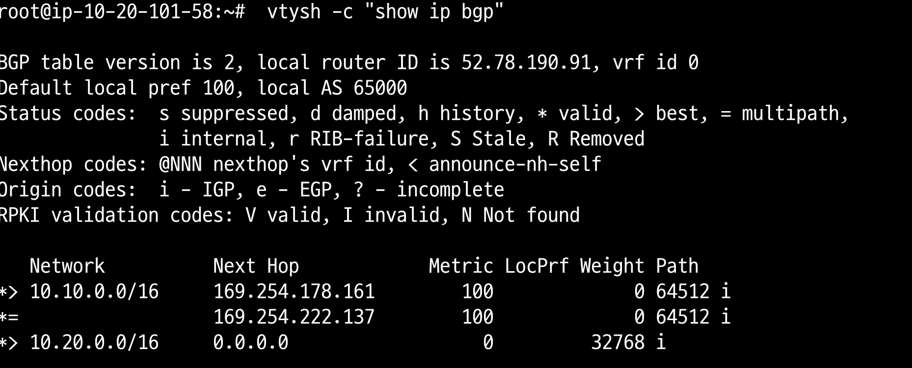

AWS 콘솔에서 VPN 터널 상태를 확인합니다. 아래 예제는 설정이 잘된것과 잘못된게 섞여 있어서 VPN터널 한개만 활성화 상태입니다.

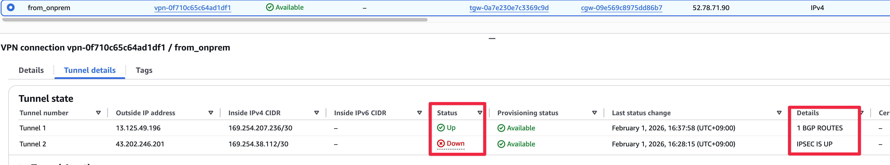

VPN 터널이 활성화되면 BGP설정때문에 TGW route table이 자동으로 업데이트 됩니다.


7. 온프레미스 VPC subnet route table 설정

온프레미스 VPC subnet대역은 cloud대역과 통신할 때 VPN을 사용할 수 있도록, private route table에 VPN EC2 instance를 설정합니다.

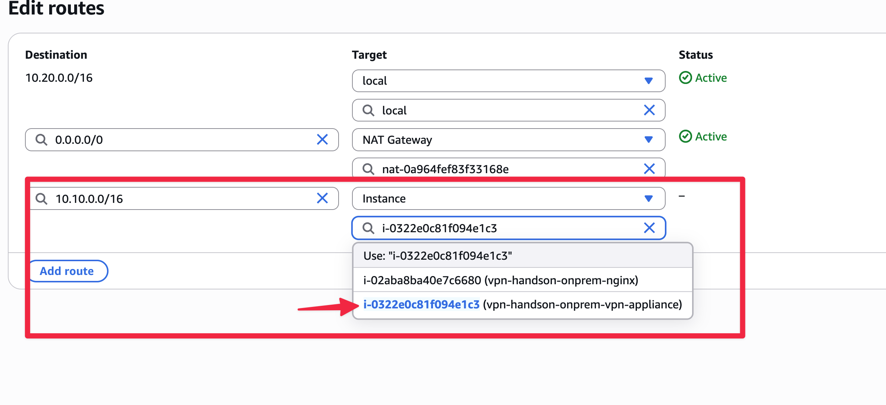

## Step 5: nginx EC2인스턴스 연결 테스트

onprem EC2인스턴스-> cloud인스턴스에서 curl을 테스트하거나, 반대로 cloud인스턴스 -> onprem EC2인스턴스 curl을 테스트합니다. 두 `curl` 명령이 모두 성공적으로 반대편 서버의 메시지를 가져오면, 최종 구성된 Site-to-Site VPN이 완벽하게 구축된 것입니다.

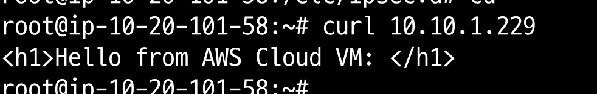

## 참고자료

* https://dev.classmethod.jp/articles/site-to-site-vpn-bgp-logging-vpn-tunnels/
